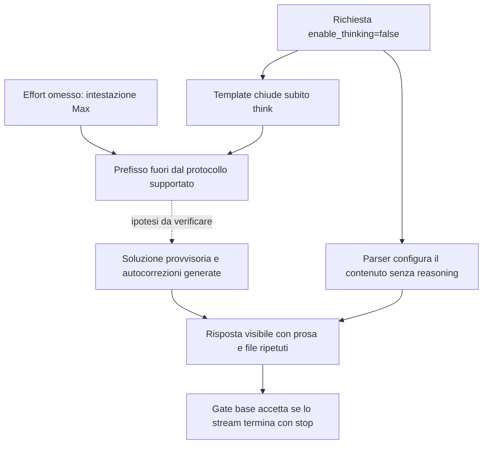

# E09 — analisi causale dell'output codice, 17 settembre 2026

**Aggiornamento dai pilot:** il [rapporto di verifica](E09-QUALIFICATION-2026-09-17.md)
registra il confronto true/false a pari effort Low: formato 5/5 in entrambi i
bracci, con errori Go che impediscono la qualificazione. Riattivare il thinking
non ha quindi dimostrato di risolvere l'anomalia. Anche High fallisce: formato
3/5, compilazione 4/5, test propri 3/4, indipendenti e race 1/4. Il solo caso
che passa tutti i test aggiunge prosa vietata; un altro ha un bug di refill dopo
un clock arretrato. Il tentativo Max interrotto non ha conservato una ricevuta
auditabile. Esito **unresolved**, nessuna conferma o transizione DFlash.
Il traffico del proprietario è ammesso per questi test di correttezza e non
viene usato per attribuire errori o misurare prestazioni. L'analisi originale
e il piano precedente sono conservati sotto come cronologia; la sequenza
approvata successivamente prevede pilot prima delle tre conferme.

**L'ipotesi principale è un'incompatibilità fra il protocollo di ragionamento del
modello e la modalità locale `enable_thinking=false`.** Il template modificato
chiude il ragionamento prima della generazione, pur mantenendo l'istruzione
`Reasoning Effort: Max`. È dimostrato che questa combinazione raggiunge il
modello e disattiva il parser del ragionamento. Che produca le autocorrezioni e
le ripetizioni osservate resta un'ipotesi da verificare con il confronto sotto.

È invece dimostrata una seconda causa, relativa al mancato rilevamento: i gate
codice usati nei run controllano presenza dell'output e fine normale dello
stream, senza verificare formato o correttezza del programma. Anche l'estrattore
dell'audit Go separato contiene un difetto riprodotto offline.

La richiesta di RCA con almeno un'ipotesi concreta e un piano risolutivo è
soddisfatta. La causa della generazione non viene dichiarata provata o risolta.
Questa analisi ha usato sorgenti effettivamente installate, ricevute conservate,
rendering CPU e test Go locali: zero nuove richieste di inferenza e zero restart.

## Anomalia e impatto verificato

Il task chiede un token bucket Go concorrente, clock iniettabile, `AllowN`,
validazione del costruttore e test con clock finto. La risposta deve contenere
esattamente un blocco implementazione e un blocco test, entrambi con nome file,
nessuna prosa e meno di 1100 parole. I cinque casi sono cinque nonce dello
stesso task, non cinque problemi indipendenti.

| Esito sui cinque casi codice | Conferma con DFlash | Controllo senza DFlash |
| --- | ---: | ---: |
| Gate nativo di base | 4/5 | 5/5 |
| Due blocchi, nomi file, nessuna prosa | 2/5 | 2/5 |
| Troncamento a 8192 token | 1/5 | 0/5 |

Nella conferma con DFlash, il caso 4 ripubblica implementazioni e test fino al
limite, lasciando l'ultimo blocco incompleto. Nel controllo senza DFlash il caso
5 pubblica implementazione e test, annuncia una correzione e ripubblica i test.
I casi 2 e 4 aggiungono commenti finali vietati. Il difetto sopravvive dunque
alla rimozione della speculazione; l'episodio fino al limite non si riproduce
in questi cinque campioni. Non si può attribuire quel troncamento a DFlash
sulla base di questo solo confronto.

L'analisi successiva ha eseguito anche il codice già conservato, senza
correggerlo. Estrazione dei blocchi reali per posizione, toolchain locale
`go1.26.0 darwin/amd64`, `go test -json -count=1 -timeout=20s -p=1 ./...`,
risoluzione di dipendenze e download toolchain disabilitati. È un replay
forense degli artefatti, non un nuovo benchmark o l'audit Docker nativo.

| Caso senza DFlash | Blocchi / prosa esterna | Parole, separate da spazi | Test forniti dal modello |
| --- | --- | ---: | --- |
| 1 | 2 / assente | 1024 | PASS |
| 2 | 2 / presente | 838 | PASS |
| 3 | 2 / assente | 826 | PASS |
| 4 | 2 / presente | 948 | FAIL: `allowed = 50, want 100` |
| 5 | 3 / presente | 1458 | FAIL con il test originale e con quello ripubblicato |

Nel caso 4 il test avvia 50 goroutine, ciascuna consuma un solo token, ma
pretende 100 successi: l'errore è nell'aspettativa del test. Nel caso 5 il
costruttore controlla soltanto `rate <= 0` e capacità positiva, mentre i test
richiedono il rifiuto di NaN e infinito positivo. La versione ripubblicata
corregge il calcolo dei valori speciali, ma lascia invariata l'implementazione:
entrambi i controlli continuano a fallire.

Quindi 3/5 artefatti superano i propri test; soltanto 2/5 superano anche il
formato richiesto. Il PASS dei test generati dallo stesso modello non prova
correttezza generale: manca un oracolo indipendente e non è stato eseguito
il race detector. I due FAIL, invece, dimostrano incoerenze interne reali dei
deliverable, anche se uno riguarda il test e non il limiter.

## Ipotesi H1: ragionamento forzato chiuso prematuramente

Z.ai documenta GLM-5.3-Flash come modello con ragionamento obbligatorio, non
disattivabile. La ricetta ufficiale vLLM specifica che il prefisso di generazione
apre sempre `<think>`. Il model card della revisione effettiva ammette gli effort
`low`, `high`, `max`, con default `max`. Questi documenti descrivono il protocollo
supportato; non dimostrano da soli la causa del nostro output.
[Z.ai](https://docs.z.ai/guides/capabilities/thinking-mode),
[ricetta vLLM](https://raw.githubusercontent.com/vllm-project/recipes/main/models/zai-org/GLM-5.3-Flash.yaml),
[model card della revisione installata](https://huggingface.co/zai-org/GLM-5.3-Flash/blob/690b705278a3a58e538fcb37c2ca8b5f9511213c/README.md).

Il percorso locale è stato ricostruito direttamente:

1. Rigmark invia `chat_template_kwargs: {"enable_thinking": false}`; non
   specifica `reasoning_effort`.
2. [`render_chat_template.py`](scripts/render_chat_template.py) sostituisce
   il prefisso upstream `<|assistant|><think>` con
   `<|assistant|><think></think>` quando il flag è falso.
3. La parte iniziale del template rimane invariata e inserisce
   `Reasoning Effort: Max`. Il prompt dice quindi di usare effort massimo,
   ma presenta il ragionamento come già terminato e vuoto.
4. Nel motore R10 `glm45` è un alias dell'adattatore `Glm47MoeParser`. Il suo
   inizializzatore legge lo stesso flag, imposta `thinking_enabled=False` e
   `is_reasoning_end()` restituisce `True`. Il testo successivo viene trattato
   come contenuto, senza separazione del ragionamento.
5. I cinque output registrati hanno effettivamente zero caratteri di reasoning.
   Questo è coerente con la configurazione; non prova che il modello sia
   incapace di ragionare né che il client abbia perso un campo.

Il meccanismo ipotizzato è che la soppressione del tratto previsto per la
pianificazione favorisca una risposta provvisoria, seguita da revisioni nel
testo finale. È plausibile per il tipo di errore osservato, ma non è stato
ancora misurato un miglioramento riaprendo quel tratto. Non sappiamo se spieghi
anche il caso estremo di ripetizione fino a 8192 token.

Un probe CPU ha eseguito i metodi reali di fusione dei parametri, costruzione
dei parametri chat e inizializzazione/query del parser, estratti tramite AST.
Ha usato i template e il tokenizer installati, sostituendo soltanto la
costruzione del motore non necessaria alla query. Nessun import di vLLM,
Torch o `sitecustomize`, nessuna esecuzione GPU. Sono passate 40 combinazioni
(otto configurazioni per cinque prompt); il caso attuale riproduce esattamente
i conteggi prompt nativi 132, 137, 136, 134, 134.

| Parametri verificati | Intestazione | Prefisso | Parser thinking |
| --- | --- | --- | --- |
| `enable_thinking=false`, effort omesso | Max | chiuso | disattivato |
| `enable_thinking=true`, effort omesso | Max | aperto | attivato |
| `enable_thinking=true`, effort `low` | Low | aperto | attivato |
| `enable_thinking=true`, effort `high` | High | aperto | attivato |
| `enable_thinking=false`, effort `low` | Low | chiuso | disattivato |
| top-level `reasoning_effort=low`, flag falso ancora presente | Low | chiuso | disattivato |
| top-level `reasoning_effort=low`, flag assente | Low | aperto | attivato |
| top-level `reasoning_effort=none`, flag assente | Max | chiuso | disattivato |

Con `enable_thinking=true`, il testo renderizzato coincide byte per byte con
il template upstream per questi cinque prompt, a parità di effort. Il primo
confronto può quindi usare una modifica della richiesta sul processo già
caricato. Impostare soltanto `reasoning_effort=low` lasciando il flag falso
non risolverebbe l'incompatibilità.

**Limite decisivo: la stessa modifica del template esisteva già in F0.** Il
manifest F0 registra lo stesso SHA del renderer corrente; la baseline registra
anch'essa `enable_thinking=false`. H1 può essere un problema preesistente o
un'interazione con il motore attuale, non una novità attribuibile a E09. Le
ricevute raw F0 non sono state reperite nei percorsi locali e remoti esaminati;
i soli gate aggregati non dimostrano che gli output F0 rispettassero il formato.
F0 rimane congelata e non è stata rieseguita o modificata.

## Difetto certo nella rilevazione

`bench.py:validate_visible_output()` richiede output non vuoto e fine normale;
`receipt.py:output_valid()` applica sostanzialmente lo stesso criterio al codice.
Il PASS 5/5 del controllo senza DFlash significa dunque cinque risposte presenti
e terminate normalmente, non cinque programmi validi e aderenti al prompt.

L'audit separato `audit_code.py:code_blocks()` usa una regex che riconosce solo
fence vuoti o `go` e non verifica il testo esterno. L'esecuzione della funzione
originale, senza modificare Rigmark, ha riprodotto tre problemi:

- Due blocchi `go` con prosa vietata vengono accettati dall'estrattore.
- Due blocchi con fence `ratelimit.go` e `ratelimit_test.go` vengono rifiutati:
  la regex accoppia delimitatori sbagliati e ne conta uno. Succede al caso 3,
  che invece rispetta il formato ed esegue correttamente i propri test.
- Nei tre blocchi del caso 5 l'estrattore trova apparentemente due blocchi,
  ma estrae una stringa vuota e la frase di autocorrezione. L'eventuale build
  fallirebbe per l'estrazione, senza diagnosticare il vero errore del codice.

Il replay Go di questa RCA usa i blocchi reali conservati e documenta entrambe
le versioni del caso 5. Non è una correzione nascosta dell'audit nativo. La
correzione permanente deve essere fatta in Rigmark, senza riscrivere le
ricevute storiche o introdurre un secondo framework di qualificazione.

## Alternative e grado di esclusione

| Ipotesi | Evidenza | Conclusione operativa |
| --- | --- | --- |
| H1: protocollo thinking-off locale | Mismatch documentato e percorso riprodotto; tipologia di autocorrezioni compatibile | Prima ipotesi da testare; nesso causale ancora aperto |
| DFlash come causa necessaria | Prosa e ripubblicazione presenti anche senza draft | Escluso come requisito di questi difetti; possibile ruolo sul caso fino al cap non risolto |
| Restore esterno corrotto | Prompt codice sotto 4096 token; nessun hit/restore nei relativi intervalli su 4/4 rank; difetto anche nel processo nuovo senza replay | Nessuna evidenza di restore coinvolto; non esclude ogni effetto globale del connettore installato |
| Guasto rete, timeout o GID | Run integri, HTTP 200, stream completi, quattro rank sani; GID corretti prima del boot | Il vecchio blocco d'avvio GID è separato; non spiega le autocorrezioni osservate |
| Mancata terminazione EOS | Config effettiva contiene i tre EOS corretti; il sorgente li integra negli stop; tutti i casi senza draft finiscono con stop | Nessuna evidenza attuale di EOS mancante; servono token generati per escludere un bug intermittente |
| H2: greedy decoding favorisce cicli | Protocollo usa temperatura 0; configurazione modello usa 1.0 / top_p 0.95 | Possibile concausa, non verificata; separare dal test sul thinking |
| H3: errore numerico residuo R10/FP8/KDA/sparse attention | Il controllo senza draft conserva questi componenti; in passato furono necessari fix reali | Resta possibile; smoke test brevi e restore coerenti non validano tutte le posizioni del decode |
| Normale fallibilità del modello sul task | Stesso task ripetuto con cinque nonce; nessun controllo nel protocollo ufficiale ancora eseguito | Non esclusa; non generalizzare a tutti i task di codice |

Gli EOS del tokenizer effettivo sono 154820=`<|endoftext|>`, 154827=`<|user|>`,
154829=`<|observation|>`. Non è disponibile una traccia che dimostri se un EOS
fosse stato emesso e ignorato nel caso terminato per lunghezza. Inoltre
`</think>` termina il ragionamento, non la risposta: non va aggiunto come stop
per nascondere l'anomalia.

## Piano risolutivo, in ordine

**1. Correggere la misura in Rigmark e conservare il confronto storico.**
Intervenire sul parser dell'audit per gestire i nomi file nei fence, delimitatori
di apertura/chiusura, prosa esterna, esattamente due file distinti, blocchi
incompleti e limite parole. Aggiungere i controesempi sopra come regressioni
nel progetto Rigmark. Separare gli esiti di trasporto, formato, compilazione,
test forniti dal modello e verifica indipendente. Collegare l'audit al riesame
del run prima che parta il successivo, distinguendo i fallimenti attesi del
braccio di controllo dalla qualificazione di una correzione.

Riesaminare le ricevute esistenti senza modificarle. Se si recuperano i raw F0,
applicare lo stesso audit offline e annotare il risultato separatamente; nessun
rerun F0. Fissare l'identità del client e dell'audit per tutti i bracci nuovi.
I controlli Go indipendenti successivi devono coprire validazione, refill,
capacità, clock che arretra, atomicità di `AllowN` e accesso concorrente,
adattando esplicitamente le API ammesse: il prompt attuale non fissa una firma
unica. Non sostituire in silenzio i test generati né cambiare il prompt storico.

**2. Confrontare A e B sul target-only già caricato, senza reload.**
Stesso Rigmark nativo, modello, cinque nonce, comparison ID, seed 20260905,
temperatura 0, top_p 1, limite totale 8192, sorgenti e processo. Cambia solo
`enable_thinking`; nuovi label e salt per ogni invocazione. Conservare il salt
distinto necessario all'isolamento, già usato nei controlli precedenti.

| Braccio | `chat_template_kwargs` | Domanda |
| --- | --- | --- |
| A, controllo | `{"enable_thinking":false}` | Riproduce l'anomalia attuale? |
| B, confronto causale | `{"enable_thinking":true}` | Riaprire il ragionamento a pari effort Max corregge il deliverable? |
| C, eventuale fase successiva | `{"enable_thinking":true,"reasoning_effort":"low"}` | Con thinking aperto, Low riduce costo e latenza mantenendo correttezza? |

Usare direttamente `rigmark run` con `--runs 5 --decode-tokens 8192
--seed 20260905 --skip-prefill --skip-concurrency`, lo stesso comparison ID
`glm53-nq2-3x-20260911-v1`, base URL loopback e `--extra-body` del braccio.
Ogni invocazione comprende 15 richieste: cinque codice, cinque prosa e cinque
structured. Il piano mantiene le tre invocazioni native consecutive per
variante: A+B sono sei invocazioni, 90 richieste, 15 campioni codice per braccio.
C, se necessario, aggiunge tre invocazioni, 45 richieste e 15 campioni codice.
Qualsiasi pilot con un conteggio ridotto va concordato come eccezione; non è
stato avviato in questa RCA. I cinque task ripetuti non diventano 15 problemi
indipendenti.

Prima e dopo ciascun run verificare identità 4/4, health, idle, contatori,
assenza di traffico estraneo e assenza di restore sui casi codice. Conservare
ogni ricevuta, il testo visibile, conteggi/hash reasoning, stop/length e gli
esiti dell'audit. Errori di trasporto, identità o esclusività fermano la serie.
Le violazioni attese in A sono dati diagnostici, mai un PASS di qualificazione.

Per sostenere H1 occorre un miglioramento ripetuto B rispetto ad A; per
accettare la correzione richiedere tutti i 15/15 deliverable codice completi,
due file senza prosa o duplicazioni, entro il limite parole e con test passanti,
oltre ai controlli prosa/structured. Il risultato deve restare valido con un
oracolo indipendente prima della promozione. Una risposta finale vuota, con
tutto il codice spostato nel reasoning, non costituisce una correzione.

Il budget 8192 comprende anche i token di ragionamento: se B esaurisce il
budget prima della risposta, il confronto di formato è inconcludente, non una
confutazione di H1. In quel caso pianificare una coppia separata false/Low e
true/Low, oppure aumentare il budget in entrambi i bracci di un protocollo
diagnostico distinto. Non cambiare simultaneamente thinking, effort e sampling
per poi attribuire il risultato a un solo fattore.

**3. Stabilizzare l'integrazione se H1 è sostenuta.**
Usare il protocollo upstream con ragionamento aperto e un effort esplicito
scelto sulle prove. Eliminare l'assunzione che `false` sia una modalità
supportata di questo modello nei client, nei gate e nell'adattatore. Definire
esplicitamente il comportamento verso client che continuano a richiederla;
non dichiarare il ragionamento disabilitato quando viene soltanto ridotto.
Verificare separazione reasoning/content, tool call e conversazioni multi-turn.

La prima verifica A/B richiede solo parametri della richiesta. La rimozione
permanente dell'adattatore o un cambio di ricetta vanno invece codificati in
IaC e verificati nella successiva transizione coordinata autorizzata dei quattro
rank, con i gate di boot previsti. Nessuna ricarica è stata eseguita per la RCA.

**4. Se H1 non basta, distinguere sampling e motore.**
Con un protocollo supportato, verificare H2 in un esperimento separato e
versionato. Rigmark protegge `temperature` e `top_p`: non forzarli tramite
`--extra-body`; un'opzione diagnostica deve appartenere al client nativo.
Una configurazione ufficiale è un controllo utile, non garanzia di output
corretto. Anche qui variare un fattore alla volta.

Se il difetto persiste, preparare una traccia bounded del decode target-only
nelle posizioni in cui inizia la revisione: token scelti, top logits e margine,
posizioni KDA/sparse attention e slot KV. Confrontare lo stesso prefisso
teacher-forced nel prefill e nel decode incrementale, con tolleranze numeriche
esplicite; cercare una divergenza ripetibile anziché interpretare ogni minima
differenza FP8 come bug. Solo dopo scegliere un controllo mirato, per esempio
graph/eager o connettore attivo/disattivo, con un singolo delta e la necessaria
finestra di reload. Non avviare automaticamente una cascata di ricariche.

**5. Qualificare la soluzione utile al carico reale.**
Dopo la correttezza, misurare C1/C2/C4 e prosa con il protocollo ordinario di
tre run. Rigmark dispone già di `ttft_seconds` e
`time_to_first_visible_seconds`: riportarli separatamente, perché il primo
può misurare il primo token di ragionamento. La velocità totale non equivale
alla velocità di consegna di codice utilizzabile.

F0 rimane la mediana storica fissa. Una variante con thinking attivo cambia
le condizioni rispetto a F0: indicarlo chiaramente, senza rivendicare un
confronto prestazionale a parità di lavoro. Registrare eventuali tradeoff sul
codice e sulla concorrenza; nessuna promozione basata solo sul formato o su un
singolo run.

## Stato conservato e verificabilità

Ultimo controllo read-only: **16:10:41–16:10:44 UTC, 18:10 italiane**.
Stessi quattro container target-only, una sola istanza per nodo, zero restart,
`/health` 200, running/waiting 0/0, contatore 17 stop e zero length/abort/error.
Nessuna nuova inferenza durante la RCA. Overlay invariato
`scripts/node/etc/local/e09-r10-on-target-only-20260917.env`; per eventuale stop
usare lo stesso overlay e il controller appuntato. Nessun ripristino automatico
F0/E07a, modifica dei pesi, commit, push o promozione.

Evidenze private: cartella locale esterna al checkout `E09-RCA-20260917`,
directory 0700 e file 0600. Contiene sorgenti runtime, ricevuta e output copiati,
`prompt-matrix-probe.py`, `prompt-matrix.json`, controesempi dell'estrattore,
`go-replay-results.json`, sorgenti e log dei sei replay (cinque originali più
il test ripubblicato), controlli runtime finali e manifest SHA-256. Le finestre
remote già sigillate sono state soltanto lette.

| Artefatto | SHA-256 |
| --- | --- |
| Ricevuta nativa target-only | `c0db977776995db29b41c947b884da30a6852d0729172941f71cf116430eb468` |
| Template upstream installato | `0c4099f3382d6c92700dfb99725025360966fd73032f0ecf32377c0d9e6309c5` |
| Template attivo | `d8b991bdcc284e346b87a01858700f2bbf5fa3c2fe8ad879d8adbe07907bbf3e` |
| Renderer corrente e nel manifest F0 | `2db3481f8c3df20374ae29e793a55846575a9e3828fbda818091d915eeeecaf1` |
| Audit Go nativo esaminato | `db3dbec2365d5bca28b0d8fc88ee4c766deb4840dcf4ded2cfddfe9de64f8d46` |
| Baseline F0, invariata | `5828ae600458d09219df94d920193b7cd29c32530380284e616aef104755048d` |

Le fonti web sono state consultate il 17 settembre 2026; il model card è
fissato alla revisione dei pesi. Le deduzioni sul runtime si basano sulle copie
effettive delle sorgenti, non sull'assunzione che l'immagine R10 coincida con
l'upstream attuale.
