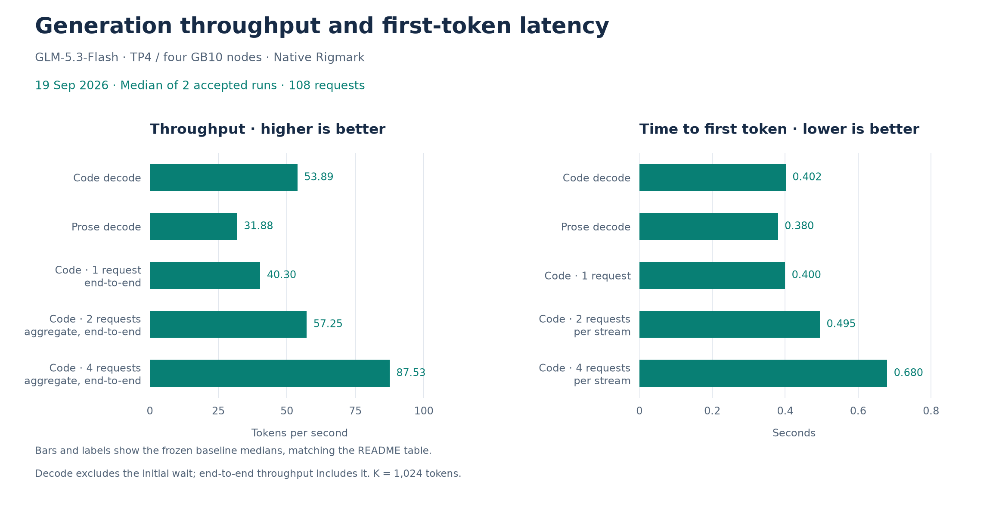
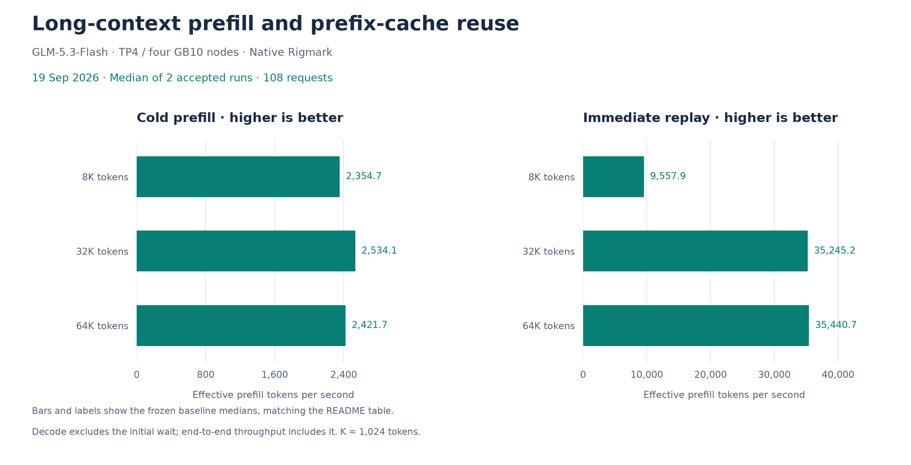

# GLM-5.3-Flash FP8 on four NVIDIA GB10 nodes (switchless)

[](https://x.com/jnardiello)

Run GLM-5.3-Flash FP8 with vLLM across four NVIDIA GB10 systems, connected directly
through a switchless ConnectX-7 RoCE ring. This is my daily driver for coding and
parallel agents, with a **256K context window (262,144 tokens)**. The repository
contains the infrastructure as code, runtime patches, and guides to
[install it with an agent](#install-with-an-agent) on compatible hardware.

## Measured performance

Current baseline: **19/09/2026**, measured with native
[Rigmark](https://github.com/alexellis/rigmark). Values are frozen medians of
**two accepted runs: 108/108 requests**, zero measurement/runtime errors and
30/30 native output gates passing.

| Workload | Current · 19/09/2026 | Change vs [📊 11/09/2026](docs/benchmarks/baselines/2026-09-11.md) |
| --- | ---: | ---: |
| Code decode, one request | 53.89 tok/s | +6.9% |
| Prose decode | 31.88 tok/s | +9.1% |
| Code, one request (end-to-end) | 40.30 tok/s | +8.3% |
| Code, two concurrent requests (aggregate, end-to-end) | 57.25 tok/s | +0.4% |
| Code, four concurrent requests (aggregate, end-to-end) | 87.53 tok/s | +23.1% |
| Prefill 8K, cold | 2,354.7 tok/s | +11.5% |
| Prefill 32K, cold | 2,534.1 tok/s | +15.1% |
| Prefill 64K, cold | 2,421.7 tok/s | +10.0% |
| Code, two concurrent requests, per-stream TTFT | 0.495 s | -19.6% |
| Code, four concurrent requests, per-stream TTFT | 0.680 s | -27.3% |

Percentages use unrounded medians relative to the initial September 11 baseline.
Higher throughput and lower TTFT are better. The separate IaC reproduction and the
run excluded for competing traffic are outside these medians.

Decode speed excludes the initial wait; end-to-end speed includes it. TTFT is time
to first token. Concurrent requests cap output at 256 tokens; long decode tests
allow 8192. Cold prefill uses a new prefix and a fresh cache salt per run.
These measurements describe inference rather than complete agent tasks.

The graphs show only the current baseline, using the same frozen values as the table.
Click an image for its SVG version.

[](docs/plots/baselines/2026-09-19/generation.svg)

[](docs/plots/baselines/2026-09-19/prefill.svg)

The [current benchmark report](docs/benchmarks/baselines/2026-09-19.md) records all
16 metrics, settings and limits, including the **15 GiB KV pool per rank**.
The [benchmark archive](docs/benchmarks/README.md) retains previous baselines,
comparisons, experiments and separate reproduction results. See
[local Rigmark reports](docs/rigmark_reports/README.md) for saving and viewing native receipts.

The [current recipe](docs/production-recipe.md), encoded in
[`cluster.env.example`](cluster.env.example), combines the digest-pinned SparkRing
image, DFlash2 with adaptive verification, hybrid INT8/BF16 KDA projections,
SparkCache prefix reuse, and SIRCL/patched NCCL transport.

## Install with an agent

Start with a local checkout and an agent that can read its files and use SSH. The
verified hardware is ASUS Ascent GX10; the agent must inventory your actual four
nodes before creating the site configuration.

| Prerequisite | What you need |
| --- | --- |
| Nodes | Four DGX Spark-class systems, one NVIDIA GB10 and 128 GB unified memory each |
| Fabric | Two usable ConnectX-7/RoCE ports per node; four DACs in the ring 0 ↔ 1 ↔ 2 ↔ 3 ↔ 0; verified at 200 Gb/s and MTU 9000 |
| Hosts and access | Ubuntu, NVIDIA driver, Docker with GPU support, `rdma-core`, and SSH access over a trusted management LAN/VPN |
| Storage | At least 330 GiB free per node for a fresh model fetch, plus image and runtime-cache space |
| Pinned artifacts | Image, target weights, drafter, and patched NCCL from the [installation procedure](docs/install-from-zero.md) |
| Operator payload | Original SparkCache connector, encoder from the pinned image, and SIRCL bundle/runtime; follow [payload preparation](docs/install-from-zero.md#8-place-the-sparkcache-and-sircl-payload) |

The operator payload is pinned by hash and is not redistributed here. DFlash2 carries
non-commercial terms; review [credits and licenses](CREDITS.md). The API has no
authentication or TLS, so keep it on a trusted network or behind an authenticating
proxy.

Replace the placeholders below, then give this prompt to the agent in the checkout:

```text
Install this repository's September 19, 2026 recipe on my four nodes.
Read AGENTS.md, docs/install-from-zero.md, and docs/operations.md first.
Use docs/historical_benchmarks/baselines/2026-09-19/baseline.json and cluster.env.example as the reference.

SSH targets in rank order:
0: <user@rank0-host>
1: <user@rank1-host>
2: <user@rank2-host>
3: <user@rank3-host>
Authorized maintenance window and actions: <describe the agreed scope>

Run the read-only preflight on all four targets and use their actual hardware
and network mappings. Confirm the cable map and keep site values in ignored
cluster.env. Follow the documented artifact preparation, deployment, startup,
functional gates, and identity checks. Preserve the pinned recipe and hashes.
If an operator payload is missing, report exactly what I must supply.
Continue actions already authorized without asking again at each tool call;
ask only about missing inputs or actions outside that scope.
Do not run Rigmark or replace frozen measurements unless I request it.
```

The [agent contract](AGENTS.md#fresh-checkout-reproduction-contract) supplies the
short execution checklist. The guides below own the complete procedures.

## Documentation

| Goal | Guide |
| --- | --- |
| Give an agent the repository contract | [Agent entry point](AGENTS.md) |
| Install on prepared hosts | [Install from zero](docs/install-from-zero.md) |
| Inspect, deploy, start, stop, recover, or roll back | [Operations](docs/operations.md) |
| Cable, configure, or diagnose the RoCE ring | [Fabric](docs/fabric.md) |
| Understand the current components and customizations | [Production recipe](docs/production-recipe.md) |
| Understand files installed on the nodes | [Node assets](scripts/node/README.md) |
| Check host/software pins and bootstrap | [Bootstrap pins](scripts/node/bootstrap/README.md) |
| Manage host IOMMU configuration | [Host controls](scripts/node/host/README.md) |
| Understand container patches | [Patch guide](scripts/node/patches/README.md) |
| Generate site network files | [Netplan renderer](scripts/render-netplan.md) |
| Build and install patched NCCL | [NCCL guide](scripts/node/nccl/README.md) |
| Maintain workstation scripts | [Shared shell helpers](scripts/lib/README.md) |
| Review benchmark results and history | [Benchmark reports](docs/benchmarks/README.md), [native report storage](docs/rigmark_reports/README.md) |
| Review changes and third-party terms | [Changelog](CHANGELOG.md), [credits](CREDITS.md), [license](LICENSE) |

## Use the endpoint

Once the cluster has passed readiness and its post-boot gates, the OpenAI-compatible
API is available on rank 0. From a client inside the trusted network:

```sh
curl http://<MGMT_IP_RANK0>:8000/v1/chat/completions \
  -H 'Content-Type: application/json' \
  -d '{
    "model": "glm-5.3-flash",
    "temperature": 0,
    "max_tokens": 64,
    "chat_template_kwargs": {"enable_thinking": false},
    "messages": [{"role": "user", "content": "Reply with READY."}]
  }'
```

`enable_thinking=false` selects the local chat-template adapter. Its behavior and the
model's reasoning controls are explained in
[Thinking-off compatibility](docs/production-recipe.md#thinking-off-compatibility).

## Development checks

Install Python 3.9+ and `Jinja2==3.1.6`, then run the offline check:

```sh
python3 -m pip install 'Jinja2==3.1.6'
./scripts/check.sh
```

The check requires no GPU, Docker daemon, SSH connection, site configuration, or model
weights. It validates syntax, public documentation links, command help, manifests,
chat-template rendering, host and controller lifecycle fixtures, preflight, and the
adaptive-k policy.
