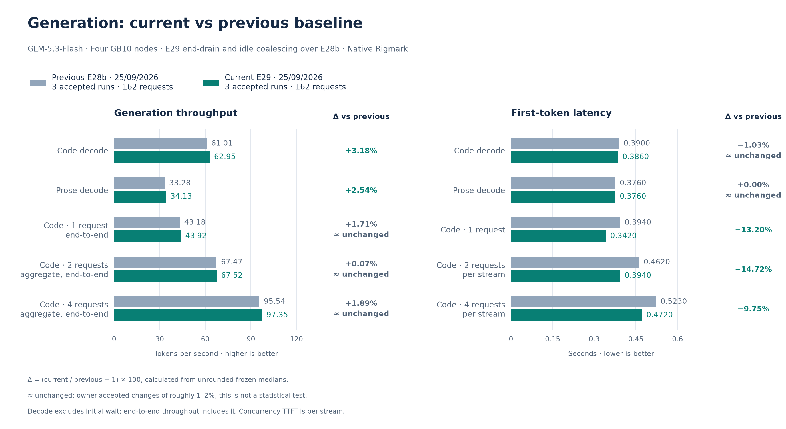
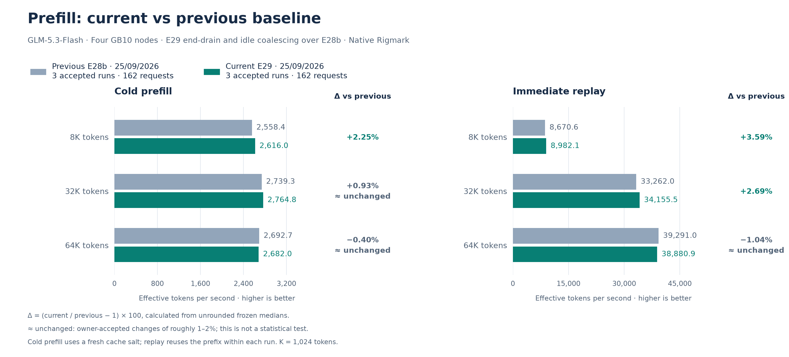

# GLM-5.3-Flash FP8 on four NVIDIA GB10 nodes (switchless)

[](https://x.com/jnardiello)

Run GLM-5.3-Flash FP8 with vLLM across four NVIDIA GB10 systems, connected directly
through a switchless ConnectX-7 RoCE ring. This is my daily driver for coding and
parallel agents, with a **256K context window (262,144 tokens)**. The repository
contains the infrastructure as code, runtime patches, and guides to
[install it with an agent](#install-with-an-agent) on compatible hardware.

## Measured performance

Current accepted baseline: **25/09/2026 · E29, no speculative step past a length finish**,
measured with native [Rigmark](https://github.com/alexellis/rigmark). Frozen medians of
**three complete runs: 162/162 requests**, zero measurement/runtime errors and 45/45 native
output gates passing.

| Workload | Current · 25/09/2026 E29 | vs previous [📊 25/09/2026 E28b](docs/benchmarks/baselines/2026-09-25-e28b.md) |
| --- | ---: | ---: |
| Code decode, one request | 62.95 tok/s | 61.01 tok/s · +3.18% |
| Code C1, end-to-end | 43.92 tok/s | 43.18 tok/s · ≈ unchanged (+1.71%) |
| Code C2, aggregate end-to-end | 67.52 tok/s | 67.47 tok/s · ≈ unchanged (+0.07%) |
| Code C4, aggregate end-to-end | 97.35 tok/s | 95.54 tok/s · ≈ unchanged (+1.89%) |
| Prose decode | 34.13 tok/s | 33.28 tok/s · +2.54% |
| Code TTFT | 0.386 s | 0.390 s · ≈ unchanged (-1.03%) |
| Prose TTFT | 0.376 s | 0.376 s · ≈ unchanged (+0.00%) |
| C1 per-stream TTFT | 0.342 s | 0.394 s · -13.20% |
| C2 per-stream TTFT | 0.394 s | 0.462 s · -14.72% |
| C4 per-stream TTFT | 0.472 s | 0.523 s · -9.75% |
| Prefill 8K, cold | 2,615.9 tok/s | 2,558.4 tok/s · +2.25% |
| Prefill 8K, replay | 8,982.1 tok/s | 8,670.6 tok/s · +3.59% |
| Prefill 32K, cold | 2,764.8 tok/s | 2,739.3 tok/s · ≈ unchanged (+0.93%) |
| Prefill 32K, replay | 34,155.5 tok/s | 33,262.0 tok/s · +2.69% |
| Prefill 64K, cold | 2,682.0 tok/s | 2,692.7 tok/s · ≈ unchanged (-0.40%) |
| Prefill 64K, replay | 38,880.9 tok/s | 39,291.0 tok/s · ≈ unchanged (-1.04%) |

Both baselines were measured over the same direct LAN client path. Percentages use
unrounded values. “≈ unchanged” marks owner-accepted changes of roughly 1–2%, with the
exact delta retained; it does not establish statistical equivalence.
Higher throughput and lower TTFT are better. C1/C2/C4 mean one, two or four concurrent
requests. Decode excludes the initial wait; end-to-end speed includes it. TTFT is time
to first token. Concurrency outputs cap at 256 tokens; long decode allows 8,192.
Cold prefill uses a fresh cache salt per run. These are inference measurements,
not complete agent-task timings.

**What E29 changes.** With asynchronous scheduling the engine queues a request's next step
before the output of the step in flight has come back. With E28b's seven draft tokens, a
request limited by `max_tokens` usually finished inside a step that could produce several
tokens, so the step queued behind it verified drafts for a finished request. A request
arriving right after it waited for that step, which cost E28b about 50 ms of first-token
time.

- **Hold near the length limit:** the scheduler does not queue another step while the step
  in flight may finish the request. First-token time returns to 0.342 s with one request
  (C1) and improves to 0.394 s with two (C2) and 0.472 s with four (C4).
- **Idle coalescing:** at an idle engine, requests arriving within 4 ms are prefilled in one
  step, so agents released together start together.
- **Kept from E28b:** decode is unchanged or slightly faster. Neither change alters the
  steps in between, the seven draft tokens or the 16 GiB KV pool.
- **Remaining cost:** a cached replay sent right after its cold request waits for the cache
  connector to publish that request. At 8K and 32K it stays 56–82 ms slower than on E27c.

The [current benchmark report](docs/benchmarks/baselines/2026-09-25-e29.md) lists per-run
values, the diagnosis, the prefill re-runs, the memory samples and limitations.

The graphs compare current and previous medians side by side, with each delta calculated
against the previous September 25 E28b baseline. Click an image for its SVG version.

[](docs/plots/comparisons/2026-09-25-e29-vs-2026-09-25-e28b/generation.svg)

[](docs/plots/comparisons/2026-09-25-e29-vs-2026-09-25-e28b/prefill.svg)

The [benchmark archive](docs/benchmarks/README.md) retains earlier baselines, experiments
and separate reproduction results. See [local Rigmark reports](docs/rigmark_reports/README.md)
for saving and viewing native receipts.

The [current recipe](docs/production-recipe.md), encoded in
[`cluster.env.example`](cluster.env.example), combines the digest-pinned SparkRing image,
DFlash2 with adaptive verification capped by its effective draft budget, E03 mHC prefill
sharding, hybrid INT8/BF16 KDA input projections, E21 8-bit weights for the KDA output
and MLA attention projections, E22b 8-bit weights for the DFlash2 drafter, the E27 prefill
cadence with the E27c scheduler, seven draft tokens (E28b), the E29 length-finish hold and
idle coalescing, SparkCache replay views and SIRCL/patched NCCL.
The **16 GiB KV pool per rank** (E28b) and the **262,144-token context limit** apply.

## Measured quality

**Measured 27/09/2026.** Does the current recipe answer as well as the official model it
is built from? We gave the same 2.5 million tokens of text to three setups on these four
nodes: the current recipe, the vendor's FP8 model served without this repository's
changes, and a public NVFP4 recipe. The text is coding-agent sessions, synthetic Italian
chats and model-written answers. At every token we recorded two things: which token each
model would pick next, and how surprised it was by the token that actually followed.

**How to read the numbers**

- **Token and context.** A token is a piece of a word, and 2K tokens are roughly 1,500
  words of conversation. "First 2K tokens" covers short conversations; "beyond 2K" covers
  the rest of longer ones.
- **Same first choice.** How often two models would write the same next token. Below
  100% is not a problem in itself: often several tokens are equally good, like two good
  writers choosing different synonyms.
- **Distance (KL).** How different the whole list of likely next tokens is. 0 means
  identical, and larger means more different. It measures difference, not quality, and
  it can only underestimate the true difference.
- **Perplexity change.** The main quality number: how much more (positive) or less
  (negative) surprised a model is by real text than the vendor model is. 0% means
  equally good, and lower is better. The brackets give the range where the true value
  very likely lies (95% confidence). If that range includes 0, no difference could be
  measured.
- **Tasks passed.** 75 small, automatically graded exercises: code, reasoning, maths,
  JSON, formatting and prose. With this many, only differences larger than about 7
  points would show up.
- **Same output when run twice.** Whether the same input produces exactly the same
  predictions again.
- **Broken characters.** The replacement symbol � appearing inside an answer, a sign of
  corrupted text.

### vs vendor FP8

**Same quality, not a bit-for-bit copy.** The current recipe changes how the model is
computed, so it does not always pick the same token as the vendor model. It predicts
real text just as well.

| What we measured | Current recipe | What it means |
| --- | ---: | --- |
| Same first choice as vendor FP8, first 2K tokens | 83% | Small numeric changes move the top pick |
| Perplexity change, all text | +0.1% [−0.3, +0.6] | No measurable loss |
| Perplexity change, first 2K tokens | 0.0% [−0.6, +0.6] | No measurable loss |
| Perplexity change, beyond 2K tokens | +0.2% [−0.3, +0.7] | No measurable loss |
| Perplexity change, agentic code | +0.4% [−0.4, +1.1] | No measurable loss |
| Perplexity change, synthetic Italian chats | 0.0% [−0.2, +0.1] | No measurable loss |
| Tasks passed (vendor FP8: 73/75) | 73/75 | Same result |

[](docs/fidelity/plots/01-quality-vs-fp8.svg)

### vs NVFP4

NVFP4 stores the expert weights, which make up most of the model, in 4 bits instead of 8
to save memory. We ran
[Alex Ellis's public NVFP4 recipe](https://github.com/alexellis/glm-5.3-flash-4x-dgx-spark-switchless/tree/e2d0839a92f118a0a874abcfc1fe8012ee69978e),
with its own checkpoint and engine, on the same four nodes. The results describe that
recipe as published, not the NVFP4 format in general.

**The current recipe is more precise, especially on longer text.** Both columns are
measured against the vendor FP8 model.

| Compared with vendor FP8 | Current recipe | NVFP4 |
| --- | ---: | ---: |
| Same first choice, first 2K tokens | 83% | 75% |
| Distance (KL), first 2K tokens | 0.18 | 0.35 |
| Perplexity change, first 2K tokens | 0.0% | −3.3% |
| Perplexity change, all text | +0.1% | +7.1% |
| Perplexity change, beyond 2K tokens | +0.2% | +12.1% |
| Perplexity change, agentic code | +0.4% | +9.3% |
| Perplexity change, synthetic Italian chats | 0.0% | +10.1% |
| Same output when run twice, first 2K tokens | always | almost never |
| Tasks passed | 73/75 | 74/75 |
| Italian answers with broken characters | 0 of 40 | 3 of 40 |

Every NVFP4 perplexity difference is larger than its measuring error; none of the current
recipe's is. The report gives the ranges.

- **Short text:** NVFP4 is about 3% better on the first 2K tokens, a result we cannot yet
  explain. Beyond 2K tokens it is about 12% worse.
- **Tasks and tool calls:** no difference at this sample size. Both called tools
  correctly in 10 of 10 tests.
- **Broken characters:** they match a known vLLM issue with NVFP4 checkpoints (issue
  54150). 3 of 40 is a warning sign, not yet a statistically significant difference.

[](docs/fidelity/plots/02-different-vs-worse.svg)

**Good to know**

- **Measurement mode.** The distance and perplexity numbers come from a measurement mode
  that sends one request at a time. The tasks and the broken-character test ran on the
  normal serving setup.
- **Beyond 2K tokens** the serving engine gives slightly different predictions from run
  to run, even for the vendor model, so there only overall quality is compared.
- **Tasks.** 75 tasks are too few to prove that two setups are equivalent; they can only
  reveal large differences.

The [full report](docs/fidelity/REPORT.md) starts with a
[plain-language summary](docs/fidelity/REPORT.md#in-plain-words). It covers the method,
where the differences come from and the limitations.
[`report.html`](docs/fidelity/report.html) is a self-contained version with every figure,
and the [experiment archive](docs/historical_benchmarks/experiments/2026-09-27-fidelity/README.md)
holds the data.

## Install with an agent

Start with a local checkout and an agent that can read its files and use SSH. The
verified hardware is ASUS Ascent GX10; the agent must inventory your actual four
nodes before creating the site configuration.

| Prerequisite | What you need |
| --- | --- |
| Nodes | Four DGX Spark-class systems, one NVIDIA GB10 and 128 GB unified memory each |
| Fabric | Two usable ConnectX-7/RoCE ports per node; four DACs in the ring 0 ↔ 1 ↔ 2 ↔ 3 ↔ 0; verified at 200 Gb/s and MTU 9000 |
| Hosts and access | Ubuntu, NVIDIA driver, Docker with GPU support, `rdma-core`, and SSH access over a trusted management LAN/VPN |
| Storage | At least 330 GiB free per node for a fresh model fetch, plus image and runtime-cache space |
| Pinned artifacts | Image, target weights, drafter, and patched NCCL from the [installation procedure](docs/install-from-zero.md) |
| Third-party payload | Included: the [SparkCache](https://github.com/FujitsuPolycom/sparkcache) connector and encoder and the [SparkRing SIRCL](https://github.com/FujitsuPolycom/sparkring) bundle and runtime, both Apache-2.0, under [`third_party/`](third_party/); generate the SIRCL site files as in [payload preparation](docs/install-from-zero.md#8-prepare-the-sparkcache-and-sircl-payload) |

[Third-party payload](docs/third-party.md) lists every included file: where it comes
from, which bytes are upstream and what this project changed. DFlash2 carries
non-commercial terms; review [credits and licenses](CREDITS.md). The API has no
authentication or TLS, so keep it on a trusted network or behind an authenticating
proxy.

Replace the placeholders below, then give this prompt to the agent in the checkout:

```text
Install this repository's accepted September 25, 2026 E29 recipe on my four nodes.
Read AGENTS.md, docs/install-from-zero.md, and docs/operations.md first.
Use docs/historical_benchmarks/baselines/2026-09-25-e29/baseline.json and cluster.env.example as the reference.

SSH targets in rank order:
0: <user@rank0-host>
1: <user@rank1-host>
2: <user@rank2-host>
3: <user@rank3-host>
Authorized maintenance window and actions: <describe the agreed scope>

Run the read-only preflight on all four targets and use their actual hardware
and network mappings. Confirm the cable map and keep site values in ignored
cluster.env. Follow the documented artifact preparation, deployment, startup,
functional gates, and identity checks. Preserve the pinned recipe and hashes.
If a required artifact is missing, report exactly what I must supply.
Continue actions already authorized without asking again at each tool call;
ask only about missing inputs or actions outside that scope.
Do not run Rigmark or replace frozen measurements unless I request it.
```

The [agent contract](AGENTS.md#fresh-checkout-reproduction-contract) supplies the
short execution checklist. The guides below own the complete procedures.

## Documentation

| Goal | Guide |
| --- | --- |
| Give an agent the repository contract | [Agent entry point](AGENTS.md) |
| Install on prepared hosts | [Install from zero](docs/install-from-zero.md) |
| Inspect, deploy, start, stop, recover, or roll back | [Operations](docs/operations.md) |
| Cable, configure, or diagnose the RoCE ring | [Fabric](docs/fabric.md) |
| Understand the current components and customizations | [Production recipe](docs/production-recipe.md) |
| Understand files installed on the nodes | [Node assets](scripts/node/README.md) |
| Check host/software pins and bootstrap | [Bootstrap pins](scripts/node/bootstrap/README.md) |
| Manage host IOMMU configuration | [Host controls](scripts/node/host/README.md) |
| Understand container patches | [Patch guide](scripts/node/patches/README.md) |
| Generate site network files | [Netplan renderer](scripts/render-netplan.md) |
| Build and install patched NCCL | [NCCL guide](scripts/node/nccl/README.md) |
| Maintain workstation scripts | [Shared shell helpers](scripts/lib/README.md) |
| Review benchmark results and history | [Benchmark reports](docs/benchmarks/README.md), [native report storage](docs/rigmark_reports/README.md) |
| Check output quality against vendor FP8 | [Fidelity report](docs/fidelity/REPORT.md), [fidelity tooling](scripts/fidelity/README.md) |
| Review changes and third-party terms | [Changelog](CHANGELOG.md), [credits](CREDITS.md), [license](LICENSE) |

## Use the endpoint

Once the cluster has passed readiness and its post-boot gates, the OpenAI-compatible
API is available on rank 0. From a client inside the trusted network:

```sh
curl http://<MGMT_IP_RANK0>:8000/v1/chat/completions \
  -H 'Content-Type: application/json' \
  -d '{
    "model": "glm-5.3-flash",
    "temperature": 0,
    "max_tokens": 64,
    "chat_template_kwargs": {"enable_thinking": false},
    "messages": [{"role": "user", "content": "Reply with READY."}]
  }'
```

`enable_thinking=false` selects the local chat-template adapter. Its behavior and the
model's reasoning controls are explained in
[Thinking-off compatibility](docs/production-recipe.md#thinking-off-compatibility).

## Development checks

Install Python 3.9+ and `Jinja2==3.1.6`, then run the offline check:

```sh
python3 -m pip install 'Jinja2==3.1.6'
./scripts/check.sh
```

The check requires no GPU, Docker daemon, SSH connection, site configuration, or model
weights. It validates syntax, public documentation links, command help, manifests,
chat-template rendering, host and controller lifecycle fixtures, preflight, and the
adaptive-k policy.
