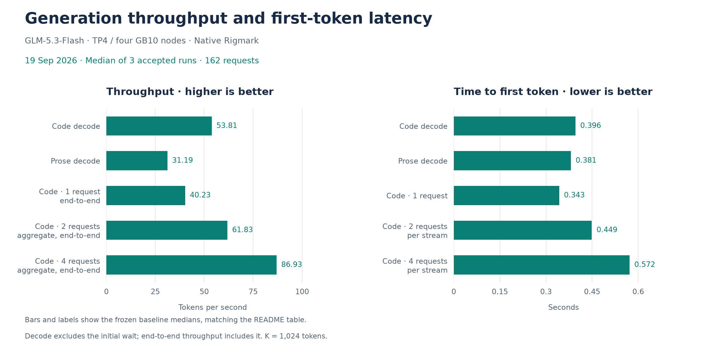
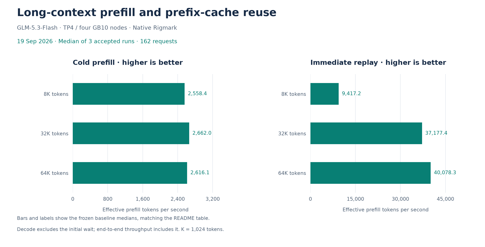

# September 19 accepted E03, replay views and draft-budget reference

**Outcome: promote, accepted by the owner.** The default IaC now encodes the measured
E03 mHC prefill, replay views and effective draft-budget scheduler. The [promotion
record](../../historical_benchmarks/baselines/2026-09-19-e03/promotion.json) separates
this local packaging change from the pending coordinated deployment and reproduction.

The frozen performance reference uses the **three final complete native Rigmark suites,
162 requests**, from the [retained-candidate investigation](../experiments/2026-09-19-e03-draft-budget-c1-review.md).
Each suite contributes its native per-run metric once; displayed values are their
medians. Nine isolated C1 requests, the original three candidate suites and the initial
C4 screen remain separate records, with no observations discarded or replaced.
The [previous September 19 base](2026-09-19.md) remains immutable at exactly two
accepted runs / 108 requests. This is not a pooled six-run median or a new benchmark.

## Performance

Higher throughput and lower TTFT are better. Exact deltas use unrounded medians.
The owner accepts small measured decreases even if systematic; “≈ unchanged” is a
requested presentation convention for changes of roughly 1–2%, not a statistical test.

| Metric | Accepted current | Previous September 19 base | Change vs previous | Change vs initial September 11 |
| --- | ---: | ---: | ---: | ---: |
| Code decode, one request | 53.809 tok/s | 53.891 tok/s | ≈ unchanged (-0.15%) | +6.76% |
| Code C1, end-to-end | 40.233 tok/s | 40.300 tok/s | ≈ unchanged (-0.17%) | +8.09% |
| Code C2, aggregate end-to-end | 61.834 tok/s | 57.252 tok/s | +8.00% | +8.46% |
| Code C4, aggregate end-to-end | 86.932 tok/s | 87.527 tok/s | ≈ unchanged (-0.68%) | +22.29% |
| Prose decode | 31.186 tok/s | 31.878 tok/s | ≈ unchanged (-2.17%) | +6.73% |
| Code TTFT | 0.3960 s | 0.4015 s | ≈ unchanged (-1.37%) | -3.41% |
| Prose TTFT | 0.3810 s | 0.3800 s | ≈ unchanged (+0.26%) | -4.03% |
| C1 per-stream TTFT | 0.3430 s | 0.3995 s | -14.14% | -15.10% |
| C2 per-stream TTFT | 0.4490 s | 0.4950 s | -9.29% | -27.11% |
| C4 per-stream TTFT | 0.5720 s | 0.6795 s | -15.82% | -38.82% |
| Prefill 8K, cold | 2,558.401 tok/s | 2,354.666 tok/s | +8.65% | +21.12% |
| Prefill 8K, replay | 9,417.164 tok/s | 9,557.898 tok/s | ≈ unchanged (-1.47%) | +102.52% |
| Prefill 32K, cold | 2,661.974 tok/s | 2,534.081 tok/s | +5.05% | +20.89% |
| Prefill 32K, replay | 37,177.429 tok/s | 35,245.167 tok/s | +5.48% | +72.72% |
| Prefill 64K, cold | 2,616.073 tok/s | 2,421.733 tok/s | +8.02% | +18.84% |
| Prefill 64K, replay | 40,078.253 tok/s | 35,440.692 tok/s | +13.09% | +11.42% |

The README's percentage column uses the initial September 11 baseline for historical
presentation. Future experiments use the new accepted current reference above.

## Variability and acceptance

C1 per-run throughput is **40.233 / 39.786 / 41.190 tok/s**. Its recovery from the original
candidate's 38.762 tok/s median occurred without a serving change; the cause remains
unisolated. C4 is **86.932 / 85.997 / 88.889 tok/s**, so the earlier +3.48% gain is not
consistently reproduced. Prose is **31.186 / 31.790 / 30.908 tok/s**. The owner accepts
these observed tradeoffs alongside the repeated C2 and long-prefix gains. Acceptance
does not prove that all decreases are noise or that a new causal fix was applied.

The frozen JSON retains all 16 per-run metric triples and sample standard deviations.
The earlier measurements remain in the experiment archive. Noncontemporaneous series
and intervening traffic outside the measurement windows limit causal comparisons.

## Integrity and memory

All **162/162 streams completed visibly**, with zero native, protocol or runtime errors.
Native code, prose and structured gates each pass **15/15**; prefill token counts match
**54/54**. Finish reasons are **45 stop / 117 length**. The limited prefill/concurrency
outputs are normal caps. No run or metric block was excluded from the final series.
No generated-code quality audit was used as a performance acceptance gate.

| Rank | Minimum available GiB, full 1 | Full 2 | Full 3 |
| --- | ---: | ---: | ---: |
| 0 | 2.360 | 2.300 | 2.257 |
| 1 | 6.696 | 6.939 | 6.528 |
| 2 | 6.655 | 6.805 | 6.609 |
| 3 | 6.667 | 6.558 | 6.548 |

All 12 rank windows record zero GPU OOMs, allocation retries and host OOM kills.
These are sampled minima, not guaranteed headroom. Allocator lifetime peaks were not
reset; the portable per-run extracts preserve pressure and allocator observations.

## Reproduction identity

- Image: digest-pinned SparkRing/SparkCache R10; FP8 target with hybrid KDA projections.
- E03 mHC: TP4/DCP1, 6,912 eager target rows, 1,728 owner rows; dedicated cache namespace.
- Replay connector: `5893f8747aa093874c46a0185f93c786265d99b5a4cd8da849a7471132422d66`.
- Scheduler: `697f99bf1951535dcc3381776fa744ad8204d83d2606f341b617bac7a31949b4`, batch-uniform,
  `VLLM_ADAPTIVE_K_RESPECT_DRAFT_BUDGET=1`; budget from the producing `SchedulerOutput`.
- DFlash2, graph table `[[1,1,5],[2,6,3]]`, 15 GiB KV per rank and 262,144-token context retained.
- Rigmark source `e0e92cff99f74ffa43d0a82541cf9db6010dd0a4ef3e8e7b84c5e1abd13a867f`, revision
  `ca0b5c11c0bf0cef7271cc0fc21192c7cbe8f087`; prompts and explicit settings match the previous base.
- Five decode requests per workload, 8,192 output tokens; three cold/replay pairs at
  8K/32K/64K; three code rounds at concurrency 1/2/4 with 256 output tokens. Seed 20260905,
  temperature 0, top-p 1, thinking disabled; a fresh salt for each complete suite.

All suites retained one model load and the same four serving processes. Both functional
gates passed after that candidate load. This is measured-candidate evidence; it does
not establish that the newly encoded default IaC has subsequently been deployed.
Follow [operations](../../operations.md#migrate-the-accepted-overlay-to-defaults) for a
coordinated migration and save its identity, gates and native reproduction separately.

[Current frozen values, source pins and native receipt hashes](../../historical_benchmarks/baselines/2026-09-19-e03/baseline.json).
[Owner acceptance](../../historical_benchmarks/experiments/2026-09-19-e03-draft-budget-c1-review/owner-decision.json).

