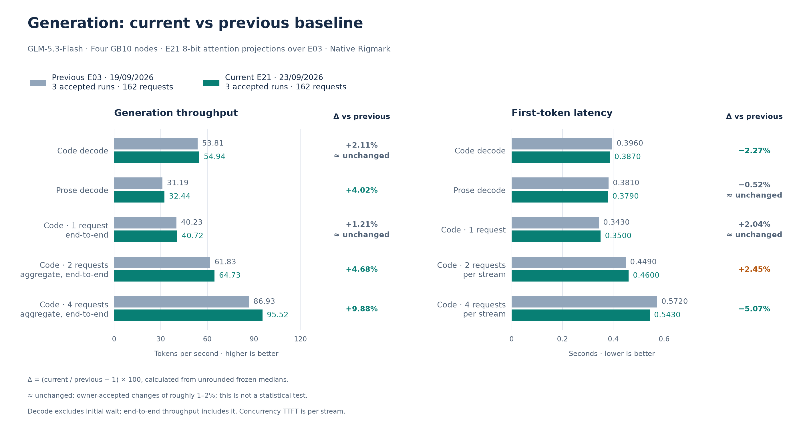
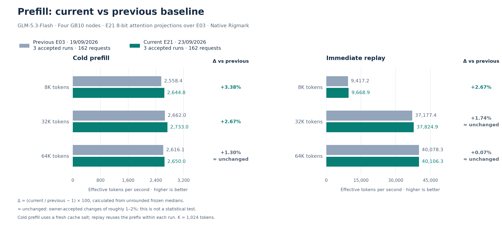

# September 23 accepted E21 reference: 8-bit residual attention projections

**Outcome: promote, accepted by the owner.** E21 extends the accepted E20 INT8 group-128
mechanism from the KDA input projection to the KDA output projection and the MLA output,
fused QKV-A and Q-B projections, 67 modules in total. The default IaC now encodes it. The
[promotion record](../../historical_benchmarks/baselines/2026-09-23-e21/promotion.json)
records how the default was applied to the running cluster.

The frozen performance reference uses **three complete native Rigmark suites, 162
requests**, measured on one retained candidate load after one coordinated transition; see
the [experiment report](../experiments/2026-09-23-e21-bf16-residue.md). Each suite
contributes its native per-run metric once; displayed values are their medians. No run
or metric block was excluded. The [previous E03 reference](2026-09-19-e03.md) remains
immutable at three suites / 162 requests.

No separate reproduction run was made after promotion, by owner decision. The encoded
default produces a launcher command identical, on all four ranks, to the measured
candidate, and the measured serving processes remained in service.

## Performance

Higher throughput and lower TTFT are better. Exact deltas use unrounded medians.
“≈ unchanged” is a presentation convention for changes of roughly 1–2%, not a
statistical test.

| Metric | Accepted current | Previous E03 | Change vs previous | Per run |
| --- | ---: | ---: | ---: | ---: |
| Code decode, one request | 54.945 tok/s | 53.809 tok/s | ≈ unchanged (+2.11%) | 55.318 / 54.945 / 53.819 |
| Code C1, end-to-end | 40.718 tok/s | 40.233 tok/s | ≈ unchanged (+1.21%) | 38.760 / 40.718 / 40.944 |
| Code C2, aggregate end-to-end | 64.726 tok/s | 61.834 tok/s | +4.68% | 64.269 / 64.726 / 66.066 |
| Code C4, aggregate end-to-end | 95.524 tok/s | 86.932 tok/s | +9.88% | 96.785 / 92.501 / 95.524 |
| Prose decode | 32.441 tok/s | 31.186 tok/s | +4.02% | 32.647 / 32.441 / 31.799 |
| Code TTFT | 0.3870 s | 0.3960 s | -2.27% | 0.387 / 0.407 / 0.387 |
| Prose TTFT | 0.3790 s | 0.3810 s | ≈ unchanged (-0.52%) | 0.379 / 0.380 / 0.377 |
| C1 per-stream TTFT | 0.3500 s | 0.3430 s | ≈ unchanged (+2.04%) | 0.350 / 0.392 / 0.338 |
| C2 per-stream TTFT | 0.4600 s | 0.4490 s | +2.45% | 0.460 / 0.443 / 0.461 |
| C4 per-stream TTFT | 0.5430 s | 0.5720 s | -5.07% | 0.655 / 0.543 / 0.524 |
| Prefill 8K, cold | 2,644.825 tok/s | 2,558.401 tok/s | +3.38% | 2,653.208 / 2,587.697 / 2,644.825 |
| Prefill 8K, replay | 9,668.860 tok/s | 9,417.164 tok/s | +2.67% | 9,527.941 / 9,692.828 / 9,668.860 |
| Prefill 32K, cold | 2,733.042 tok/s | 2,661.974 tok/s | +2.67% | 2,733.042 / 2,736.966 / 2,716.192 |
| Prefill 32K, replay | 37,824.884 tok/s | 37,177.429 tok/s | ≈ unchanged (+1.74%) | 37,824.884 / 34,351.789 / 37,929.218 |
| Prefill 64K, cold | 2,649.955 tok/s | 2,616.073 tok/s | ≈ unchanged (+1.30%) | 2,662.712 / 2,649.955 / 2,615.638 |
| Prefill 64K, replay | 40,106.337 tok/s | 40,078.253 tok/s | ≈ unchanged (+0.07%) | 40,106.337 / 40,007.301 / 40,178.996 |

Future experiments use this accepted reference.

## Variability and acceptance

C4 and C2 improved in every suite beyond the E03 run-to-run range: C4 is
**96.785 / 92.501 / 95.524 tok/s** against an E03 maximum of 88.889, and C2 is
**64.269 / 64.726 / 66.066 tok/s** against an E03 maximum of 62.272. Prose improved in
every suite as well.

C1 was **38.760 tok/s in run 1**, below the E03 range, and **40.718 and 40.944 tok/s** in
runs 2 and 3. This matches the C1 variability already recorded on this machine, whose
cause remains unisolated; the median does not regress.

The small per-stream TTFT increases at C1 and C2, 7 ms and 11 ms, stay within or at the
edge of the E03 dispersion. The owner accepts them alongside the concurrency gains.
Generated text differs from E03 because the converted weights change the arithmetic, so
per-request comparisons are confounded; suite medians are the unit of comparison.

## Integrity and memory

All **162/162 streams completed visibly** with DONE markers, and there were zero native,
protocol or runtime errors. Prose and structured gates pass **15/15**. The code gate is
**13/15**: two long code requests reached the 8,192-token output budget, a measured
output limit rather than a failure. Prefill token counts match **54/54**. Finish reasons
are **43 stop / 119 length**. Each suite made exactly 54 generation calls, with no
competing traffic. No generated-code quality audit was used as an acceptance gate.

| Rank | Minimum available GiB, run 1 | Run 2 | Run 3 |
| --- | ---: | ---: | ---: |
| 0 | 3.219 | 3.581 | 3.359 |
| 1 | 7.511 | 7.537 | 7.860 |
| 2 | 7.621 | 7.717 | 7.739 |
| 3 | 7.434 | 7.760 | 7.903 |

Every rank has more headroom than under E03; rank 0 rose from 2.26–2.36 GiB to
3.22–3.58 GiB. Converting about 1.18 GiB of BF16 weights per rank to 8-bit storage
frees memory, while the KV pool stays fixed. All 12 rank windows record zero GPU OOMs,
allocation retries and host OOM kills. These are sampled minima, not guaranteed headroom.

## Reproduction identity

- Everything in the [E03 reference](2026-09-19-e03.md#reproduction-identity), plus E21.
- E21 families per rank: KDA `o_proj` 34 × 4096×2048; MLA `o_proj` 11 × 4096×4096;
  MLA `fused_qkv_a_proj` 11 × 2048×4096; MLA `q_b_proj` 11 × 4096×1536.
- Boot signature `E21_BF16_RESIDUE_W8A16_READY`: 67 modules, layout `q_lora`,
  79,691,776 added scratch bytes, Marlin below 2,048 rows and BF16 scratch at or above it.
- Flag `VLLM_E21_BF16_RESIDUE_W8A16=1`; separate SparkCache namespace
  `sparkcache-e21-bf16-residue-20260923`.
- Engine-reported KV capacity unchanged at 1,344,328 tokens with 15 GiB per rank.
- The MLA projections are block FP8 in the checkpoint and are dequantized to BF16 on load
  by the vendor model code, so the 8-bit step is a second quantization. Before the window,
  a CPU check on real checkpoint weights measured relative weight error of 0.65–0.71%,
  the same order as E20.
- Rigmark source, prompts and explicit settings match the E03 reference; a fresh salt was
  used for each complete suite.

Rollback to E03 is one complete overlay: `TP4_ENV=scripts/node/reference/baseline-20260919-e03.env`.

[Current frozen values, source pins and native receipt hashes](../../historical_benchmarks/baselines/2026-09-23-e21/baseline.json).
[Owner acceptance](../../historical_benchmarks/experiments/2026-09-23-e21-bf16-residue/owner-decision.json).

