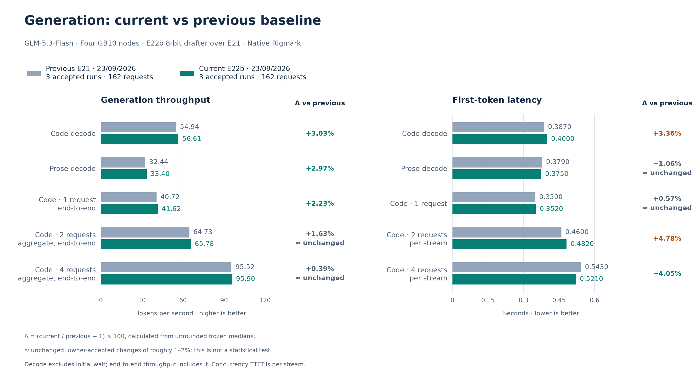
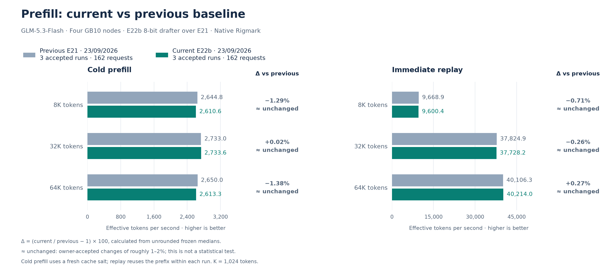

# September 23 accepted E22b reference: 8-bit weights for the DFlash2 drafter

**Outcome: promote, accepted by the owner.** E22b applies the accepted E20/E21 INT8
group-128 mechanism to 30 BF16 linears of the DFlash2 speculative drafter: in each of its
five layers the QKV, output, gate/up and down projections and the two grouped-convolution
kernel projections. The drafter's fused context K/V projection stays in BF16. The default
IaC now encodes it. The [promotion record](../../historical_benchmarks/baselines/2026-09-23-e22b/promotion.json)
records how the default was applied to the running cluster.

The frozen performance reference uses **three complete native Rigmark suites, 162
requests**, measured on one retained E22b load; see the
[experiment report](../experiments/2026-09-23-e22b-drafter-context-bf16.md). Each suite
contributes its native per-run metric once; displayed values are their medians. No run
or metric block was excluded. The [previous E21 reference](2026-09-23-e21.md) remains
immutable at three suites / 162 requests.

## Performance

Higher throughput and lower TTFT are better. Exact deltas use unrounded medians.
“≈ unchanged” is a presentation convention for changes of roughly 1–2%, not a
statistical test.

| Metric | Accepted current | Previous E21 | Change vs previous | Per run |
| --- | ---: | ---: | ---: | ---: |
| Code decode, one request | 56.611 tok/s | 54.945 tok/s | +3.03% | 56.793 / 56.376 / 56.611 |
| Code C1, end-to-end | 41.625 tok/s | 40.718 tok/s | +2.23% | 41.900 / 40.704 / 41.625 |
| Code C2, aggregate end-to-end | 65.780 tok/s | 64.726 tok/s | ≈ unchanged (+1.63%) | 64.676 / 66.832 / 65.780 |
| Code C4, aggregate end-to-end | 95.901 tok/s | 95.524 tok/s | ≈ unchanged (+0.39%) | 90.213 / 101.571 / 95.901 |
| Prose decode | 33.403 tok/s | 32.441 tok/s | +2.97% | 33.471 / 33.402 / 33.403 |
| Code TTFT | 0.4000 s | 0.3870 s | +3.36% | 0.400 / 0.387 / 0.403 |
| Prose TTFT | 0.3750 s | 0.3790 s | ≈ unchanged (-1.06%) | 0.375 / 0.373 / 0.376 |
| C1 per-stream TTFT | 0.3520 s | 0.3500 s | ≈ unchanged (+0.57%) | 0.384 / 0.340 / 0.352 |
| C2 per-stream TTFT | 0.4820 s | 0.4600 s | +4.78% | 0.639 / 0.440 / 0.482 |
| C4 per-stream TTFT | 0.5210 s | 0.5430 s | -4.05% | 0.753 / 0.521 / 0.519 |
| Prefill 8K, cold | 2,610.637 tok/s | 2,644.825 tok/s | ≈ unchanged (-1.29%) | 2,640.951 / 2,573.002 / 2,610.637 |
| Prefill 8K, replay | 9,600.375 tok/s | 9,668.860 tok/s | ≈ unchanged (-0.71%) | 9,600.375 / 9,843.350 / 9,585.177 |
| Prefill 32K, cold | 2,733.601 tok/s | 2,733.042 tok/s | ≈ unchanged (+0.02%) | 2,803.737 / 2,733.601 / 2,718.400 |
| Prefill 32K, replay | 37,728.202 tok/s | 37,824.884 tok/s | ≈ unchanged (-0.26%) | 38,129.593 / 36,844.348 / 37,728.202 |
| Prefill 64K, cold | 2,613.315 tok/s | 2,649.955 tok/s | ≈ unchanged (-1.38%) | 2,753.685 / 2,600.572 / 2,613.315 |
| Prefill 64K, replay | 40,214.030 tok/s | 40,106.337 tok/s | ≈ unchanged (+0.27%) | 40,472.809 / 40,214.030 / 39,290.592 |

Future experiments use this accepted reference.

## Variability and acceptance

Code decode, C1 and prose improved in every suite beyond the E21 maximum, apart from C1
run 2 at 40.704 tok/s, at the E21 median. C4 was 90.213 tok/s in run 1, below the E21
range, and 101.571 and 95.901 tok/s in runs 2 and 3; its median is unchanged.

First-token times of concurrent requests are quantized in engine-step units, about 50 ms,
in every variant: in a round one stream starts at once and the others wait one or more
steps. Run 1 caught the later steps at C2 and C4 (0.639 s and 0.753 s); runs 2 and 3 were
at or below E21. The C2 per-stream TTFT median of +4.78% comes from that spread, and the
owner accepts it alongside the throughput gains. The 64K cold prefill median is 3 tok/s
below the E21 minimum; the other runs were above it.

The drafter accepted 0.621, 0.611 and 0.611 of its drafted tokens per suite, compared
with 0.634, 0.638 and 0.616 for E21. Generated tokens remain those of the target model;
suite medians are the unit of comparison.

## Matched first-token and prefill probes

The first candidate, E22, also converted the context K/V projection. Its suites showed a
higher C1 per-stream TTFT and a slower 8K cold prefill. Identical native probes, 30 C1
rounds and 10 cold/replay 8K pairs, were run on E22, on E21 after one transition and on
E22b after a second:

| Probe | E21 | E22 | E22b |
| --- | ---: | ---: | ---: |
| C1 TTFT median / mean | 0.404 / 0.395 s | 0.394 / 0.392 s | 0.387 / 0.377 s |
| C1 rounds on the later step | 26/30 | 25/30 | 21/30 |
| 8K cold prefill median | 2,650.4 tok/s | 2,571.5 tok/s | 2,639.5 tok/s |
| 8K cold on the slower TTFT step | 2/10 | 7/10 | 5/10 |

The C1 TTFT difference was sampling, not an E22 cost; the 8K cold loss was real and came
from the converted context K/V projection. [Probe extract](../../historical_benchmarks/experiments/2026-09-23-e22b-drafter-context-bf16/matched-probes.json).

## Integrity and memory

All **162/162 streams completed visibly** with DONE markers, and there were zero native,
protocol or runtime errors. Code, prose and structured gates pass **15/15** each; no code
request reached the output budget. Prefill token counts match **54/54**. Finish reasons
are **45 stop / 117 length**. Each suite made exactly 54 generation calls, with no
competing traffic.

| Rank | Minimum available GiB, run 1 | Run 2 | Run 3 |
| --- | ---: | ---: | ---: |
| 0 | 3.241 | 3.541 | 3.571 |
| 1 | 7.390 | 7.780 | 8.013 |
| 2 | 7.581 | 8.213 | 7.855 |
| 3 | 7.469 | 7.884 | 7.443 |

Converting the drafter reduces its weights from 540 MiB to 274 MiB per rank; the KV pool
stays fixed. All 12 rank windows record zero GPU OOMs, allocation retries and host OOM
kills. These are sampled minima, not guaranteed headroom.

## Reproduction identity

- Everything in the [E21 reference](2026-09-23-e21.md#reproduction-identity), plus E22b.
- Converted drafter linears per rank: `qkv_proj` 5 × 1536×4096, `o_proj` 5 × 4096×1024,
  `gate_up_proj` 5 × 6144×4096, `down_proj` 5 × 4096×3072, `kernel_projection`
  10 × 1024×4096; always native Marlin W8A16, no scratch.
- Boot signature `E22_DRAFTER_W8A16_READY`: 30 modules, five families,
  `context_kv_w8a16` false, 0 added scratch bytes.
- Flags `VLLM_E22_DRAFTER_W8A16=1` and `VLLM_E22_CONTEXT_KV_W8A16=0`; separate SparkCache
  namespace `sparkcache-e22b-drafter-context-bf16-20260923`.
- The drafter override is the serving image's `qwen3_dflash2.py` byte for byte plus one
  appended, flag-gated load hook.
- Rigmark source, prompts and explicit settings match the E21 reference; a fresh salt was
  used for each complete suite.

Rollback to E21 is one complete overlay: `TP4_ENV=scripts/node/reference/baseline-20260923-e21.env`.

[Current frozen values, source pins and native receipt hashes](../../historical_benchmarks/baselines/2026-09-23-e22b/baseline.json).
[Owner acceptance](../../historical_benchmarks/experiments/2026-09-23-e22b-drafter-context-bf16/owner-decision.json).

