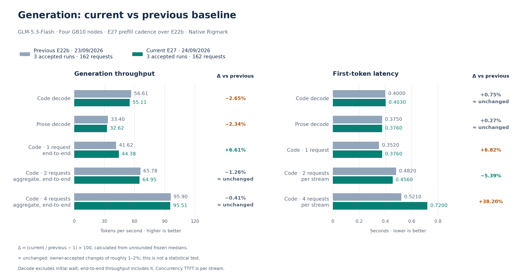
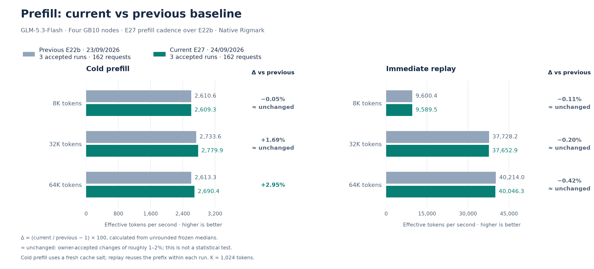

# September 24 accepted E27 reference: decode-only steps while another request prefills

**Outcome: promote, accepted by the owner.** E27 adds the serving image's native
`--prefill-schedule-interval 8` to the E22b recipe.

- While requests are in decode, the engine admits prefill work on one step in eight. The
  steps in between are decode-only.
- A prefill with no running decode is unchanged.
- The engine also stops deferring prefill while requests wait in the queue, so several long
  contexts that arrive together behave as on E22b.

Weights, answers and the SparkCache namespace are the E22b ones. The default IaC now encodes
E27. The [promotion record](../../historical_benchmarks/baselines/2026-09-24-e27/promotion.json)
records how it was applied.

The frozen performance reference uses **three complete native Rigmark suites, 162
requests**, measured on one retained E27 load. Two same-day control suites of E22b,
108 requests over the same client path, make the comparison of small effects fair. See the
[experiment report](../experiments/2026-09-24-e27-prefill-interval.md). No run or metric
block was excluded. The [previous E22b reference](2026-09-23-e22b.md) remains immutable.

## What E27 changes

With E22b, a client that sends a long cold prompt blocks everyone already generating. Each
engine step that carries a prefill chunk of up to 8,192 tokens lasts about 2.5 s, so
running requests advance only once per chunk. Rigmark's standard concurrency levels start
every stream together and do not show this. A new optional Rigmark phase does: it measures
running requests' decode while another request cold-prefills.

| Arriving cold prefill | Running decoders | Decode before | Decode during, E22b → E27 | Longest pause during | Arriving TTFT, E22b → E27 | Arriving prefill rate |
| --- | ---: | ---: | ---: | ---: | ---: | ---: |
| 8K | 1 | 43 → 43 tok/s | 2.2 → **11.5** tok/s (×5.2) | 2.64 → 2.64 s | 3.62 → 4.70 s (+30%) | 2,266 → 1,744 tok/s |
| 8K | 3 | 24 → 25 tok/s | 2.1 → **6.1** tok/s (×2.9) | 2.66 → 2.66 s | 3.77 → 4.96 s (+31%) | 2,172 → 1,653 tok/s |
| 32K | 1 | 44 → 42 tok/s | 1.6 → **8.7** tok/s (×5.4) | 3.09 → 2.65 s | 14.17 → 16.29 s (+15%) | 2,312 → 2,012 tok/s |
| 32K | 3 | 27 → 27 tok/s | 1.4 → **7.0** tok/s (×5.1) | 3.05 → 2.66 s | 13.92 → 19.06 s (+37%) | 2,354 → 1,719 tok/s |

Values are medians of three runs per cell, both variants measured on the same day with the
same client.

- Running requests keep generating 3–5× faster while another client loads a long context.
- The arriving request pays 15–37% more time to its first token, and only while others
  decode.
- The longest pause between updates stays about 2.65 s: a prefill step still carries a
  full chunk.
- When four 32K contexts arrive together, per-stream decode and TTFT match E22b, because
  the cadence is not applied while requests wait.

## Performance

Higher throughput and lower TTFT are better. Exact deltas use unrounded medians.
“≈ unchanged” is a presentation convention for changes under 2%, not a statistical test.

The E27 suites and the same-day control reached the rank-0 API over direct LAN HTTP. The
E22b reference used an SSH tunnel over a direct Tailscale path. For effects of a few
percent, compare with the same-day control column.

| Metric | Accepted current | Previous E22b | Change vs previous | Same-day LAN control | Change vs control | Per run |
| --- | ---: | ---: | ---: | ---: | ---: | ---: |
| Code decode, one request | 55.108 tok/s | 56.611 tok/s | -2.65% | 56.149 tok/s | ≈ unchanged (-1.85%) | 54.678 / 55.665 / 55.108 |
| Code C1, end-to-end | 44.377 tok/s | 41.625 tok/s | +6.61% | 42.942 tok/s | +3.34% | 43.168 / 45.251 / 44.377 |
| Code C2, aggregate end-to-end | 64.954 tok/s | 65.780 tok/s | ≈ unchanged (-1.26%) | 63.947 tok/s | ≈ unchanged (+1.57%) | 62.055 / 66.588 / 64.954 |
| Code C4, aggregate end-to-end | 95.507 tok/s | 95.901 tok/s | ≈ unchanged (-0.41%) | 98.735 tok/s | -3.27% | 96.073 / 89.909 / 95.507 |
| Prose decode | 32.623 tok/s | 33.403 tok/s | -2.34% | 33.373 tok/s | -2.25% | 33.277 / 32.486 / 32.623 |
| Code TTFT | 0.4030 s | 0.4000 s | ≈ unchanged (+0.75%) | 0.3895 s | +3.47% | 0.386 / 0.406 / 0.403 |
| Prose TTFT | 0.3760 s | 0.3750 s | ≈ unchanged (+0.27%) | 0.3735 s | ≈ unchanged (+0.67%) | 0.375 / 0.376 / 0.376 |
| C1 per-stream TTFT | 0.3760 s | 0.3520 s | +6.82% | 0.3650 s | +3.01% | 0.389 / 0.376 / 0.337 |
| C2 per-stream TTFT | 0.4560 s | 0.4820 s | -5.39% | 0.4625 s | ≈ unchanged (-1.41%) | 0.456 / 0.451 / 0.468 |
| C4 per-stream TTFT | 0.7200 s | 0.5210 s | +38.20% | 0.5330 s | +35.08% | 0.544 / 0.751 / 0.720 |
| Prefill 8K, cold | 2,609.345 tok/s | 2,610.637 tok/s | ≈ unchanged (-0.05%) | 2,648.264 tok/s | ≈ unchanged (-1.47%) | 2,609.345 / 2,616.943 / 2,479.402 |
| Prefill 8K, replay | 9,589.485 tok/s | 9,600.375 tok/s | ≈ unchanged (-0.11%) | 9,533.552 tok/s | ≈ unchanged (+0.59%) | 9,538.703 / 9,589.485 / 9,589.553 |
| Prefill 32K, cold | 2,779.897 tok/s | 2,733.601 tok/s | ≈ unchanged (+1.69%) | 2,728.622 tok/s | ≈ unchanged (+1.88%) | 2,779.897 / 2,719.255 / 2,782.534 |
| Prefill 32K, replay | 37,652.856 tok/s | 37,728.202 tok/s | ≈ unchanged (-0.20%) | 36,830.849 tok/s | +2.23% | 37,652.856 / 36,479.984 / 38,073.062 |
| Prefill 64K, cold | 2,690.397 tok/s | 2,613.315 tok/s | +2.95% | 2,645.719 tok/s | ≈ unchanged (+1.69%) | 2,690.397 / 2,644.246 / 2,701.644 |
| Prefill 64K, replay | 40,046.294 tok/s | 40,214.030 tok/s | ≈ unchanged (-0.42%) | 39,884.614 tok/s | ≈ unchanged (+0.41%) | 40,625.626 / 40,046.294 / 39,886.723 |

Future experiments use this accepted reference.

## Costs the owner accepted

- **C4 per-stream TTFT rose 35% against the same-day control, and C4 aggregate throughput
  fell 3.3%.** C4 streams start together. When one of them starts decoding before another
  has been admitted, the latecomer's short prefill waits for the cadence.
- **The arriving request's TTFT rose 15–37% in the interference phase** (table above).
- Code and prose decode are about 2% below the same-day control. With a single request
  there is nothing to defer, so this may be run-to-run variation. It is recorded, not
  explained.
- The C1 and TTFT differences against the frozen E22b medians mostly reflect the client
  path. The same-day control is closer.

A follow-up, E27b, would apply the cadence only to prefills with at least 2,048 remaining
tokens. That would keep short concurrent prompts, such as those in C2 and C4, out of the
deferral.

## Integrity

All **162/162 streams completed visibly** with DONE markers, and there were zero native,
protocol or runtime errors. Code, prose and structured gates pass **15/15** each; no code
request reached the output budget. Prefill token counts match **54/54**. Finish reasons are
**45 stop / 117 length**. The client path lost no probe in any suite: about 1,700
one-second pings. Both post-boot gates passed 3.2 s after `/health` 200. The two control
suites had 108/108 streams and zero errors. Both interference receipts validate with zero
receipt errors.

Host memory observers were not run in this window. E27 changes scheduling only and
allocates no memory; engine logs show no OOM or allocation retry.

## Reproduction identity

- Everything in the [E22b reference](2026-09-23-e22b.md#reproduction-identity), plus the
  engine argument `--prefill-schedule-interval 8`.
- `scripts/check-f0.py` checks the argument in the effective recipe and in every rank's
  running command; records before E27 require its absence.
- The standard suites use the frozen Rigmark source (`e0e92cff…`, the E22b one), prompts
  and settings, with a fresh salt for each suite.
- The interference phase uses a local Rigmark extension (`--interference-depths`) on the
  same revision; its source hash is recorded in the interference extract.

Rollback to E22b is one complete overlay: `TP4_ENV=scripts/node/reference/baseline-20260924-e22b.env`.

[Current frozen values, source pins and native receipt hashes](../../historical_benchmarks/baselines/2026-09-24-e27/baseline.json).
[Owner acceptance](../../historical_benchmarks/experiments/2026-09-24-e27-prefill-interval/owner-decision.json).
[Interference extract](../../historical_benchmarks/experiments/2026-09-24-e27-prefill-interval/interference.json).

