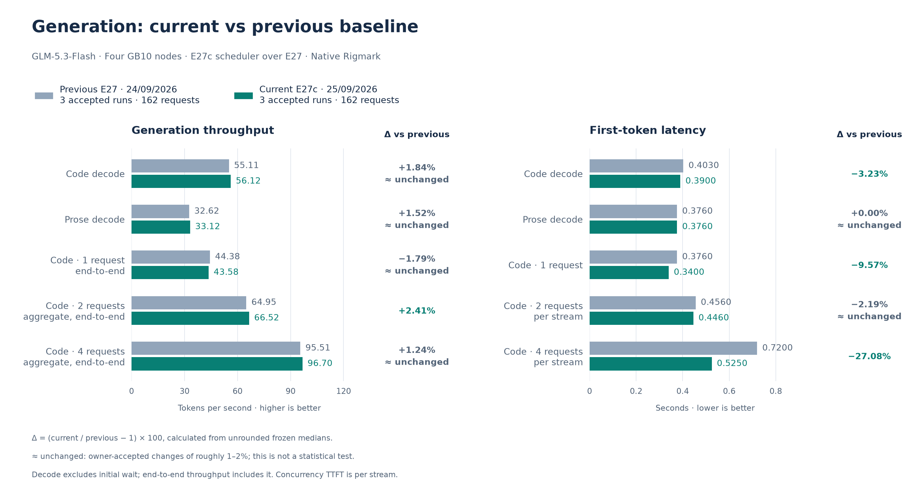
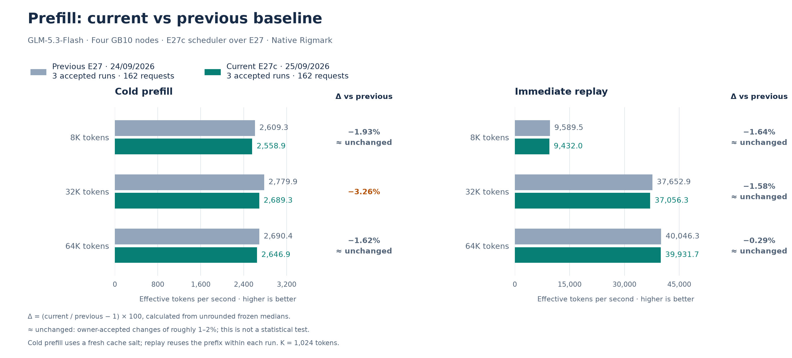

# September 25 accepted E27c reference: long prefills paced, short ones admitted

**Outcome: promote, accepted by the owner.** E27c keeps E27's native
`--prefill-schedule-interval 8` and mounts a patched copy of the serving image's scheduler:

**Superseded on September 25, 2026** by the [E28b reference](2026-09-25-e28b.md), which drafts seven
tokens for a single request and uses a 16 GiB KV pool.

- **Short prefills pass at once.** While requests decode, a prefill with fewer than 2,048
  tokens left to compute is admitted on any step, up to 2,048 such tokens per step. Longer
  prefills still run on one engine step in eight. This part was measured first as
  [E27b](../experiments/2026-09-24-e27b-long-prefill-cadence.md).
- **The cadence stays on while requests are queued.** The image's scheduler switched the
  cadence off whenever requests were left waiting, so several long contexts arriving
  together stalled the first stream again. E27c keeps deferring long prefills in that case.

Weights, the drafter and the SparkCache namespace are the E22b ones. Different batching can
change answers slightly, as with any scheduling change. The default IaC now encodes E27c.
The [promotion record](../../historical_benchmarks/baselines/2026-09-25-e27c/promotion.json)
records how it was applied: the measured load was still serving, so the default was
deployed without a restart and the live identity check passed.

The frozen performance reference uses **three complete native Rigmark suites, 162
requests**, measured on one retained E27c load over the same direct LAN client path as
E27. See the [experiment report](../experiments/2026-09-25-e27c-queued-cadence.md). No run
or metric block was excluded. The [previous E27 reference](2026-09-24-e27.md) remains
immutable.

## Several long contexts arriving together

The same private diagnostic as for E27 sends four cold 32K prompts at once, twice. Streams
are listed in the order in which they reach their first token.

| | 1st stream | 2nd | 3rd | 4th |
| --- | ---: | ---: | ---: | ---: |
| Decode, E27 | 6.2 tok/s | 9.1 | 15.0–15.3 | 56–57 |
| Decode, E27b | 6.1–6.2 | 9.0–9.1 | 14.7–15.0 | 52–54 |
| Decode, **E27c** | **11.3–12.5** | **10.9–11.0** | 14.8–15.0 | 68–72 |
| First token, E27 | 15–16 s | 29–30 s | 41 s | 55 s |
| First token, E27c | 16–18 s | 29–31 s | 43–44 s | 58–60 s |

- The first stream now decodes about twice as fast while the other three prefill; the last
  prompt reaches its first token about 7% later.
- The first stream stays near 12 tok/s: each cadence cycle still holds one prefill step of
  up to 8,192 tokens, about 2.6 s, against seven decode-only steps of a few tens of
  milliseconds. Smaller prefill chunks while others decode are the next lever.

## One prompt arriving while agents generate

The Rigmark interference phase, protocol 2, measured E27, E27b and E27c on the same client.
Medians of three runs per cell.

| Arriving prompt | Agents | Its first token, E27 → E27c | Agents' longest pause | Agents' net delay |
| --- | ---: | ---: | ---: | ---: |
| 1K | 1 | 1.28 → **0.78** s | 0.66 → 0.66 s | 0.82 → 0.59 s |
| 1K | 3 | 1.98 → **0.91** s | 0.68 → 0.67 s | 0.64 → 0.73 s |
| 8K | 1 | 4.24 → 3.80 s | 2.65 → 2.73 s | 3.49 → 3.48 s |
| 8K | 3 | 5.79 → **3.74** s | 2.66 → 2.66 s | 3.19 → 3.09 s |
| 32K | 1 | 16.0 → 16.0 s | 2.65 → 2.94 s | 12.9 → 13.3 s |
| 32K | 3 | 18.6 → 18.4 s | 2.66 → 2.97 s | 12.9 → 13.0 s |

- Short and medium prompts no longer wait for the cadence.
- During a 32K prefill the agents keep generating at about 6–8 tok/s, as with E27; with
  the image's scheduler alone (E22b) they fell to about 1.5 tok/s.
- The net delay is the time by which an agent finishes later because of the arriving
  prompt. It is about the same for every variant: the cadence spreads the prefill cost
  so that streams keep moving, it does not remove it.
- The longest pause at 32K rose from 2.65 to about 2.95 s in this single series; it is
  recorded, not explained.

## Performance

Higher throughput and lower TTFT are better. Exact deltas use unrounded medians.
“≈ unchanged” is a presentation convention for changes of roughly 1–2%, not a
statistical test.

| Metric | Accepted current | Previous E27 | Change vs previous | Per run |
| --- | ---: | ---: | ---: | ---: |
| Code decode, one request | 56.124 tok/s | 55.108 tok/s | ≈ unchanged (+1.84%) | 54.824 / 57.287 / 56.124 |
| Code C1, end-to-end | 43.581 tok/s | 44.377 tok/s | ≈ unchanged (-1.79%) | 43.039 / 43.581 / 44.380 |
| Code C2, aggregate end-to-end | 66.520 tok/s | 64.954 tok/s | +2.41% | 68.265 / 66.520 / 65.083 |
| Code C4, aggregate end-to-end | 96.696 tok/s | 95.507 tok/s | ≈ unchanged (+1.24%) | 96.700 / 94.084 / 96.696 |
| Prose decode | 33.120 tok/s | 32.623 tok/s | ≈ unchanged (+1.52%) | 33.662 / 33.104 / 33.120 |
| Code TTFT | 0.3900 s | 0.4030 s | -3.23% | 0.390 / 0.386 / 0.402 |
| Prose TTFT | 0.3760 s | 0.3760 s | ≈ unchanged (+0.00%) | 0.376 / 0.376 / 0.377 |
| C1 per-stream TTFT | 0.3400 s | 0.3760 s | -9.57% | 0.340 / 0.337 / 0.340 |
| C2 per-stream TTFT | 0.4460 s | 0.4560 s | ≈ unchanged (-2.19%) | 0.460 / 0.446 / 0.446 |
| C4 per-stream TTFT | 0.5250 s | 0.7200 s | -27.08% | 0.525 / 0.592 / 0.520 |
| Prefill 8K, cold | 2,558.895 tok/s | 2,609.345 tok/s | ≈ unchanged (-1.93%) | 2,602.898 / 2,546.988 / 2,558.895 |
| Prefill 8K, replay | 9,431.975 tok/s | 9,589.485 tok/s | ≈ unchanged (-1.64%) | 9,353.221 / 9,431.975 / 9,493.590 |
| Prefill 32K, cold | 2,689.310 tok/s | 2,779.897 tok/s | -3.26% | 2,689.310 / 2,662.879 / 2,730.835 |
| Prefill 32K, replay | 37,056.262 tok/s | 37,652.856 tok/s | ≈ unchanged (-1.58%) | 36,702.756 / 37,056.262 / 37,317.912 |
| Prefill 64K, cold | 2,646.928 tok/s | 2,690.397 tok/s | ≈ unchanged (-1.62%) | 2,646.928 / 2,640.063 / 2,671.680 |
| Prefill 64K, replay | 39,931.684 tok/s | 40,046.294 tok/s | ≈ unchanged (-0.29%) | 40,004.175 / 39,654.356 / 39,931.684 |

Future experiments use this accepted reference.

## Costs the owner accepted

- **Cold prefill and replay are 0.3–3.3% below the E27 medians.** No request decodes in
  the prefill phase, so E27b and E27c run identical code there; the spread between those
  two loads (up to 2.9% on 8K cold prefill) is of the same size. The owner accepted them as
  load-to-load variation.
- **Queued long prompts start later** when others decode: about +7% for the last of four
  32K prompts.
- C1 end-to-end is −1.8% against E27 and +1.5% against the same-day E22b control of
  September 24.

## Integrity

All **162/162 streams completed visibly** with DONE markers, and there were zero native,
protocol or runtime errors. Prose and structured gates pass **15/15**; the code gate passes
**14/15**, because one code answer reached the 8,192-token output budget, a measured output
limit rather than a service failure. Prefill token counts match **54/54**. Finish reasons
are **44 stop / 118 length**. The client path lost no probe in any suite. Both post-boot
gates passed 3.2 s after `/health` 200. All interference receipts validate with zero
receipt errors.

Host memory observers were not run in this window. The scheduler adds no weights or
buffers; batching changes can alter KV residency, which was not measured. Engine logs show
no OOM or allocation retry, and the boot reported the E27 KV capacity, 1,344,328 tokens.

## Reproduction identity

- Everything in the [E27 reference](2026-09-24-e27.md#reproduction-identity), plus the
  scheduler mount `experiments/e03/queued-cadence/scheduler.py` over
  `vllm/v1/core/sched/scheduler.py`, `VLLM_E27B_SHORT_PREFILL_TOKENS=2048` and
  `VLLM_E27C_CADENCE_WHEN_QUEUED=1`.
- The scheduler is the image's file plus one reviewed patch of its two prefill-deferral
  gates and the capacity-latch condition; the [candidate README](../../../scripts/node/experiments/e03/queued-cadence/README.md)
  describes it and its offline test rebuilds the vendor file from the patch.
- At startup rank 0 logs `E27C_CADENCE_WHEN_QUEUED_READY interval=8` and
  `E27B_SHORT_PREFILL_READY tokens=2048 interval=8`. `scripts/check-f0.py` checks both,
  the flags and the scheduler hash on every rank; records before E27c require the flags'
  absence.
- The standard suites use the frozen Rigmark source (`e0e92cff…`), prompts and settings,
  with a fresh salt for each suite. The interference phase uses the corrected local
  Rigmark extension (protocol 2); its source hash is recorded in the interference extract.

Rollback to E27 is one complete overlay: `TP4_ENV=scripts/node/reference/baseline-20260924-e27.env`.

[Current frozen values, source pins and native receipt hashes](../../historical_benchmarks/baselines/2026-09-25-e27c/baseline.json).
[Owner acceptance](../../historical_benchmarks/experiments/2026-09-25-e27c-queued-cadence/owner-decision.json).
[Interference extract](../../historical_benchmarks/experiments/2026-09-25-e27c-queued-cadence/interference.json).
[Four-context diagnostic](../../historical_benchmarks/experiments/2026-09-25-e27c-queued-cadence/long-context-diagnostic.json).

