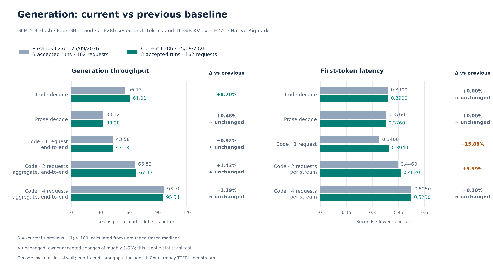
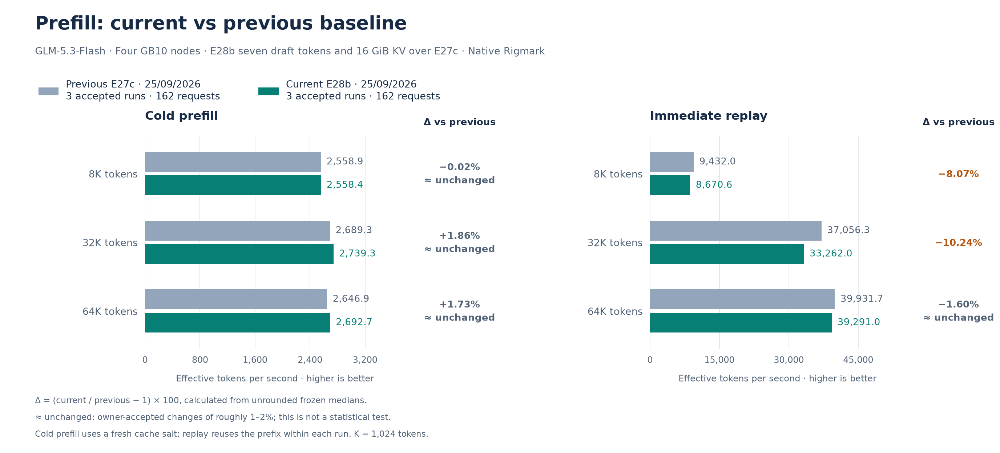

# September 25 accepted E28b reference: seven draft tokens and a 16 GiB KV pool

**Outcome: promote, accepted by the owner.** E28b changes two settings of the E27c recipe:

**Superseded on September 25, 2026** by the [E29 reference](2026-09-25-e29.md), which stops
queuing a speculative step past a possible length finish and coalesces requests arriving
together at an idle engine.

- **Seven draft tokens for a single request.** The DFlash2 drafter is trained with blocks
  of eight positions, but earlier recipes let it propose only five tokens per step. E28b
  sets `SPEC_TOKENS=7`, the per-batch table `[[1,1,7],[2,6,3]]` and
  `VLLM_ADAPTIVE_K_HI=7`. Batches of 2–6 keep three tokens, and the adaptive low state keeps
  three. `--compilation-config={"max_cudagraph_capture_size":72}` keeps the E27c CUDA graph
  set. This part was measured first as [E28](../experiments/2026-09-25-e28-draft-depth-7.md).
- **KV pool of 16 GiB per rank instead of 15.** Seven draft tokens hold about 5% fewer KV
  tokens per GiB; the larger pool restores room for five agents at the full context. This
  was measured as [E28b](../experiments/2026-09-25-e28b-kv16.md).

Weights, the drafter and the SparkCache namespace are unchanged, and every draft token is
verified by the target. The default IaC now encodes E28b. The
[promotion record](../../historical_benchmarks/baselines/2026-09-25-e28b/promotion.json)
records how it was applied: the measured load was still serving, so the default was
deployed without a restart and the live identity check passed.

The frozen performance reference uses **three complete native Rigmark suites, 162
requests**, measured on one retained E28b load over direct LAN HTTP, like E27c. No run or
metric block was excluded. The [previous E27c reference](2026-09-25-e27c.md) remains
immutable.

## Tokens per verification step

A private probe sent one request at a time with Rigmark's prompts and read the server's
speculative-decoding counters before and after each request.

| Request | Tokens per step, E27c → E28 | Decode, E27c → E28 |
| --- | ---: | ---: |
| Code | 4.09–4.84 → **4.81–5.04** | 55.30–62.61 → 61.58–63.54 tok/s |
| Structured | 5.88 → **7.77** | 72.25–73.60 → 91.30–91.66 tok/s |
| Prose | 1.94–1.96 → **1.95–1.96** | 32.64–32.91 → 32.86–33.17 tok/s |
| Code, thinking on | 3.36 → **4.23** | 46.16 → 56.95 tok/s |
| Prose, thinking on | 3.32 → **3.36** | 49.84 → 51.14 tok/s |

- Code and structured output accept the sixth and seventh token often: structured output
  reaches 7.8 tokens per step.
- Prose without thinking stays at three draft tokens and does not change.
- With thinking on, as in interactive agent clients, reasoning about code gains the most.
  Those are single requests whose content varies, so the figures indicate a direction.

## KV capacity and memory

| | E27c | E28 (15 GiB) | **E28b (16 GiB)** |
| --- | ---: | ---: | ---: |
| KV tokens | 1,344,328 | 1,278,751 | **1,365,066** |
| Full 262,144-token contexts | 5.13 | 4.88 | **5.21** |

Five agents at the full context need 1,310,720 tokens, which fit in E28b with about 54,000
tokens to spare. MemAvailable was sampled once per second on every rank during the three
suites:

| Rank | Minimum | Median |
| --- | ---: | ---: |
| 0 | 2.12 GiB | 3.52 GiB |
| 1 | 6.05 GiB | 8.03 GiB |
| 2 | 6.44 GiB | 8.10 GiB |
| 3 | 6.09 GiB | 7.64 GiB |

Rank 0 also runs the API server and engine core, so it keeps the smallest margin. `earlyoom`
on the nodes acts below 0.5 GiB. The earlier 16 GiB failure on September 19 ran six parallel
agents on a larger memory footprint. The engine logs show no OOM or allocation retry.

## Performance

Higher throughput and lower TTFT are better. Exact deltas use unrounded medians.
“≈ unchanged” is a presentation convention for changes of roughly 1–2%, not a
statistical test.

| Metric | Accepted current | Previous E27c | Change vs previous | Per run |
| --- | ---: | ---: | ---: | ---: |
| Code decode, one request | 61.008 tok/s | 56.124 tok/s | +8.70% | 62.633 / 61.008 / 59.344 |
| Code C1, end-to-end | 43.179 tok/s | 43.581 tok/s | ≈ unchanged (-0.92%) | 42.485 / 44.257 / 43.179 |
| Code C2, aggregate end-to-end | 67.470 tok/s | 66.520 tok/s | ≈ unchanged (+1.43%) | 66.577 / 67.470 / 69.311 |
| Code C4, aggregate end-to-end | 95.541 tok/s | 96.696 tok/s | ≈ unchanged (-1.19%) | 93.640 / 97.442 (run 1 excluded) |
| Prose decode | 33.280 tok/s | 33.120 tok/s | ≈ unchanged (+0.48%) | 33.809 / 33.111 / 33.280 |
| Code TTFT | 0.3900 s | 0.3900 s | ≈ unchanged (+0.00%) | 0.386 / 0.390 / 0.401 |
| Prose TTFT | 0.3760 s | 0.3760 s | ≈ unchanged (+0.00%) | 0.376 / 0.375 / 0.378 |
| C1 per-stream TTFT | 0.3940 s | 0.3400 s | +15.88% | 0.409 / 0.394 / 0.390 |
| C2 per-stream TTFT | 0.4620 s | 0.4460 s | +3.59% | 0.462 / 0.468 / 0.448 |
| C4 per-stream TTFT | 0.5230 s | 0.5250 s | ≈ unchanged (-0.38%) | 0.525 / 0.521 (run 1 excluded) |
| Prefill 8K, cold | 2,558.395 tok/s | 2,558.895 tok/s | ≈ unchanged (-0.02%) | 2,592.683 / 2,524.306 / 2,558.395 |
| Prefill 8K, replay | 8,670.646 tok/s | 9,431.975 tok/s | -8.07% | 8,564.102 / 8,783.724 / 8,670.646 |
| Prefill 32K, cold | 2,739.303 tok/s | 2,689.310 tok/s | ≈ unchanged (+1.86%) | 2,785.522 / 2,737.134 / 2,739.303 |
| Prefill 32K, replay | 33,262.007 tok/s | 37,056.262 tok/s | -10.24% | 32,152.031 / 33,262.007 / 34,480.037 |
| Prefill 64K, cold | 2,692.740 tok/s | 2,646.928 tok/s | ≈ unchanged (+1.73%) | 2,692.740 / 2,703.217 / 2,642.957 |
| Prefill 64K, replay | 39,290.992 tok/s | 39,931.684 tok/s | ≈ unchanged (-1.60%) | 39,290.992 / 39,331.834 / 38,941.122 |

Future experiments use this accepted reference.

## Costs the owner accepted

- **A single short request starts later:** C1 per-stream TTFT +15.9%, about +54 ms, and
  short 256-token answers do not decode faster (C1 end-to-end −0.9%).
- **Cached replay is slower:** −8.1% at 8K and −10.2% at 32K, about 0.1 s per request. The
  cause was not identified.
- **C4, suite 1 excluded:** in suite 1 all three C4 rounds started staggered: one stream
  first, the other three 0.5–0.9 s later (aggregate 93.5 tok/s, per-stream TTFT 0.867 s).
  By owner decision the two C4 medians use suites 2–3; the excluded values stay in the frozen
  record. Staggered rounds are an intermittent scheduling behaviour that also appears on
  E27c (3 of 9 rounds, kept in its medians) and once in E28b suite 2.

## Integrity

All **162/162 streams completed visibly** with DONE markers, with zero native, protocol or
runtime errors. Code, prose and structured gates pass **15/15** each. Prefill token counts
match **54/54**. The client path lost no probe. Both post-boot gates passed 3.5 s after
`/health` 200.

## Reproduction identity

- Everything in the [E27c reference](2026-09-25-e27c.md#reproduction-identity), plus
  `SPEC_TOKENS=7`, the table `[[1,1,7],[2,6,3]]`, `VLLM_ADAPTIVE_K_HI=7`,
  `--compilation-config={"max_cudagraph_capture_size":72}` and
  `--kv-cache-memory-bytes=17179869184`.
- At startup the engine reports `num_spec_tokens=7`, capture sizes ending at 72,
  `engine_k=7` in the draft-budget line and `GPU KV cache size: 1,365,066 tokens`.
  `scripts/check-f0.py` checks the draft settings, the graph limit and the KV budget on every
  rank.
- The standard suites use the frozen Rigmark source (`e0e92cff…`), prompts and settings,
  with a fresh salt for each suite.

Rollback to E27c is one complete overlay: `TP4_ENV=scripts/node/reference/baseline-20260925-e27c.env`.

[Current frozen values, source pins and native receipt hashes](../../historical_benchmarks/baselines/2026-09-25-e28b/baseline.json).
[Owner acceptance](../../historical_benchmarks/experiments/2026-09-25-e28b-kv16/owner-decision.json).
[Acceptance probes](../../historical_benchmarks/experiments/2026-09-25-e28-draft-depth-7/acceptance-probes.json).
[Host memory samples](../../historical_benchmarks/experiments/2026-09-25-e28b-kv16/host-memory.json).

