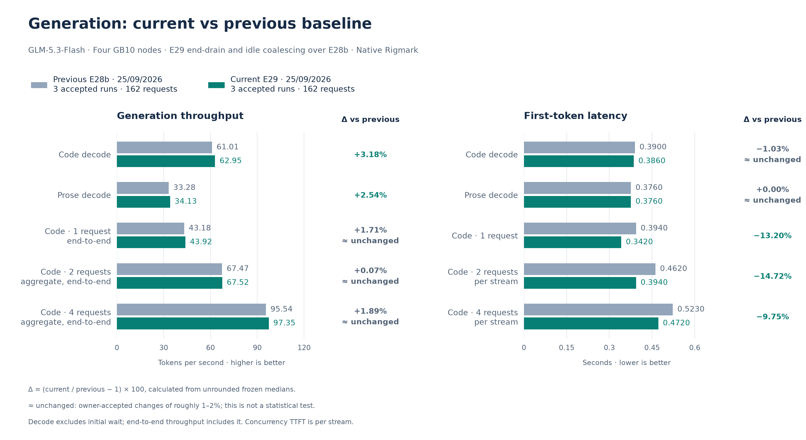
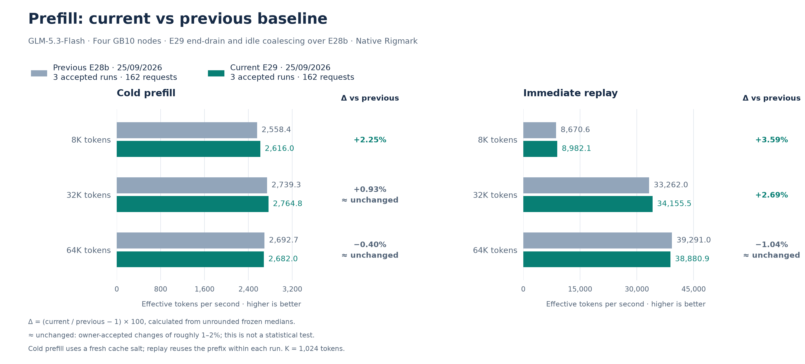

# September 25 accepted E29 reference: no speculative step past a possible length finish

**Outcome: promote, accepted by the owner.** E29 keeps the E28b recipe and changes only
request boundaries. The target and drafter, the seven draft tokens and the KV pool are
unchanged:

- **Hold near the length limit (`VLLM_E29_END_DRAIN=1`).** With asynchronous scheduling
  the engine queues a request's next step before the output of the step in flight has
  returned. The vendor guard skips that step only when a single token is missing. With seven
  drafts, a request limited by `max_tokens` therefore usually finished inside a step that
  could produce several tokens. The step queued behind it verified drafts for a finished
  request, and a request arriving right after waited for it. The E29 scheduler does not queue
  another step while the step in flight may finish the request, and resumes it if tokens are
  still missing. Structured-output requests keep the vendor pipeline.
- **Idle coalescing (`VLLM_E29_IDLE_COALESCE_MS=4`).** At an idle engine, requests arriving
  within 4 ms of the first are prefilled in one step. The hold leaves the engine idle when a
  group of requests arrives, so without the window two- and four-request rounds started
  staggered.

Both come from one [overlay](../../../scripts/node/experiments/e03/end-drain/README.md) with
two additions-only patches, to the E27c scheduler and to the image's engine core. It is
measured as [E29](../experiments/2026-09-25-e29-end-drain.md). The default IaC now encodes
E29. The [promotion record](../../historical_benchmarks/baselines/2026-09-25-e29/promotion.json)
records how it was applied.

The frozen performance reference uses **three complete native Rigmark suites, 162
requests**, measured on one E29 load over direct LAN HTTP, like E28b. No run or metric block
was excluded. The [previous E28b reference](2026-09-25-e28b.md) remains immutable.

## Diagnosis

The probes used the frozen Rigmark client, one request or group at a time.

- **E28b.** Over 40 length-capped predecessors, the next request reached its first token in
  0.335 s when the predecessor's last step emitted one token. Otherwise it took 0.404 s at
  the median and 0.439 s at most.
- **E29.** The next request took 0.336 s whatever the last step. C1 rounds submitted back to
  back took 0.336 s against 0.392 s.
- **Arrival spread.** Arrivals of two- and four-request groups spread over 1.45 ms at the
  median and 3.17 ms at most. With the 4 ms window, 0 of 24 groups started staggered, against
  22 of 24 without it.

## Performance

Higher throughput and lower TTFT are better. Exact deltas use unrounded medians.
“≈ unchanged” is a presentation convention for changes of roughly 1–2%, not a
statistical test.

| Metric | Accepted current | Previous E28b | Change vs previous | Per run |
| --- | ---: | ---: | ---: | ---: |
| Code decode, one request | 62.947 tok/s | 61.008 tok/s | +3.18% | 62.947 / 62.988 / 61.522 |
| Code C1, end-to-end | 43.917 tok/s | 43.179 tok/s | ≈ unchanged (+1.71%) | 43.917 / 44.394 / 43.571 |
| Code C2, aggregate end-to-end | 67.518 tok/s | 67.470 tok/s | ≈ unchanged (+0.07%) | 67.518 / 69.141 / 65.690 |
| Code C4, aggregate end-to-end | 97.351 tok/s | 95.541 tok/s | ≈ unchanged (+1.89%) | 97.351 / 97.462 / 96.109 |
| Prose decode | 34.126 tok/s | 33.280 tok/s | +2.54% | 33.791 / 34.281 / 34.126 |
| Code TTFT | 0.3860 s | 0.3900 s | ≈ unchanged (-1.03%) | 0.385 / 0.386 / 0.389 |
| Prose TTFT | 0.3760 s | 0.3760 s | ≈ unchanged (+0.00%) | 0.376 / 0.376 / 0.375 |
| C1 per-stream TTFT | 0.3420 s | 0.3940 s | -13.20% | 0.338 / 0.342 / 0.343 |
| C2 per-stream TTFT | 0.3940 s | 0.4620 s | -14.72% | 0.393 / 0.394 / 0.394 |
| C4 per-stream TTFT | 0.4720 s | 0.5230 s | -9.75% | 0.472 / 0.476 / 0.472 |
| Prefill 8K, cold | 2,615.950 tok/s | 2,558.395 tok/s | +2.25% | 2,654.884 / 2,615.950 / 2,391.311 |
| Prefill 8K, replay | 8,982.141 tok/s | 8,670.646 tok/s | +3.59% | 8,910.217 / 8,982.141 / 9,005.543 |
| Prefill 32K, cold | 2,764.797 tok/s | 2,739.303 tok/s | ≈ unchanged (+0.93%) | 2,783.711 / 2,758.093 / 2,764.797 |
| Prefill 32K, replay | 34,155.534 tok/s | 33,262.007 tok/s | +2.69% | 33,504.873 / 34,155.534 / 35,042.766 |
| Prefill 64K, cold | 2,681.976 tok/s | 2,692.740 tok/s | ≈ unchanged (-0.40%) | 2,691.591 / 2,681.976 / 2,669.894 |
| Prefill 64K, replay | 38,880.916 tok/s | 39,290.992 tok/s | ≈ unchanged (-1.04%) | 38,880.916 / 40,118.907 / 36,985.952 |

Future experiments use this accepted reference.

At the owner's request, three extra native executions of the prefill section were run on a
second E29 load. Over all six executions the first-token times are:

| Prefill | Cold | Replay |
| --- | --- | --- |
| 8K | 3.200 s | 0.925 s |
| 32K | 11.866 s | 0.966 s |
| 64K | 24.491 s | 1.650 s |

The three 64K replays of 1.77–1.97 s seen in suites 1 and 3 did not recur. These medians
are supplementary; the three suites remain the reference.

## Costs and limits

- **Cached replay issued right after its cold request.** It waits for the SparkCache
  connector to confirm on all four ranks that the cold request's context was published: 6–170
  ms in every measured replay. With seven drafts the cold request ends sooner, so the wait is
  longer than on E27c. At 8K and 32K replay remains 56–82 ms slower than on E27c.
- **EOS-finished requests.** A request that ends on EOS can still leave one step behind it.
  As on E27c and E28b, the next request then starts after about 0.40 s.
- **Isolated requests.** A request arriving at an idle engine waits up to the 4 ms window.
- **Interference (protocol 2, one execution).** Against the E27c record, decode in the
  interference window was equal or higher in every cell. The arriving 8K prompt with three
  agents took 4.39 s against 3.74 s.
- **Four simultaneous 32K prompts.** Per-stream decode was 15.7 tok/s, against 13.7 on E27c.

## Memory

MemAvailable was sampled once per second on every rank during load B:

| Rank | Minimum | Median |
| --- | ---: | ---: |
| 0 | 1.95 GiB | 3.55 GiB |
| 1 | 6.30 GiB | 7.70 GiB |
| 2 | 6.02 GiB | 8.14 GiB |
| 3 | 6.18 GiB | 8.10 GiB |

`earlyoom` on the nodes acts below 0.5 GiB. The engine logs show no OOM or allocation retry.

## Integrity

All **162/162 streams completed visibly** with DONE markers, with zero native, protocol or
runtime errors. Code, prose and structured gates pass **15/15** each. Prefill token counts
match **54/54**. The client path lost no probe. Both post-boot gates passed 3 s after
`/health` 200. Launcher arguments and environment matched the overlay on all four ranks.

## Reproduction identity

- **Base recipe.** Everything in the [E28b reference](2026-09-25-e28b.md#reproduction-identity).
- **Mounts.** `experiments/e03/end-drain/scheduler.py` replaces the E27c scheduler mount, and
  `experiments/e03/end-drain/core.py` replaces the image's `vllm/v1/engine/core.py`.
- **Environment.** `VLLM_E29_END_DRAIN=1`, `VLLM_E29_IDLE_COALESCE_MS=4` and
  `VLLM_E29_TRACE=0`.
- **Startup.** The engine logs `E29_END_DRAIN_READY trace=0` and
  `E29_IDLE_COALESCE_READY ms=4 trace=0`. `scripts/check-f0.py` checks both files, the three
  variables and both lines.
- **Benchmark.** The standard suites use the frozen Rigmark source (`e0e92cff…`), prompts
  and settings, with a fresh salt for each suite.

Rollback to E28b is one complete overlay: `TP4_ENV=scripts/node/reference/baseline-20260925-e28b.env`.

[Current frozen values, source pins and native receipt hashes](../../historical_benchmarks/baselines/2026-09-25-e29/baseline.json).
[Owner acceptance](../../historical_benchmarks/experiments/2026-09-25-e29-end-drain/owner-decision.json).
[Probe summary](../../historical_benchmarks/experiments/2026-09-25-e29-end-drain/screening.json).
[Prefill re-runs](../../historical_benchmarks/experiments/2026-09-25-e29-end-drain/prefill-reruns.json).
[Interference](../../historical_benchmarks/experiments/2026-09-25-e29-end-drain/interference.json).
[Host memory samples](../../historical_benchmarks/experiments/2026-09-25-e29-end-drain/host-memory.json).

