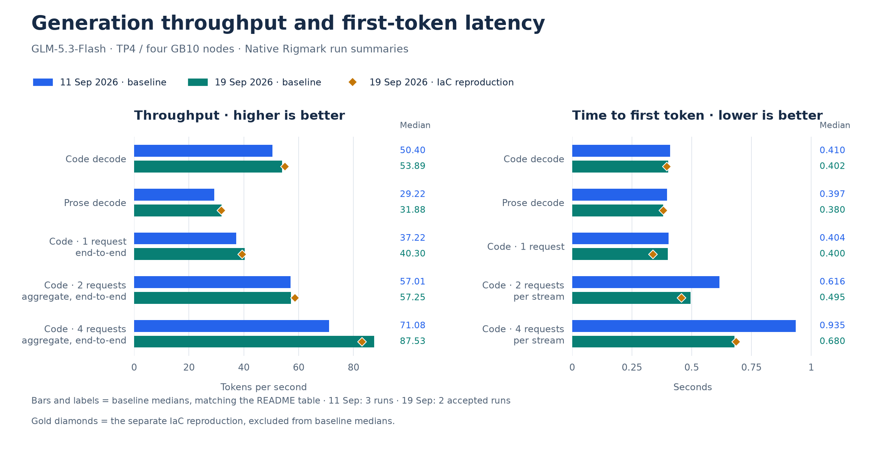
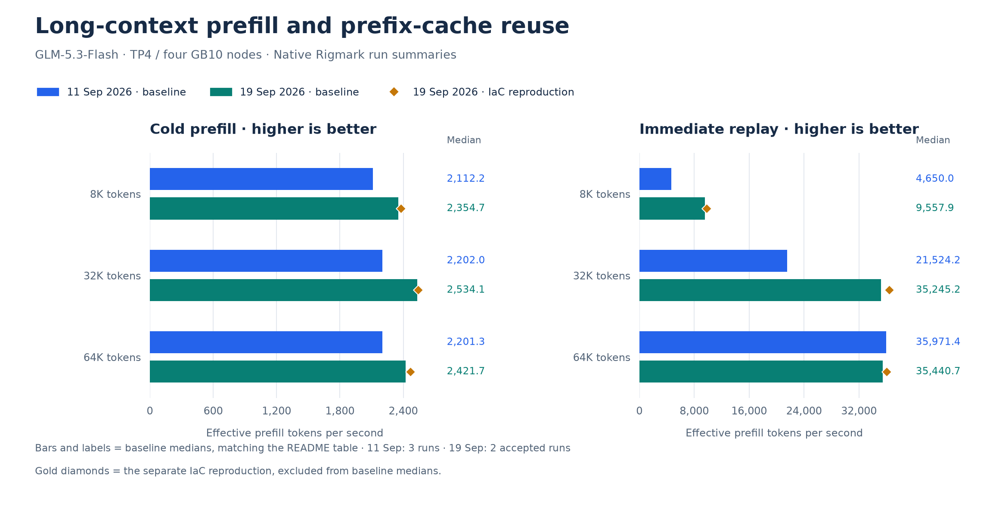

# Baseline comparison: September 11, 18 and 19, 2026

These are frozen medians: three runs on September 11, three on September 18, and exactly two accepted runs on September 19. Percent changes below compare September 19 with September 11 using unrounded values. Higher throughput and lower TTFT are better.

The former README table is preserved below with its original display precision.

| Workload | 11/09/2026 | 18/09/2026 | 19/09/2026 | Change, 19/09 vs 11/09 |
| --- | ---: | ---: | ---: | ---: |
| Code decode, one request | 50.40 tok/s | 51.78 tok/s | 53.89 tok/s | +6.9% |
| Prose decode | 29.22 tok/s | 30.27 tok/s | 31.88 tok/s | +9.1% |
| Code, one request (end-to-end) | 37.22 tok/s | 38.43 tok/s | 40.30 tok/s | +8.3% |
| Code, two concurrent requests (aggregate, end-to-end) | 57.01 tok/s | 57.39 tok/s | 57.25 tok/s | +0.4% |
| Code, four concurrent requests (aggregate, end-to-end) | 71.08 tok/s | 84.05 tok/s | 87.53 tok/s | +23.1% |
| Prefill 8K, cold | 2,112.2 tok/s | 2,393.4 tok/s | 2,354.7 tok/s | +11.5% |
| Prefill 32K, cold | 2,202.0 tok/s | 2,502.1 tok/s | 2,534.1 tok/s | +15.1% |
| Prefill 64K, cold | 2,201.3 tok/s | 2,254.0 tok/s | 2,421.7 tok/s | +10.0% |
| Code, two concurrent requests, per-stream TTFT | 0.616 s | 0.447 s | 0.495 s | -19.6% |
| Code, four concurrent requests, per-stream TTFT | 0.935 s | 0.597 s | 0.680 s | -27.3% |

All 16 metrics at their recorded precision:

| Metric | Unit | 11/09/2026 | 18/09/2026 | 19/09/2026 | Change vs 11/09 |
| --- | ---: | ---: | ---: | ---: | ---: |
| Code decode | tok/s | 50.401 | 51.777 | 53.8905 | +6.9% |
| Code C1, end-to-end | tok/s | 37.223 | 38.431 | 40.3 | +8.3% |
| Code C2, aggregate end-to-end | tok/s | 57.009 | 57.389 | 57.252 | +0.4% |
| Code C4, aggregate end-to-end | tok/s | 71.084 | 84.051 | 87.527 | +23.1% |
| Prose decode | tok/s | 29.22 | 30.27 | 31.878 | +9.1% |
| Code TTFT | s | 0.41 | 0.398 | 0.4015 | -2.1% |
| Prose TTFT | s | 0.397 | 0.379 | 0.38 | -4.3% |
| Code C1 TTFT | s | 0.404 | 0.395 | 0.3995 | -1.1% |
| Code C2 per-stream TTFT | s | 0.616 | 0.447 | 0.495 | -19.6% |
| Code C4 per-stream TTFT | s | 0.935 | 0.597 | 0.6795 | -27.3% |
| Prefill 8K, cold | tok/s | 2112.218 | 2393.385 | 2354.6655 | +11.5% |
| Prefill 8K, replay | tok/s | 4649.988 | 9719.716 | 9557.8985 | +105.5% |
| Prefill 32K, cold | tok/s | 2201.97 | 2502.08 | 2534.0805 | +15.1% |
| Prefill 32K, replay | tok/s | 21524.192 | 31976.985 | 35245.167 | +63.7% |
| Prefill 64K, cold | tok/s | 2201.282 | 2253.989 | 2421.7325 | +10.0% |
| Prefill 64K, replay | tok/s | 35971.377 | 35378.185 | 35440.6915 | -1.5% |

The full recipes differ; these observations do not isolate individual changes. September 19 reduced KV from 16 to 15 GiB per rank and included memory observers. Concurrent code outputs are capped at 256 tokens, not complete agent tasks. Compared with September 18, C2 throughput is slightly lower and concurrent-request TTFT is higher.

Bars/lines use the frozen medians; gold markers show the separate IaC run, excluded from those medians. The third image has no initial decode curve: it uses only September 19 eight-token output tails, with three requests summarized per accepted run. These short, burst-sensitive probes are not sustained decode measurements. [Probe extract](../../historical_benchmarks/baselines/2026-09-19/context-decode-probes.json).

Sources: [September 11](../baselines/2026-09-11.md), [September 18](../baselines/2026-09-18.md), [September 19](../baselines/2026-09-19.md), [IaC reproduction](../reproductions/2026-09-19-iac.md). [Benchmark index](../README.md).
