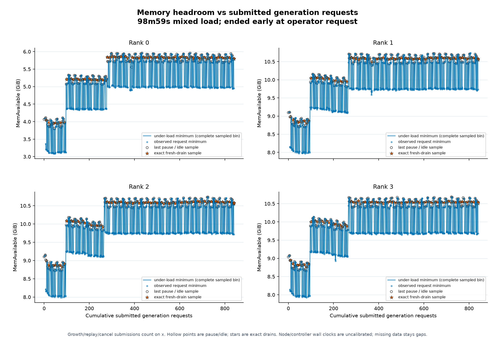

# Protected SparkCache resilience campaign

Status: **closed with deferred cases; operational recipe promoted**. The 14 GiB KV recipe has
bounded context, admission, five-client and targeted resilience evidence, including the
driver's 23-case selected matrix. The first mixed-soak attempt remains **FAIL** after
2,380.549 seconds because its terminal API-idle proof timed out. A second protocol-2 mixed
load submitted 840 generation requests over 5,939.262 seconds with exact cancellation and
final drains, then ended at the operator's request. It is recorded as **owner-stopped**:
the original 7,200-second gate is incomplete and no two-hour pass is claimed.

The final production-candidate boot passed health, both functional gates and its pinned
identity. Its native Rigmark suite completed 54/54 requests with zero recorded errors.
The equivalent default was deployed without another model reload: all four process IDs
and start times remained unchanged, deployed hashes matched, autostart selects the default,
and the plain `2026-09-29-memory-bounded` identity and both final gates passed.
Worker faults, larger queues and combined fault permutations remain deferred. The earlier
failed campaign restoration and separate protected16 recovery remain historical evidence.
Checkpoint verdicts below describe their state at capture; the final operational decision
does not convert a failed, shortened or deferred test into a pass.

The [portable results](../../historical_benchmarks/experiments/2026-09-29-sparkcache-resilience/results.json)
retain numeric extracts and the SHA-256 of both unchanged private native receipts.
The [operational identity](../../operational-identities/2026-09-29-memory-bounded.json)
pins the protected connector, KV14, allocator trim, step cap and bounded admission. The
[campaign runbook](../../resilience.md) describes the isolated fault namespace,
coordinated recovery and deadline. Existing caches and frozen benchmarks are preserved.

## Initial native measurement

Upstream Rigmark revision `c5a0db01b0542ac291883ab049b6141efae0c7d3` ran directly,
with its defaults, `reasoning_effort=low`, no cache salt and a fresh comparison ID.
Source, prompt hashes and flags match the [E31 reference](../baselines/2026-09-28-e31.md).
This is one complete suite, **n = 1**, with no exclusions: 15 decode requests,
18 cold/replay prefill requests and 21 concurrent streams, 54 requests in total.
All 54 streams had a done marker and visible output; no error fields were recorded.
The 15 basic output gates passed. Finish reasons were 15 normal stops and 39
output-limit stops; the latter are expected under the native caps.

| Native median | Initial protected default | Frozen E31 |
| --- | ---: | ---: |
| Code decode, tokens/s | 65.107 | 65.185 |
| Code C1 aggregate, tokens/s | 47.444 | 43.988 |
| Code C2 aggregate, tokens/s | 75.489 | 68.369 |
| Code C4 aggregate, tokens/s | 108.618 | 101.448 |

These are native per-suite medians, not medians of repeated suites. E31 was
measured on a different weight load with the previous cache management. The
differences are descriptive and establish neither a repeatable gain nor a
regression beyond noise. The final bounded-recipe measurement is recorded below;
this campaign does not replace or extend E31.

During the initial suite, minimum `MemAvailable` was 2.10 GiB on rank 0 and
6.93–6.94 GiB on the other ranks. All four containers remained running, with no
new OOM event or safety trip observed. Host samples target 200 ms; process/cache
collection targets one second and log-based OOM collection five seconds. Raw
records retain each source's age. RSS and GPU memory are not added together on
the unified-memory hardware. These observations cover the initial suite only.

## Final native measurement

The production candidate completed one separate coordinated four-rank boot with KV14,
the normal protected cache namespace, allocator trim, the step cap and bounded admission.
Health, both functional gates and its pinned identity passed. The fault-injection overlay
was absent. Native Rigmark then ran on that same load, using the same upstream source,
protocol and settings as the initial suite and a fresh comparison ID.

The final receipt contains **54/54 complete requests**, all with done markers, visible
output and known latency; no error fields were recorded. All 15 native basic output gates
passed. There were 15 normal stops and 39 expected output-limit stops. The immutable native
receipt SHA-256 is
`dceed1318ab03d321b731c10fe38d2ae105fae22723ae252ba39c59bb27eb901`.

| Native throughput median, tokens/s | Initial protected 16 GiB | Final bounded 14 GiB | Change |
| --- | ---: | ---: | ---: |
| Code decode | 65.107 | 64.979 | −0.20% |
| Prose decode | 35.501 | 35.056 | −1.25% |
| Structured decode, diagnostic | 96.228 | 96.213 | −0.02% |
| Code C1 aggregate end-to-end | 47.444 | 48.409 | +2.03% |
| Code C2 aggregate end-to-end | 75.489 | 75.133 | −0.47% |
| Code C4 aggregate end-to-end | 108.618 | 108.078 | −0.50% |
| 8K cold prefill | 2,686.872 | 2,515.081 | −6.39% |
| 8K replay | 9,360.681 | 7,593.334 | −18.88% |
| 32K cold prefill | 2,834.056 | 2,760.899 | −2.58% |
| 32K replay | 37,166.634 | 36,928.556 | −0.64% |
| 64K cold prefill | 2,841.258 | 2,793.916 | −1.67% |
| 64K replay | 42,589.086 | 41,290.010 | −3.05% |

These are **n = 1 per recipe on different weight loads**, not repeated-suite medians.
Code and concurrency stayed close in this pair; the slower 8K replay is an observed
tradeoff retained under the owner's memory-resilience priority. No individual change
is assigned a causal effect, no equivalence is proved, and no performance baseline is
promoted. The portable extract also records native latency summaries and their precision.

The observer was ready before launch and recorded 2,583 in-window host samples per rank
at a 200 ms target cadence. Minimum available memory was **3.990 / 8.939 / 8.859 / 8.900 GiB**
on ranks 0–3. All four worker identities remained unchanged; there were no safety trips.
Host/cgroup OOM, earlyoom and logged CUDA-OOM indicators had complete sampled coverage
with no positive observations. These are sampled observations, not proof of unsampled
headroom or allocator-retry coverage. The production disk policy remains distinct from
the test namespace's eviction policy.

## First targeted stop

The first cold 8k/C2 attempt crossed the 768 MiB `MemAvailable` guard on rank 0;
the last sample was approximately 564 MiB. The controller preserved inspect and
worker logs before coordinated restoration. All four captured containers were
still running with `OOMKilled=false`; telemetry recorded no new OOM or earlyoom
event. This is a failed campaign case, not a demonstrated worker crash or a
successful resilience result.

The initial evidence points to CUDA working-memory pressure during concurrent
prefill: live CUDA allocation increased by approximately 1–1.26 GiB per rank,
while rank-0 cgroup anonymous memory stayed near 10.92 GiB. Cache reservations
and staging were zero and the namespace remained near 529 MiB per rank. Rank 0
entered with much less headroom than the other ranks. The precise allocation
source and a sustainable corrective policy remain unresolved; no protected
connector change is justified by these observations alone.

A separate 4k-token diagnostic on the restored protected default completed one C1
request, then stopped two simultaneous requests at the same guard. Tokenization
changed rank-0 available memory only from 2126 to 2122 MiB. After C1 drained,
live CUDA allocation returned to its pre-C1 value of 96.778 GiB, while reserved memory remained at
98.367 GiB and host availability fell to 1449 MiB. C2 reached 98.002 GiB live /
99.168 GiB reserved, with a 660 MiB host minimum. The live allocation is a maximum
of sampled current values; the allocator lifetime peak increased to 98.063 GiB
during C2. The live `reserved_bytes_by_private_pools.0_2.all.current` counter stayed
at 2.121 GiB and no allocator retry, OOM or worker death was observed. This
supports allocator reservation and concurrent working-memory pressure, whose avoidable share remains unresolved;
reserved minus allocated is only an upper bound on reclaimable memory. The cache
probe targeted the inactive test namespace, so its zeroes are excluded from this
default-only diagnosis. The group was stopped through the controller after evidence
capture, before any further load. These diagnostic requests are separate from the
planned matrix and do not count as three successful repetitions.

The separate allocator-trim candidate released 682 MiB of unused CUDA reservation
on each rank immediately before the same 4k/C2 workload. Each worker recorded two
new requests and 8,000 scheduled tokens. C1 completed and drained, but both C2
clients were interrupted by the memory guard; the observed rank-0 minimum during
collection was approximately 698 MiB. Fresh worker logs show a rank-0 sampled live
maximum of 97.939 GiB, a lifetime peak of 98.061 GiB and a reserved maximum of
99.326 GiB. The phase checkpoint's CUDA values predated C2 and are not used for
these maxima. No worker death or new OOM event was observed, and the controller
stopped all four ranks after evidence capture.

Same-process snapshots before and after that diagnostic show only 6.1 MiB of
additional rank-0 anonymous memory, including 2.5 MiB in the API process. They do
not support persistent process-heap growth as the cause of this memory loss.
The trim released memory but was insufficient as a standalone correction. These
are single diagnostic executions on different weight loads, with no performance
verdict or successful C2 repetition. Cross-host wall clocks were not calibrated;
precise ordering across controller and node timestamps is not inferred. The next
candidate therefore limited scheduled tokens per step while leaving remainder work queued.

The initial protected-default matrix, before either diagnostic candidate, recorded:

| Targeted case | Completed repetitions | Result on the protected default |
| --- | ---: | --- |
| 8k, C1, cold | 3 | Pass, including fresh zero-reservation drain on all ranks |
| 8k, C1, replay | 3 | Pass, including four-rank restore evidence |
| 8k, C2, cold | 1 attempted | Failed memory guard; individual client outcomes unavailable in this first failure receipt |

## Bounded corrective diagnostics

The composed allocator-trim and 6,912-token per-step scheduling-cap candidate completed
two bounded diagnostics. At each prompt depth it returned all seven requests: one C1
request and three drained C2 repetitions of two requests each. Every response reported
the requested prompt depth and exactly 16 output tokens. The 4k C2 repetitions each
scheduled 6,304 then 1,700 target tokens; the 8k records never exceeded the 6,912-token
step cap. The 8k prefill was partly serialized through the queue: these are concurrent
client results, not evidence that two complete 8k prefills execute simultaneously.

| Prompt depth | Requests | C2 repetitions | `MemAvailable` minimum by rank, MiB | Result |
| --- | ---: | ---: | --- | --- |
| 4k | 7/7 | 3/3, drained | 912.89 / 6046.12 / 6063.30 / 6075.63 | Bounded case passed |
| 8k | 7/7 | 3/3, drained | 1145.96 / 6296.40 / 6323.18 / 6299.79 | Bounded case passed |

The portable results retain the unchanged private diagnostic SHA-256 values and the
pins from the [allocator-trim manifest](../../../scripts/node/experiments/e03/prefill-cache-trim/manifest.json)
and [step-cap manifest](../../../scripts/node/experiments/e03/prefill-step-cap/manifest.json).
These sampled minima show limited rank-0 headroom and do not guarantee unsampled
headroom. The step cap constrains one scheduler output; it is not aggregate admission
control. Mixed-load behavior and performance tradeoffs remain unresolved. The candidate
has not been promoted and does not change the protected operational default.

## Context-matrix checkpoint

The composed candidate subsequently ran the context portion of the main resilience matrix.
A case qualifies here only with three passing run records carrying the selected candidate
identity. The checkpoint contains 34 qualifying cases / 102 repetitions and one partial
case, for 103 recorded passing runs. These are resilience context checks, not native
Rigmark suites or fault-injection results.

| Prompt tokens | Complete cases | Complete repetitions | Primary responses | Replay seeds | Total inference responses |
| ---: | ---: | ---: | ---: | ---: | ---: |
| 8,000 | 8 | 24 | 78 | 12 | 90 |
| 32,000 | 8 | 24 | 78 | 12 | 90 |
| 64,000 | 8 | 24 | 78 | 12 | 90 |
| 128,000 | 8 | 24 | 78 | 12 | 90 |
| 180,000 | 2 | 6 | 6 | 3 | 9 |
| **Complete cases** | **34** | **102** | **318** | **51** | **369** |

At 8k through 128k, the eight cases at each depth are cold and replay at C1, C2,
C4 and C6. At 180k, C1 cold and replay are complete. The 180k/C2 cold case has one
recorded passing repetition with two primary responses; its next work was interrupted
before another run record was persisted. It remains partial. Including that repetition,
the checkpoint has 320 primary responses plus 51 replay-seed responses, 371 inference
HTTP responses in total. Unrecorded or interrupted responses are excluded.

All 320 primary receipts returned HTTP 200 with JSON bodies, null recorded errors and
guard causes, the exact requested prompt-token count, 16 completion tokens and a length
finish. All 51 seed receipts returned HTTP 200 with the same token and finish checks;
their compact schema does not carry the primary receipt's error fields. Each recorded
run has fresh, complete, zero-reservation drain evidence on all ranks, 412/412 rank
proofs. All 51 replay runs have four-rank same-digest seed publication and restore
evidence: 204 successful publication events and 204 successful restore events, with no
recorded publication or restore error. This proves the seeded restore path ran; it does
not prove every concurrent primary response was a physical cache hit.

Across 29,808 samples per rank, minimum `MemAvailable` was 1,092,923,392 /
6,302,347,264 / 6,374,797,312 / 6,373,851,136 bytes (1042.29 / 6010.39 /
6079.48 / 6078.58 MiB). No sample crossed the 768 MiB guard. Container and worker
identities remained single-valued per rank and all 119,232 container samples were
running. OOM coverage is known for 29,807 samples per rank after one explicitly unknown
initial sample. Known samples show zero new host or cgroup OOM kills, CUDA allocator
retries, CUDA OOM evidence and earlyoom kills. The maximum known process/cache source
age was 0.986 seconds and the maximum log/OOM source age was 5.086 seconds.

The operator then sent a planned interrupt to replace the local campaign driver. The
controller recorded `KeyboardInterrupt` with no campaign stop reason; the stable workers,
running containers and zero OOM deltas do not support a worker-failure interpretation.
The final pre-restoration sample retained one active publication and 86,999,040 bytes
(82.97 MiB) reserved on each rank. That is interrupted in-flight work, is excluded from
completed-run drain evidence, and is not evidence of a persistent leak. This checkpoint
does not cover the subsequent restoration state.

The immutable source SHA-256 values are `415bf60c…d3aba` for campaign state,
`0249acec…e54d` for events and, in rank order, `538e5e81…3875`,
`5bd71598…9c67`, `5ea14e1e…2067`, and `9b9fdc78…42b7` for telemetry. The
portable results retain the complete digests and the checkpoint-report digest. The
candidate remains unpromoted and the protected operational default remains unchanged.

## API and cache checkpoint

A later candidate epoch is disjoint from the context checkpoint above. Its immutable cut
contains 48 persisted runs across 16 cases: 42 source-recorded passes and six pending
results, with no source-recorded failure. The API and cache portion covers 14 cases. Four
API cases and nine cache cases each have three source-recorded passes; shared-prefix has
three pending results because the required second, larger four-rank snapshot publication
was not proven.

| Area | Cases / persisted runs | Workload attempts | Recorded result |
| --- | ---: | ---: | --- |
| API rejection and disconnect handling | 4 / 12 | 12 | Three passes per case: nine expected HTTP 4xx responses and three intentional partial-upload disconnects |
| Cache identity, corruption and I/O faults | 9 / 27 | 78 | Three passes per case |
| Shared-prefix cache behavior | 1 / 3 | 6 | Pending; existing aligned seed restore supported, second larger publication unproven |
| Cancellation observations | 2 / 6 | 24 | Queue has three legacy-protocol source passes; prefill has three pending results; neither establishes verified cancellation under the replacement protocol |

The cache receipts contain 30 four-rank baseline publications and 18 four-rank action
publications. They also record 48 expected fault hits, 12 successful delayed stages,
36 expected stage errors, 36 mutations, 12 per-rank manifest increases and zero cleanup
errors. The shared-prefix action produced 12 publication errors, so it remains pending.
A separate trace matched 12/12 rank-local existing-seed publications to successful restores
across the three shared-prefix runs. That limited result does not prove the missing second
publication and does not change the case status.

These are bounded harness-visible results. Every cache fault request used C1 at 32k prompt
tokens. Checksum, missing-file and truncation cases infer fallback from same-digest
republication; the receipts do not capture the exact corruption-detection decision, and the
harness restores its backups, so they do not prove autonomous self-healing. Manifest counts
rose on all 12 rank checks, but eviction means this is not evidence that each publication
adds exactly one retained entry. ENOSPC proves a capture-stage error, while interrupted
publication proves an uncommitted publication-stage error; neither has a later negative
receipt proving that the affected digest was never served. The delay was configured at
500 ms but per-operation delay was not measured.

There were 120 workload attempts in the cut: 12 API attempts, 84 cache inference responses
and 24 legacy cancellation attempts. The 24 consist of 18 blocker streams, three cancelled
target streams and three successful reissues. Exactly 87 complete HTTP 200 responses have
full response-integrity evidence: all 84 cache responses and the three reissues. Each reports
the exact requested prompt usage, 16 completion tokens and a `length` finish. The denominator
of 120 includes the expected API rejections, intentional disconnects and cancelled streams;
it is not a count of 120 successful responses. All 48 persisted runs have fresh, complete,
zero-reservation drain evidence on every rank, 192/192 rank proofs, including 168/168 for
the API and cache cases.

The invalid-parameter case combined an empty `messages` value with a negative `max_tokens`,
so its HTTP 400 does not isolate which condition was rejected. The partial-upload case proves
health and fresh drain after the client disconnected; it does not independently prove a
server rejection or complete connection cleanup.

The telemetry cut contains 5,872 / 5,878 / 5,883 / 5,888 samples by rank. Minimum
`MemAvailable` was 1,089,974,272 / 6,347,558,912 / 6,356,807,680 / 6,317,469,696 bytes
(1039.48 / 6053.50 / 6062.32 / 6024.81 MiB), above the 768 MiB guard. The largest observed
test namespace was 3,990,336,038 / 4,057,453,151 / 4,015,510,111 / 4,074,230,363 bytes,
below the 8 GiB per-rank limit. Containers and worker identities remained single-valued.
After one explicitly unknown initial OOM sample per rank, all 23,517 covered samples show
zero new host or cgroup OOM kills, CUDA allocator retries, CUDA OOM evidence and earlyoom
kills.

The rank-0 sampled minimum was only 284,667,904 bytes (271.48 MiB) above the guard. Sampling
does not establish a guaranteed lower bound between observations.

Observed median host-sample intervals were 200.001–200.004 ms; per-rank p95 values were
200.689–200.726 ms, the largest interval was 214.286 ms and no deadline was missed. These
are measured intervals, not an inference from the configured target. Process/cache sources
were at most 0.975 seconds old and log/OOM sources at most 5.120 seconds old, so the slower
fields are not 200 ms observations. Host, cgroup, cache and CUDA memory domains overlap or
have different semantics and are not summed.

The checkpoint report SHA-256 is `129472c590fe6cb17618af0e6aa208862ad599df9712b09f1fe6e44340f80660`.
Its campaign and event snapshots are `9f8780348c1cf42b6be5150a2aa882010adf907e8150087d4db8bd92e5d555a2`
and `c59a89d4992acb8b73ded3a98c3aef2661e07275dcbe40d4c82cd4f0d72543bd`.
The rank-ordered telemetry-span digests are retained in the portable results. The cut
precedes later cancellation work and the planned next controller transition; neither is
credited here.

## KV14 maximum-context checkpoint

A later retained load reduced the candidate KV pool from the earlier experimental 16 GiB
setting to 14 GiB, a 2 GiB / 12.5% resident-pool reduction. All four ranks reported the
selected runtime identity, `max_model_len=262144`, 1,194,033 GPU KV-cache tokens and a
reported 4.55 maximum concurrency at that context length. Both functional gates passed
18.284 seconds after the independently observed first health 200.

The immutable checkpoint contains two C1 cases: 262,128 input tokens plus 16 output tokens,
cold and replay, each with three passing repetitions. All six primary responses and three
replay-seed responses returned HTTP 200 JSON, exact 262,128 / 16 / 262,144 token usage, a
`length` finish and no recorded error or guard abort. Every run has fresh, complete,
zero-reservation and zero-staging evidence on all ranks, 24/24 rank proofs. The three replay
runs use distinct seed digests and contain 12/12 successful rank publication events plus
12/12 successful same-digest restore events, with no recorded publication or restore error.

Telemetry contains 3,507 samples per rank. Minimum `MemAvailable`, in rank order, was
2,925,760,512 / 8,315,645,952 / 8,448,114,688 / 8,476,688,384 bytes (2790.22 / 7930.42 /
8056.75 / 8084.00 MiB), above the 768 MiB guard. Container and worker identities remained
single-valued, and all 14,028 container samples were running with verified identity. OOM
coverage is known for 3,506 samples per rank; the one initial unknown sample per rank is
retained as unknown. Covered samples show zero new host or cgroup OOM kills, CUDA allocator
retries, CUDA OOM evidence and earlyoom kills. Process/cache evidence was at most 0.974
seconds old and log/OOM evidence at most 4.956 seconds old.

The 14 GiB and 16 GiB observations came from different loads and epochs, so this does not
establish a paired memory delta or a performance effect. It proves only bounded C1 cold and
replay behavior at the maximum token budget. Queue waves, fault and cancellation cases,
sustained soak, final restoration and the final native suite remain pending. The candidate
is unpromoted and the protected operational default is unchanged. The portable results
retain the runtime, frozen checkpoint and boot-receipt SHA-256 values.

## KV14 queue and cancellation checkpoint

This checkpoint starts after the maximum-context checkpoint above and does not recount its
six repetitions or nine responses. It retains the same 14 GiB candidate identity and contains
13 persisted runs: nine passes, three pending runs and one failure.

| Case | Runs | Actual inference attempts | Recorded result |
| --- | ---: | ---: | --- |
| 8-client queue wave | 3 | 24 wave requests + 18 blocker streams | 3 passes; queue observed, API idle and four-rank drain each time |
| 16-client queue wave | 3 | 48 wave requests + 18 blocker streams | 3 passes; queue observed, API idle and four-rank drain each time |
| Multi-request cancellation, protocol 2 | 3 | 12 cancelled targets + 3 reissues | 3 passes; targets interrupted and terminated, reissues healthy |
| Queue cancellation, protocol 2 | 3 | 18 blocker streams + 3 cancelled targets + 3 reissues | Pending; global waiting was visible but could not be tied to each target |
| 32-client queue wave | 1 | 32 wave requests + 6 blocker streams | Failed management telemetry guard; no wave response completed |

The cut contains 185 actual inference attempts. Seventy-two successful queue-wave JSON
responses and six cancellation reissues have complete response-integrity evidence. The queue
responses comprise 45 at 512 prompt tokens, nine at 64,000 and 18 at 128,000; the six
reissues use 32,000 prompt tokens. All 78 report 16 completion tokens and a `length` finish.
Five blocker streams independently reached a complete done marker. The other 102 stream
attempts were intentionally interrupted by their protocol or aborted by the safety event;
they are retained as attempts, not successful JSON responses.

The twelve nonfatal runs each have a fresh, complete, zero-reservation and zero-staging
drain on all ranks, 48/48 rank proofs. The 32-client failure has no post-case drain barrier.
Its terminal telemetry observations are zero on all four ranks, but those observations do
not replace the missing barrier and are not credited as a successful drain.

Across 6,719 / 6,716 / 6,716 / 6,716 disjoint samples, minimum `MemAvailable` was
2,888,753,152 / 8,092,450,816 / 8,114,991,104 / 8,131,723,264 bytes (2754.93 / 7717.56 /
7739.06 / 7755.02 MiB). All 26,867 samples have known OOM coverage, running verified
containers and stable container and worker identities. They show zero new host or cgroup OOM
kills, earlyoom kills, CUDA allocator retries or CUDA OOM evidence. Node probes missed no
sampling deadline; the largest observed node interval was 202.129 ms. Slower evidence was at
most 4.931 seconds old.

During the 32-client wave, the controller watchdog found all four management receipt clocks
more than two seconds stale. It aborted all 32 submitted wave requests with `safety_event`;
all six blockers terminated and the API subsequently appeared idle. Independent incident
analysis shows that all four node probes continued at approximately 200 ms through this
window, with no worker death or service OOM. The gap therefore occurred after sample
generation and before the controller updated its receipt clocks. Existing evidence cannot
distinguish a shared management-transport pause from controller receiver scheduling or local
append delay; neither network loss nor a controller disk or scheduling stall is proven. The
case remains failed.

The checkpoint manifest SHA-256 is `d58caaee19e7449b7e8d01d1499e500478b954b48ff77d80770dc313a7c9aa37`;
the portable results retain the campaign, event, incident-analysis, validator and rank-ordered
telemetry digests. This checkpoint is not a performance result, resilience completion or
promotion. The candidate remains unpromoted and the protected operational default is unchanged.

## KV14 bounded-admission checkpoint

This disjoint checkpoint uses the same 14 GiB KV pool, allocator trim and 6,912-token
prefill-step cap, with the bounded ASGI admission candidate added. It contains three new
passing 262,128-input-token C1 cold requests and three passing overload repetitions. No
later case had a persisted run in the immutable cut.

Each overload repetition submitted 150 wave requests behind six active blocker streams.
Exactly 128 wave requests returned HTTP 200 and 22 returned an explicit, structured
`admission_queue_full` HTTP 503. Across the checkpoint, 471 actual inference attempts
produced 405 HTTP 200 results: 387 complete JSON responses with exact token and finish-reason
evidence plus 18 complete blocker streams. The remaining 66 results were the expected
queue-full responses; there were no other errors or guard aborts. The frontend gauges were
fresh when used and observed maxima of six active, 128 waiting and 134 inflight requests.
Queue-timeout, request-timeout, oversized-body, body-idle and send-idle counters remained
zero. The cumulative admitted-total gauge is diagnostic and is not used as a request
denominator because it covers all admitted POST traffic, including tokenization calls. The
six blockers share a 32,000-token prompt and the wave shares a 512-token prompt. This proves
the configured admission bound and response accounting; it does not prove 134 distinct
long-context requests resident in model memory.

All six runs have fresh, complete, zero-reservation and zero-staging evidence on all four
ranks, 24/24 rank proofs. The frozen telemetry holds 4,837 samples per rank. Minimum
`MemAvailable`, in rank order, was 2,738,782,208 / 8,237,555,712 / 8,265,936,896 /
8,305,766,400 bytes (2611.91 / 7855.95 / 7883.01 / 7921.00 MiB); rank 0 therefore retained
about 2.55 GiB at the sampled minimum. Container and worker identities remained stable and
verified. Node probes missed no sampling deadlines, their largest observed interval was
202.569 ms, and slower source evidence was at most 4.952 seconds old.

OOM coverage is known in 19,344/19,348 samples; the first sample on each rank remains
unknown. CUDA-retry evidence is known in 19,269/19,348 samples; the first rank-0 sample and
first 26 samples on each other rank remain unknown. No sample has positive host or cgroup
OOM, earlyoom, CUDA OOM or allocator-retry evidence. These explicit unknowns prevent an
all-samples-known claim without weakening the six recorded case results.

The checkpoint manifest SHA-256 is
`1362b550ac379097a11e3cd41bd2039ecb9747bc227545706f6a550b0bcbd14c`.
The portable results retain its report, validator, driver, campaign, event and rank-ordered
telemetry digests. This is bounded queue and maximum-context safety evidence, not a native
performance result, soak completion or promotion. The protected operational default is
unchanged.

## KV14 five-client maximum-context cold checkpoint

The next disjoint checkpoint contains three cold repetitions with five concurrent clients.
All 15 responses returned HTTP 200 with exact 262,128 input tokens, 16 output tokens and a
`length` finish. The loaded driver constructs a distinct cold prompt prefix for every client
and repetition; the validator reconstructs 15 distinct prefix hashes from that pinned source
contract. Prompt bodies were not captured, so these are generator-prefix hashes rather than
hashes of retained request bodies.

Client dispatch spread was 9.114 / 6.919 / 7.627 ms across the three repetitions, and all
five clients overlapped for 105.647 / 107.000 / 105.347 seconds. The frontend admission
gauge reached five active and five inflight with none waiting. Engine telemetry reached at
most two running and four waiting requests. This establishes five concurrent accepted
clients and queued engine work; it does not establish five requests simultaneously resident
or running in the engine.

All three repetitions have fresh, complete, zero-reservation and zero-staging evidence on
all four ranks, 12/12 rank proofs. The frozen telemetry contains 8,125 samples per rank.
Minimum `MemAvailable`, in rank order, was 4,560,814,080 / 10,178,969,600 /
10,161,168,384 / 10,156,134,400 bytes (4349.53 / 9707.42 / 9690.45 / 9685.64 MiB).
Rank-0 GPU-cache usage was known in 8,124 samples: median 0.24933, p95 0.45442, p99
0.47051 and maximum 0.48257. These percentiles cover the whole checkpoint epoch and are
not aligned to request phases across machine clocks.

OOM coverage is known in 32,496/32,500 samples and CUDA-retry evidence in
32,421/32,500. The initial unknown samples remain unknown; every known value and every
positive-event check is zero. Containers and worker process identities remained stable, and
node probes missed no sampling deadline. A separate read-only metrics request observed the
native preemption total at zero once. That single snapshot is supplementary evidence, not
continuous preemption coverage.

The checkpoint manifest SHA-256 is
`a323fae06c7376d347d752d67da111886c49b0c999045be5aea77b4c5928bf49`.
The portable results retain the pinned loaded-driver and configuration hashes plus the
report, validator, campaign, event, preemption and telemetry digests. The separate
long-decode checkpoint below does not extend this short-output checkpoint. Replay,
sustained soak, final restoration and promotion remain unproven. The protected operational
default is unchanged.

## KV14 five-client long-decode checkpoint

The next disjoint checkpoint contains three cold repetitions, each with five overlapping
clients forced to generate 16,384 tokens after 245,760 input tokens. All 15 requests returned
HTTP 200 with exact 245,760 / 16,384 / 262,144 token usage and a `length` finish; no response
error or guard abort was recorded. Each repetition has a fresh, complete, zero-reservation
and zero-staging drain on all four ranks, 12/12 rank proofs.

The client-window spans were 2,233.724726 / 2,299.812066 / 2,211.615644 seconds. Dividing
81,920 output tokens per wave by each span gives aggregate end-to-end rates of 36.6742 /
35.6203 / 37.0408 output tok/s; dividing all 245,760 output tokens by the 6,745.152436-second
sum of those spans gives 36.4351 tok/s. The arithmetic means of the five individual
end-to-end request rates were 10.2033 / 8.1816 / 10.2513 tok/s by repetition, 9.5454 tok/s
over all requests, with a 7.1241–12.2893 tok/s range. These retrospective diagnostics
include prefill, queueing, reasoning, preemption and decode. They are not pure decode rates,
a native Rigmark result or promotion evidence.

The reproducible derivation source SHA-256 is
`80acad51cc5cf033ab3ab145484e77841d29cea95181a02b8528e82e98722882`;
its numeric result digest is
`1654df6f733ff414c192c2e6717f317a5a0ae2d0f7136565dcac5776516a09b5`.

The composite one-second native series contains 6,820 known samples, zero unknown or
collection-error samples, no counter reset and no gap over 1.5 seconds. Sampled engine
gauges reached four running, four waiting and five running-plus-waiting. The cumulative
preemption counter increased from 0 to 22 (8 / 6 / 8 across the repetitions); these counters
do not measure the compute cost of preemption or recompute. Generation and finish-reason counters begin only
with the second series; within that coverage the `length` counter increased by 15 while
`abort` and `error` did not increase. Five overlapping client intervals and a maximum
running-plus-waiting gauge of five do not establish five fully resident contexts.

The captured controller epoch contains 34,530 telemetry samples per rank, including 243
rows per rank after the third cache drain and the beginning of the next case. The rank-0
tail ends 49.11 seconds after the final long response. The following coverage denominators
describe that whole capture; clipping at the third drain leaves the same memory minima
and process identities. Minimum `MemAvailable`, in rank order, was
3,978,424,320 / 9,475,051,520 / 9,465,421,824 / 9,418,985,472 bytes (3794.12 / 9036.11 /
9026.93 / 8982.64 MiB), above the 768 MiB guard. Containers and worker identities remained
stable, and probes missed no sampling deadline. OOM evidence is known for 138,116/138,120
samples and CUDA-retry evidence for 138,041/138,120; the four and 79 uncovered samples stay
unknown. Every covered value and positive-event check is zero. Rank-0 admission state is
known for 23,729/34,530 samples and unknown for 10,801, so it is not carried forward through
that coverage gap.

The 12 fresh drain proofs establish zero cache reservations and staging. The third
rank-0 admission reading predates the last completion, so that separate gauge is not
evidence of post-completion API idle. Retained stage-event balances can also contain an
unmatched begin from an older worker; current fault gates use fresh case-specific events
and drains rather than interpreting that diagnostic balance as live resource ownership.

Rank 0's first drain sampled 98,128 MiB CUDA reserved and 5,465.34 MiB available; its second
drain sampled 99,690 MiB reserved and 3,841.65 MiB available. That retained reservation was
not immediately released at idle: the next prefill-trim observation sampled 98,568 MiB
reserved and 4,673.15 MiB available while current allocation increased. The third drain
returned to 98,128 MiB reserved and 5,435.26 MiB available. These sparse allocator views
show retention followed by trim and reuse; they do not prove immediate idle release, a
stable plateau or a persistent leak. Unified-memory categories are not summed.

The sealed checkpoint-report SHA-256 is
`98fb2ff075d6997ef69cc41928a2c2a827841350da6184e550cf1bca71722564`;
the portable results retain the immutable manifest, validator, loaded-source, receipt,
counter-series and telemetry digests. This is bounded long-context pressure and recovery
evidence. It does not establish replay, soak completion, final restoration, native
performance or promotion, and it does not change the protected operational default.
The fault overlay uses an instrumented connector, isolated namespace and 3 GiB / 2 GiB
eviction policy. The prepared production return shares the worker, scheduler, admission
and KV settings, but restores the protected connector and normal cache namespace with
its existing disk-capacity policy. Configuration parity does not extend this checkpoint
to arbitrary production-cache growth; final production identity and functional checks
remain separate requirements.

## KV14 bounded targeted checkpoint

This checkpoint is disjoint from the five-client long-decode capture and starts after its
third completion. The intervening C5 replay repetition 3 and queue-8 repetitions 5–6
are excluded from this interval. It records three passing repetitions for each of 16 cases: the 16-client
queue wave, maximum-context C1 replay, multi-request cancellation, three slow-client cases,
four API cases, and six cache-fault cases through interrupted publication. All 48 persisted
runs passed. The original 20-case capture request was reduced after these 16 cases completed;
cancel-restore, the combined cache-EIO/cancel-restore permutation and queue waves 32 and 64
are outside this checkpoint and receive no status from it.

The 48 runs contain 144 actual inference or protocol attempts: 48 queue-wave requests and
18 blocker streams, three replay requests plus three seeds, 12 intentionally cancelled
streams plus three successful reissues, nine slow-client streams, 12 API attempts, and 18
cache seeds plus 18 cache replays. The evidence contains 93 exact JSON responses, 48/48
queue-wave HTTP 200 responses, nine expected API HTTP 4xx results and three intentional
partial-upload disconnects. No bounded-admission full-queue or queue-timeout rejection was
recorded in this interval.

Every run has a fresh, complete, zero-reservation and zero-staging drain on all four ranks,
192/192 rank proofs. The immutable interval contains 8,860 telemetry samples per rank.
Minimum `MemAvailable`, in rank order, was 4,668,162,048 / 10,155,859,968 /
10,138,165,248 / 10,135,093,248 bytes (4451.91 / 9685.38 / 9668.51 / 9665.58 MiB),
above the 768 MiB guard. OOM and CUDA-retry coverage is known in all 35,440 samples;
no positive event was observed. Container and worker identities remained stable, no node
deadline was missed, and the largest actual sample interval by rank was 201.725 / 283.620 /
280.121 / 280.911 ms.

The manifest SHA-256 is
`0a2e859b07f61be2df5e26ef4adde3e4f5999c6e202e5762e6b54b4c834dc56b`;
the report SHA-256 is
`087bdb1d0c99a900ab2d73c50e837dc899f0f416ab47a5da9720b70f472bdd2f`.
The portable results retain the validator, capture, loaded-source and interval hashes.
Invalid-parameter evidence combines empty messages and a negative token limit. Partial
upload and slow-client cases prove recorded recovery, health and drain behavior, not the
server-side cause of disconnect. Cache fallback is inferred from same-digest response and
publication receipts; internal detection and autonomous self-healing are not captured.
ENOSPC and interrupted publication prove their recorded error boundaries, not that an
affected digest could never be served later. Older ownership snapshots and source status
repeated from a cache are not treated as independently fresh case evidence; current-identity
events and exact fresh drains provide the case-bound proof.

A subsequent fast-finish driver snapshot applies the campaign's successes-after-last-failure
rule together with exact runtime-identity and protocol matching. It records three qualifying
successes for each of 23 selected cases, 69 in total, including three current-protocol
cancel-restore successes. This is a driver-status aggregation over already recorded cases,
not a second independent validation of every response. C5 replay, queue-8 and cancel-restore
are covered only by this driver-status aggregation, not by the independent sealed validators.
Some repetitions span controller revisions; C5 replay and queue-8 have no case protocol
version, so this summary does not independently prove unchanged pass criteria across those
revisions. Its overlapping HTTP activity is
not added to the 144-attempt denominator above. The immutable campaign snapshot SHA-256 is
`bd64744e09dce3152b4c2cefb57d95b3de804c32027158174daff95fdd7bc99e`;
the summary SHA-256 is
`aebbea32def1f297d419456085f392fefb39ab5dc510094dd6da18924dbb7b98`.
Queue wave 32 has two later passes after its earlier failure; it remains incomplete and
deferred rather than being relabeled successful.

## First mixed-soak failure

The first protocol-2 mixed-soak attempt is a sealed **FAIL**, not a shortened pass. It ran
for 2,380.549 seconds against a 7,200-second requirement and wrote 356 receipt rows: 153
growth, 153 replay, 34 cancellation and 16 idle. It credited 306 ordinary responses, all
153 growth and replay requests, 33 cancellations and all 16 idle windows. All 340 recorded
HTTP attempts returned status 200. Successful ordinary HTTP latency reached 14.992 seconds;
the largest receipt-row gap was 35.837 seconds. This was a single-in-flight workload with
context targets up to 64k and does not add concurrency evidence.

Attempt 340 was interrupted and terminated, with engine running/waiting and admission
in-flight gauges at zero, but its 30-second API-idle proof failed because one connection
remained established. Independently captured server access evidence contains five
non-driver chat POST events during the terminal window, all status 200, and the admission
total rose by five. Their source was the same physical controller; the application is
unknown, so the evidence does not establish a separate host or another user. The events
are access-log timestamps rather than guaranteed stream-completion times. They provide a
concrete competing-traffic explanation for the connection-based idle failure without
proving which application held that exact connection. No competing inference POST was
observed during the covered C5-long or core-targeted intervals; periodic non-inference
model-list GETs were present. That observation does not prove exclusivity outside the
captured intervals.

The sealed telemetry contains 9,544 samples, 2,386 per rank. Minimum sampled
`MemAvailable` was 4.4772 / 9.5983 / 9.5903 / 9.5368 GiB in rank order, above the 768 MiB
guard. Container and worker identities were stable and no sampling deadline was missed.
Host and cgroup OOM deltas were known and zero throughout. Earlyoom had one unknown sample
per rank; CUDA-retry coverage had one unknown sample on rank 0 and six on each other rank.
No positive event appears in known samples, so the evidence demonstrates neither an OOM nor
a complete zero-event interval. Across 16 idle windows, first-before to last-after
`MemAvailable` changed by +6.273 / +4.508 / +11.086 / +12.820 MiB. Rank-0 cgroup anon fell
2.105 MiB while current CUDA allocation and reservation were unchanged. This interrupted
40-minute run does not demonstrate a persistent memory leak or prove leak immunity. About
115 seconds after the last-idle samples, after the interrupted cancellation and five
competing POST events, the exact final-proof scans had 154.7 / 147.4 / 126.7 / 152.1 MiB
less `MemAvailable` and 122 MiB more CUDA-reserved memory on each rank. Current CUDA
allocation was unchanged and cgroup anon was lower. Rank 0 ended about 155 MiB below its
last idle and remained inside the run's observed CUDA-reservation range. This timed endpoint
does not identify a cause or establish a leak.

The later final health/API-idle proof and four exact zero-reservation/zero-staging drains
passed. That recovery evidence does not change the source FAIL. The manifest SHA-256 is
`5511fdbb750ef4b9fff3f32561e4668e6ac80e91a08d333c542601efefe2da6e`;
the report SHA-256 is
`b50c3be60f6f8ce41c3eb25eebe8e10caa1539bc2c0b930310f2700497188fd1`;
the access-evidence SHA-256 is
`69267f1ca68d99cc098c3cbfb2283fc0d59be70a46842eb6acbce369840e73bb`.
The plotting CSV retains direct node gauges and missing values without interpolation or
adding host/process/cgroup/CUDA memory views. Driver-phase labels do not include the five
competing client intervals, although direct server gauges can reflect them.

## Owner-stopped mixed-load continuation

The second protocol-2 mixed load ended at the operator's request after
5,939.26192066 seconds (98m59s), short of the original 7,200-second gate. Its status is
**owner-stopped**, neither a technical failure nor a two-hour pass. The single-in-flight
receipt contains 881 rows: 378 growth, 378 replay, 84 cancellation and 41 idle. All 840
generation HTTP attempts returned 200; all 756 ordinary requests completed, all 84
cancellations have exact fresh four-rank drain proofs, and the terminal proof has four more
exact drains. The largest successful ordinary latency was 16.754484 seconds and the largest
gap between receipt rows was 30.368218 seconds. Context targets reached 64k.

| Rank | Samples | Minimum `MemAvailable`, bytes (GiB) | First / middle / last idle-after, GiB | Exact final drain, bytes (GiB) |
| ---: | ---: | ---: | ---: | ---: |
| 0 | 6,150 | 3,313,426,432 (3.085869) | 4.005833 / 5.850723 / 5.826138 | 6,215,430,144 (5.788570) |
| 1 | 6,149 | 8,552,247,296 (7.964901) | 8.917561 / 10.586269 / 10.594646 | 11,327,234,048 (10.549309) |
| 2 | 6,150 | 8,571,740,160 (7.983055) | 8.906796 / 10.616550 / 10.601780 | 11,360,915,456 (10.580677) |
| 3 | 6,150 | 8,505,368,576 (7.921242) | 8.857407 / 10.528645 / 10.554424 | 11,311,300,608 (10.534470) |

Every `MemAvailable` sample is known. Container and worker identities stayed stable. Host
and cgroup OOM counters have complete coverage and zero deltas in each constituent sampler. Earlyoom has two
unknown samples per rank; CUDA-retry coverage has 2 / 32 / 32 / 27 unknown samples, so a
completely observed zero-event interval is not claimed. The counts combine 5,943 / 5,942 /
5,943 / 5,943 campaign samples with 207 handoff-monitor samples per rank. The 200 ms monitor
covered the last ten request bins and terminal drain, overlapping the 1 s
campaign sampler for about 36.4 seconds by same-node timestamps. Any monitor-to-stop
wall-time difference crosses uncalibrated node/controller clocks and is not an exact duration.
Both streams are interleaved by same-node
monotonic time; the last ten request bins therefore have denser sampling.

The archived calculation flags one interval over twice the current target on each rank
at that mixed-cadence boundary. It is not evidence of a missing campaign sample: the
campaign sampler missed zero deadlines and its maximum interval was 1.001787135 seconds.
The combined CSV has no sampler-source column; the separately hashed source streams retain
that provenance. Sample density and per-request minima must not be compared as if all bins
had equal coverage. Missing or
stale data are not filled forward, and overlapping host, cgroup, process and CUDA memory
views are not summed.

The pause samples show an early increase in available memory followed by similar middle and
last values: rank 0 moved from 4.006 GiB after the first idle to 5.851 GiB at the middle idle
and 5.826 GiB at the last. The other ranks similarly moved from 8.857–8.918 GiB to
10.529–10.617 GiB and ended at 10.554–10.602 GiB. This sampled pattern supports observed
stabilization during this run; it neither identifies a cause nor proves leak immunity. The
under-load x-axis uses an explicitly uncalibrated node/controller wall-clock join, while
cancel and final stars require exact raw sample and proof identities.

The portable [summary](../../historical_benchmarks/experiments/2026-09-29-sparkcache-resilience/portable-data/summary.json),
[derived CSV](../../historical_benchmarks/experiments/2026-09-29-sparkcache-resilience/portable-data/requests-memory.csv),
[standalone replot script](../../historical_benchmarks/experiments/2026-09-29-sparkcache-resilience/portable-data/reproduce.py)
and [manifest](../../historical_benchmarks/experiments/2026-09-29-sparkcache-resilience/portable-data/manifest.json)
cover 24,599 telemetry rows and retain the source hashes.
The sealed manifest/report SHA-256 values are
`9729e658400cdb1ea221d67c5c3802a6c67a46a13e9f36dd178536da9d85c29e` and
`c5660ecb2fb01b03c75b09ecc010a3ac34eb56e0666ced6dd9facb5f2e96fe55`;
the receipt SHA-256 is
`6bc0d4138f2ab51e9e020042f0d23144a6406632356df4a6252e1591e1128353`.
The isolated test namespace used a 3 GiB budget and 2 GiB eviction target; the protected
production controls are 0/0. This run does not generalize the test namespace's disk-growth
behavior to production, and zero active reservations/staging at drains is not a disk-usage
bound.

## Restoration diagnosis and separate default recovery

The failed campaign restoration passed its two functional gates, then failed the static
identity check at rank 3 and shut down the complete group. The identity checker did not
retain its auxiliary verifier output, so the original leaf failure is unavailable. A
static repeat while the group was down reproduced `NeedDaemonReload=yes` for rank 3's
`tp4-fabric-iptables` unit, corresponding to the verifier's systemd daemon-reload row.
All four ranks had identical expected unit bytes, rank 3 had no drop-ins, and its unit
SHA-256 was `0a08578435d0fbb33553a5d1d8cf847725a3c74a66ed829730fa9c7c1f337ade`.
Linking this reproduced condition to the original leaf failure is an inference, not direct
evidence; the trigger that made systemd require a reload remains unknown.

A bounded rank-3 `daemon-reload` changed no unit, script or environment bytes and did not
change the service's active-enter timestamp. `NeedDaemonReload` changed to `no`, and a
fresh quick verifier passed. An initial raw iptables-hash receipt remains FAIL because its
comparison included changing packet/byte counters. Counter-normalized snapshots showed
the same rule definitions afterward, but cannot reconstruct the unavailable pre-reload
rules and are not used to rewrite that receipt.

This static diagnosis does not repair the failed campaign restoration. A separate
coordinated protected-default recovery then completed with exit 0: both functional gates
passed in 3.7 seconds, and plain identity verification reported the protected recipe
`CHECK PASS`. The boot, gate and identity receipt SHA-256 values are
`b041f69daa5d2c72f5f1927c098783bfebdfda4c4aa92f56f217fa221e12d345`,
`893fb7ba3c831ca3cdd032e5e1822da19e2b221813090898b69b039f13fbd9fa` and
`c438e6f5407d263a80a7e9490fcf0cf6079dda49c7cf24c596f2c12e08adffc0`.
The archived structured identity report SHA-256 is
`e8960a2c286f20260062ffe7fa8798a2c513046b6ed0e53eb60bc6d38a9ac7d0`.
The service verified by that recovery receipt was the protected 16 GiB default, not the
14 GiB candidate; this is neither a candidate production verification nor a final native
measurement.

## Operational decision and remaining coverage

This revision records the context, API/cache, KV14 maximum-context, queue/cancellation and
bounded-admission checkpoints above, plus the five-client short-output and long-decode cold
results and the bounded targeted checkpoint. The selected 23-case targeted matrix is
complete in the driver record with 69 qualifying successes, subject to the three
status-only case qualifications above. The first mixed-soak attempt is sealed FAIL after
2,380.549 seconds. The second is owner-stopped after 5,939.262 seconds; no two-hour soak has
passed. Both used one in-flight request at a time and contexts up to 64k, so their resource
observations do not establish five-client endurance or leak immunity. A restoration attempt passed the protected
recipe's functional gates but failed identity verification, and the controller then shut
down the complete group. Its reproduced static prerequisite was cleared by a bounded daemon
reload, and a separate protected-default boot completed healthy and identity-verified. The
campaign restoration remains failed. The subsequent candidate production verification,
final native suite and default integration all completed separately. Launcher parity
matched on all four ranks for the candidate and both complete rollbacks (12 comparisons).
The default migration required no worker restart or systemd modification; enabled autostart
had no overlay drop-ins. Final plain identity, both functional gates and local
`scripts/check.sh` passed. This promotes the composed operational recipe under the owner's
memory-resilience priority, while E31 remains the frozen performance reference.
Worker-fault cases, queue waves 32 and
64, and combined fault permutations are deferred. Unexecuted, interrupted, deferred or
unsupported cases are never counted as successful.

The campaign began with a 12-hour maximum, including its initial measurement. The owner
explicitly extended that window for the five-client maximum-context priority, so this report
does not infer a fixed stop time. Passing context and admission cases does not establish a
full resilience result or immunity to every possible fault.
