# GLM-5.3-Flash fidelity campaign: report

How far the E29 recipe's next-token distributions deviate from the vendor FP8 model served without this repository's precision and runtime changes (R0), and how a generic NVFP4 recipe compares. Margins were pre-registered before any measurement; protocol changes are listed under [Amendments](#amendments). Metrics generated 2026-09-27T20:52:33+00:00 from harness commit `bb76e73f4fbd` with uncommitted changes.

## In plain words

We asked a simple question: does our tuned E29 setup of GLM-5.3-Flash predict text as well as the official FP8 model it is built from? Both run on the same four machines with the same 8-bit memory cache.

- **How we checked.** We gave both models the same 2.5 million tokens of text: coding-agent sessions, synthetic Italian chats and model-written answers. At every token we asked each model what it expected next, and how surprised it was by the token that actually came next.
- **They don't always pick the same favourite token.** On short contexts, E29's first choice matches the official model 83% of the time. Several other recipe changes we measured shift it about as much, the way two equally strong chess engines can pick different good moves.
- **We found no quality loss.** E29's surprise (perplexity) differs by +0.1%. The 95% range (−0.3% to +0.6%) includes zero, and so do the ranges for code, Italian and long contexts. On 75 mixed tasks both models pass 73. That shows no measurable loss on this test set, not proof that every answer is as good.
- **A public 4-bit version (NVFP4) loses quality on longer text.** It is about 7% more surprised by real text overall, 12% beyond 2,000 tokens of context and 10% in Italian, although about 3% less surprised on short contexts. It wrote broken characters in 3 of 40 Italian answers; E29 wrote none.
- **One detail stays open.** Beyond 2,000 tokens the serving engine gives slightly different predictions from run to run, even for the official model. There we can't measure the fine-grained distance, only the overall quality, which shows no detectable change.

**Bottom line:** E29 is not a bit-for-bit copy of the official model, but we could not measure any quality loss.

## 1. Verdict

**Verdict: E29 differs from the vendor FP8 model, but shows no detectable quality loss on this corpus.** R0 is the vendor FP8 weights served on the same four nodes with an FP8 KV cache. E29's next-token distributions do not match R0, so it fails the pre-registered "negligible deviation" test by a wide margin. On the actual next token, E29's perplexity change against R0 is indistinguishable from zero in the dense, sparse and all-position aggregates. It is also indistinguishable from zero in every corpus category over all positions. This is not proof of equivalent answer quality: the task comparison is underpowered, and the long-context evidence rests on few sources. NVFP4 deviates from R0 more than E29 does and is worse overall, beyond 2,048 tokens, on agentic code and on Italian. On short contexts it scores slightly better.

1. **Different: yes (pre-registered test: exceeds).**
   - In the dense regime (at most 2,048 conditioning tokens), Cm against R0 gives a mean coarse KL of 0.184 [0.165, 0.204] nats and 83.4% top-1 agreement.
   - The margins were a mean excess below 0.002 nats, a p99 excess below 0.02 nats and a top-1 drop below 0.5 pp. They assumed that small numeric changes produce small deviations.
   - The dense-regime recipe comparisons measured here mostly land near the same value:
     - Cpre against R0: 0.182.
     - Cm against Cpre: 0.182.
     - The September 19 base recipe against R0: 0.173.
     - The E21 step: 0.172.
     - The E03 mHC step alone is smaller, at 0.075. The runtime-only steps after E22b are near zero.

   For scale, R0 against itself beyond 2,048 tokens gives 0.277 (sparse regime, from engine nondeterminism). A dense KL of this size reflects disagreement between numerically different recipes; on its own it does not show a quality loss.
2. **Worse: not detected.** E29's perplexity change against R0 on the actual next token:
   - dense: +0.03% [−0.56, +0.60];
   - sparse: +0.19% [−0.34, +0.73];
   - all positions: +0.14% [−0.32, +0.56].

   R0 against a second run of itself gives +0.21% [−0.09, +0.48] over all positions. Every corpus category over all positions also includes zero, for example agentic code +0.35% [−0.39, +1.11] and Italian chat −0.04% [−0.19, +0.12].

   Two dense-regime category intervals exclude zero, both in E29's favour: synthetic Italian chat −0.31% [−0.57, −0.02] and long context −2.86% [−4.99, −0.22]. The long-context category has only five windows.
3. **Sparse regime (beyond 2,048 tokens): unresolved.** The engine is not deterministic there: R0 against itself gives 0.277 nats and 80.0% top-1 agreement. Three executions per arm were collected, but no validated estimator exists for fidelity between population-average distributions when execution variability differs between arms. Descriptively, Cm (0.294) sits close to that floor: its single-execution excess is 0.017 nats, with a UB95 of 0.019.
4. **Where the difference comes from (ladder, 128 dense windows).** Each step's perplexity change is measured against the previous rung:
   - R0 → September 19 base recipe (hybrid KDA): +1.74% [+0.94, +2.65].
   - September 19 base → Cpre (E03 mHC): KL 0.075, +0.09% [−0.54, +0.62]. Cumulative against R0: +1.83% [+0.72, +2.78].
   - Cpre → LE21 (E21 projections): −1.82% [−2.80, −0.96]. Cumulative against R0: −0.02% [−1.16, +0.96].

   The runtime steps from E22b to E29 (drafter, scheduler and KV pool) leave the measured dense-regime logprobs bit-identical or nearly so, in measurement mode:
   - LE21 → LE22b is bit-identical (0 of 231,195 rows differ).
   - LE22b → E29 differs in 5 rows of one window: mean KL 8 × 10⁻⁸ nats, one top-1 flip.
5. **Tasks: no detected difference, but the tasks cannot establish equivalence.**
   - On qeval greedy (75 mixed tasks: 25 code, 16 reasoning, 14 maths, 8 JSON, 7 formatting, 5 prose), R0 passes 73/75 and E29 73/75, with 2 discordant tasks in each direction (McNemar p = 1.00). NVFP4 passes 74/75.
   - The ±2 pp equivalence criterion needs far more tasks. The observed discordance (4 of 75 pairs) gives an approximate paired MDE of 7.5 pp (normal approximation to McNemar).
   - The cloud (Z) arm was not run, so the task criterion remains unresolved.

**Is E29 more or less precise than NVFP4? More precise.**

- **Distance from R0 (dense, one execution):**
  - NVFP4: 0.346 [0.319, 0.373] nats, 75.1% top-1 agreement, about 1.9 times E29's coarse KL.
  - E29: 0.184 nats, 83.4%.

  NVFP4 is not deterministic even in the dense regime: 155,206 of 155,390 rows differ between two runs. On the three-execution subset, the KL between run-averaged distributions is 0.229 for NVFP4 against R0 and 0.169 for E29 (descriptive).
- **Quality, NVFP4 against E29:** perplexity changes on the actual next token:
  - sparse: +11.8% [+7.9, +15.5];
  - all positions: +6.9% [+4.5, +9.2];
  - agentic code: +8.9% [+6.3, +11.7];
  - synthetic Italian chat: +10.1% [+9.3, +10.9].

  In the dense regime alone, NVFP4 scores −3.4% [−5.4, −1.3] against E29 and −3.3% [−5.4, −1.2] against R0. That short-context advantage is present in this data but unexplained, and it does not carry over to longer contexts.
- **Corruption probe** (not run on R0):
  - Italian replies containing U+FFFD replacement characters: NVFP4 3 of 40 (8 characters in total), E29 0 of 40.
  - Tool calls parsed correctly: 10 of 10 on both.
- **Tasks:** 74/75 against 73/75, no detectable difference at this power.

**Limitations.** These limitations apply to the results above:
- **Coarse KL is a lower bound.** On the dense rows of the 85-window K = 100 subset, Cm against R0 gives 0.273 nats at K = 100 and 0.194 for the same rows truncated to K = 20.
- **R0 shares the FP8-KV error.** It uses the FP8 KV cache, because BF16 KV is not available on B12X.
- **Scope of the distribution results.** They come from cold, serial measurement mode; the production bridge was not measured.
- **Corpus coverage.** The corpus is a single provisional manifest that the owner has not frozen. The Italian conversations are synthetic, and long context rests on five windows.
- **Deferred work.** The voxel showcase and the cloud arm are deferred as next steps.

**Pre-registered outcome, Cm vs R0:** dense exceeds · sparse unresolved · overall exceeds.

- Cm vs R0, dense regime: **exceeds**. Mean excess 0.1842 [0.1653, 0.2042] nats, p99 excess 3.103 [2.834, 3.393] nats, top-1 drop 16.58 [15.33, 17.80] pp (margins on the 95% upper bounds: mean excess < 0.002 nats, p99 excess < 0.02 nats, top-1 drop < 0.5 pp).
- Cm vs R0, sparse regime: **unresolved** (no validated estimator for the KL between population-average distributions under unequal execution variability; repeated-execution quantities are descriptive (independent review)).
- Cm vs R0, overall (dense and sparse): **exceeds**.
- Tasks: N vs Cp: McNemar p = 1.00; R0 vs Cp: McNemar p = 1.00. Equivalence requires the paired 95% CI within ±2 pp.
- Data completeness: 12 of 12 configured analyses have data.

**NVFP4 answer (separate).** NVFP4 (N, descriptive, no pre-registered threshold; 424 of 424 windows): dense mean KL vs R0 0.3459 [0.3186, 0.3727] nats, top-1 agreement 75.1 [73.6, 76.7]%; sparse mean KL vs R0 0.4534 [0.4231, 0.4808] nats, top-1 agreement 70.8 [69.4, 72.3]%; for comparison Cm dense 0.1842 [0.1653, 0.2042] nats. Its sparse regime is unresolved: repeated executions are descriptive, with no validated estimator for fidelity between population-average distributions.

**How to read this**

- **KL divergence (nats)** measures how much the arm's next-token probabilities differ from R0's at one position; larger means more different. It is computed on a partition: the tokens in both top-20 lists, the actual next token and one "everything else" bucket. 0 means agreement on that partition, and the value can only under-estimate the full difference.
- **Top-1 agreement** is how often both put the same token first: the token greedy decoding would pick.
- **ΔNLL** is the change in surprise (negative log-probability) for the token that actually came next. Positive means the arm found real text less likely than R0 did.
- **Perplexity change** translates ΔNLL into a percentage: exp(ΔNLL) − 1, so +0.01 nats per token is about +1% perplexity (worse) and −0.01 nats about −1% (better); an interval that includes 0 means no detectable quality difference from R0.
- **Dense and sparse.** Positions that see at most 2,048 earlier tokens (dense) are reproducible on this engine; beyond 2,048 (sparse) even R0 disagrees with itself between runs.
- **Floor and excess.** The floor is R0 compared with a second run of itself; excess is how far an arm goes beyond that. Verdict labels: *within* (95% upper bound below the pre-registered margin), *exceeds* (95% lower bound at or above it), *unresolved* (neither).

### Quality at a glance: E29 vs FP8, E29 vs NVFP4

Perplexity change on the real next token, exp(ΔNLL) − 1 with 95% group-bootstrap CIs; lower is better. This answers "is it worse?"; the KL results below answer "is it different?".

- **E29 vs FP8:** perplexity change of E29 (Cm) against R0: dense +0.03% [-0.56, +0.60] (no detectable change); sparse +0.19% [-0.34, +0.73] (no detectable change); all +0.14% [-0.32, +0.56] (no detectable change); R0 against itself: all positions +0.21% [-0.09, +0.48].
- **E29 vs NVFP4:** perplexity change of NVFP4 (N) against E29 (Cm): dense -3.36% [-5.39, -1.31]; sparse +11.84% [+7.94, +15.45]; all +6.93% [+4.49, +9.22]; NVFP4 against R0: all positions +7.07% [+4.61, +9.37] (positive: NVFP4 predicts real text worse than the stated reference).

| Comparison | Dense (≤ 2,048) | Sparse (> 2,048) | All positions |
| --- | --- | --- | --- |
| E29 (Cm) vs R0 | +0.03% [-0.56, +0.60] | +0.19% [-0.34, +0.73] | +0.14% [-0.32, +0.56] |
| Cpre vs R0 | +1.34% [+0.81, +1.87] | +1.32% [+0.67, +1.90] | +1.33% [+0.84, +1.78] |
| NVFP4 (N) vs R0 | -3.33% [-5.43, -1.22] | +12.05% [+8.30, +15.62] | +7.07% [+4.61, +9.37] |
| NVFP4 (N) vs E29 (Cm) | -3.36% [-5.39, -1.31] | +11.84% [+7.94, +15.45] | +6.93% [+4.49, +9.22] |
| R0 vs itself (run B vs A) | +0.00% [+0.00, +0.00] | +0.31% [-0.12, +0.69] | +0.21% [-0.09, +0.48] |
| L0919 vs R0 (ladder subset, 128 windows) | +1.74% [+0.94, +2.65] | – | – |
| LE21 vs R0 (ladder subset, 128 windows) | -0.02% [-1.16, +0.96] | – | – |
| LE22b vs R0 (ladder subset, 128 windows) | -0.02% [-1.16, +0.96] | – | – |

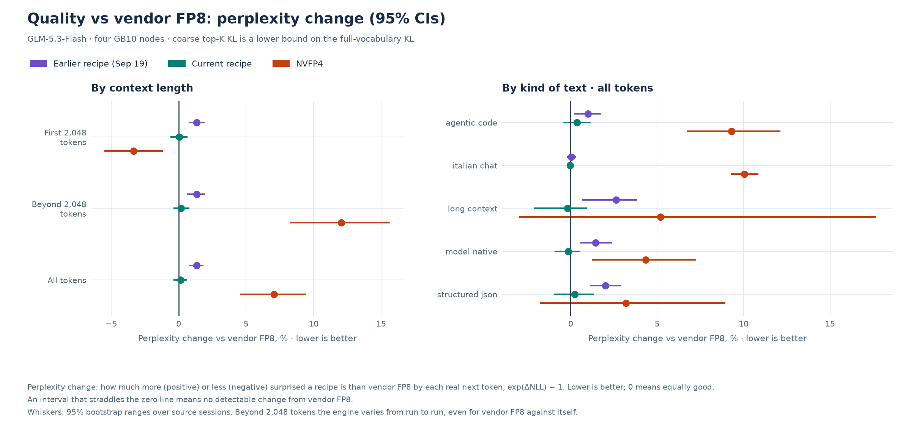

*Quality vs FP8.* Perplexity change of each arm against R0 (the vendor FP8 recipe), exp(ΔNLL) − 1, per regime and per corpus category, with 95% CIs. Lower is better; a bar whose interval straddles zero shows no detectable perplexity change from FP8.

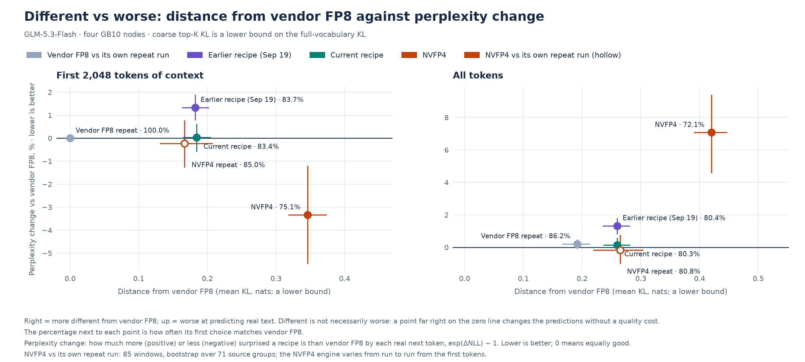

*Different vs worse.* Deviation from R0 (mean coarse KL, a lower bound) against perplexity change, one point per arm with 95% CI crosses, R0 against itself at the origin and N against itself as its run-to-run noise.

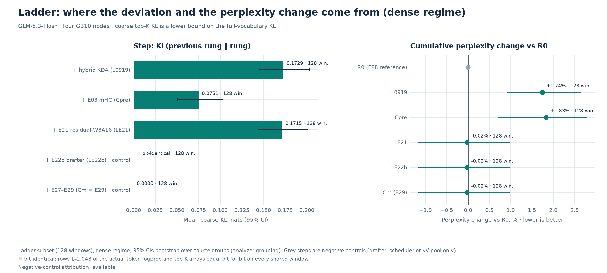

*Ladder waterfall.* Recipe ladder R0 → L0919 → Cpre → LE21 → LE22b → Cm in the dense regime: KL between adjacent recipes (not additive) and the cumulative perplexity change against R0, with bit-identical steps marked.

## 2. Method, arms and overlays

| Arm | Overlay | Recipe | Role | Scored in this report |
| --- | --- | --- | --- | --- |
| R0 | `r0fp8-m` (serving: `r0-s`) | September 18 recipe: vendor FP8 weights as served, FP8 KV, no hybrid KDA, no mHC, no E21/E22b | reference | prompt scoring, tasks |
| Cm | `cm` | E29 default in measurement mode | pre-registered candidate | prompt scoring |
| Cp | `cp-s` / default | E29 default in production (qeval tasks and corruption probe) | candidate | tasks, corruption probe |
| Cpre | `cpre-m`, `cpre-s` | September 19 E03 recipe (hybrid KDA + E03 mHC), before E21 | descriptive | prompt scoring |
| N | `n-m`, `n-s` | Published NVFP4 recipe (NVFP4 expert weights, its own engine build) on this fabric | descriptive | prompt scoring, tasks, corruption probe |
| Z | none | Cloud `glm-5.3-flash` (behavioural context for tasks only) | context | not run (deferred) |
| Ladder | `l0919-m`, `le21-m`, `le22b-m` | Frozen intermediate references between R0 and Cm | attribution | prompt scoring (ladder subset) |

Every measurement arm uses the same measurement deltas, intended not to change numerics: a 6 GiB KV pool per rank, one sequence at a time, `--max-logprobs 100`, a fresh `cache_salt` per request and the SparkCache store/restore disabled in its own namespace. Prompt scoring sends each corpus window teacher-forced with `prompt_logprobs` K = 20 (K = 100 on a fixed 20% subset).

Boot identities recorded for each measurement or serving boot:

| Boot | Overlay | Overlay sha256 | Model @ revision | Image digest | KV | Spec k | K | READY markers |
| --- | --- | --- | --- | --- | --- | --- | --- | --- |
| cm-09270932 | cm.env | 953578de69b5 | zai-org/GLM-5.3-Flash @ 690b705278 | sha256:0d4029b3b702 | fp8_e4m3 | 7 | 20 | E20_KDA_INPUT_W8A16, E21_BF16_RESIDUE_W8A16, E22_DRAFTER_W8A16, E27B_SHORT_PREFILL, E27C_CADENCE_WHEN_QUEUED, E29_END_DRAIN, E29_IDLE_COALESCE |
| cm-1 | cm.env | 953578de69b5 | zai-org/GLM-5.3-Flash @ 690b705278 | sha256:0d4029b3b702 | fp8_e4m3 | 7 | 20 | E20_KDA_INPUT_W8A16, E21_BF16_RESIDUE_W8A16, E22_DRAFTER_W8A16, E27B_SHORT_PREFILL, E27C_CADENCE_WHEN_QUEUED, E29_END_DRAIN, E29_IDLE_COALESCE |
| cp-s-09271246 | cp-s.env | 047285b03c6d | zai-org/GLM-5.3-Flash @ 690b705278 | sha256:0d4029b3b702 | fp8_e4m3 | 7 | 20 | E20_KDA_INPUT_W8A16, E21_BF16_RESIDUE_W8A16, E22_DRAFTER_W8A16, E27B_SHORT_PREFILL, E27C_CADENCE_WHEN_QUEUED, E29_END_DRAIN, E29_IDLE_COALESCE |
| cpre-m-09270828 | cpre-m.env | d4b83ebb5517 | zai-org/GLM-5.3-Flash @ 690b705278 | sha256:0d4029b3b702 | fp8_e4m3 | 5 | 20 | E20_KDA_INPUT_W8A16 |
| e29-1 | – | – | zai-org/GLM-5.3-Flash @ 690b705278 | sha256:0d4029b3b702 | fp8_e4m3 | 7 | 20 | E20_KDA_INPUT_W8A16, E21_BF16_RESIDUE_W8A16, E22_DRAFTER_W8A16, E27B_SHORT_PREFILL, E27C_CADENCE_WHEN_QUEUED, E29_END_DRAIN, E29_IDLE_COALESCE |
| e29-final-09271310 | – | – | zai-org/GLM-5.3-Flash @ 690b705278 | sha256:0d4029b3b702 | fp8_e4m3 | 7 | 20 | E20_KDA_INPUT_W8A16, E21_BF16_RESIDUE_W8A16, E22_DRAFTER_W8A16, E27B_SHORT_PREFILL, E27C_CADENCE_WHEN_QUEUED, E29_END_DRAIN, E29_IDLE_COALESCE |
| l0919-m-09271020 | l0919-m.env | d928b084c6bd | zai-org/GLM-5.3-Flash @ 690b705278 | sha256:0d4029b3b702 | fp8_e4m3 | 5 | 20 | E20_KDA_INPUT_W8A16 |
| le21-m-09271045 | le21-m.env | c7e2a954708a | zai-org/GLM-5.3-Flash @ 690b705278 | sha256:0d4029b3b702 | fp8_e4m3 | 5 | 20 | E20_KDA_INPUT_W8A16, E21_BF16_RESIDUE_W8A16 |
| le22b-m-09271109 | le22b-m.env | 4dcc197e4dc2 | zai-org/GLM-5.3-Flash @ 690b705278 | sha256:0d4029b3b702 | fp8_e4m3 | 5 | 20 | E20_KDA_INPUT_W8A16, E21_BF16_RESIDUE_W8A16, E22_DRAFTER_W8A16 |
| n-m-2 | n-m.env | 7a139f94da99 | LibertAIDAI/GLM-5.3-Flash-NVFP4 @ 9e0d74e3ce | sha256:4def0ef644cb | fp8_e4m3 | 7 | 20 | none |
| n-s-09271214 | n-s.env | 5c2c774b1255 | LibertAIDAI/GLM-5.3-Flash-NVFP4 @ 9e0d74e3ce | sha256:4def0ef644cb | fp8_e4m3 | 7 | 20 | none |
| r0-s-09271153 | r0-s.env | 29f775a25af5 | zai-org/GLM-5.3-Flash @ 690b705278 | sha256:0d4029b3b702 | fp8_e4m3 | 5 | 20 | none |
| r0-s-1 | r0-s.env | ad33ae6f7941 | zai-org/GLM-5.3-Flash @ 690b705278 | sha256:0d4029b3b702 | auto | 5 | 20 | none |
| r0-s-2 | r0-s.env | ad33ae6f7941 | zai-org/GLM-5.3-Flash @ 690b705278 | sha256:0d4029b3b702 | auto | 5 | 20 | none |
| r0-s-3 | r0-s.env | aeef972d7294 | zai-org/GLM-5.3-Flash @ 690b705278 | sha256:0d4029b3b702 | fp8_e4m3 | 5 | 20 | none |
| r0fp8-m-09271133 | r0fp8-m.env | 60dde2791b55 | zai-org/GLM-5.3-Flash @ 690b705278 | sha256:0d4029b3b702 | fp8_e4m3 | 5 | 20 | none |
| r0fp8-m-1 | r0fp8-m.env | f513d17c1f4f | zai-org/GLM-5.3-Flash @ 690b705278 | sha256:0d4029b3b702 | fp8_e4m3 | 5 | 20 | none |
| r0fp8-m-2 | r0fp8-m.env | 60dde2791b55 | zai-org/GLM-5.3-Flash @ 690b705278 | sha256:0d4029b3b702 | fp8_e4m3 | 5 | 20 | none |

### Statistical method

- Coarse KL(P_ref || P_cand) per position over the partition {tokens in both top-K rows} + {actual token, when outside that intersection and known on both sides} + {rest}. Known-cell terms are computed from logprobs, exp(lp_ref) * (lp_ref - lp_cand), so a very negative finite logprob never underflows to zero probability; only -inf is a genuine zero (floored at 1e-12 and counted). By the data-processing inequality the value is a LOWER BOUND on the full-vocabulary KL; a small value does not certify a small full KL. Covered mass (probability of the shared cells including the actual token, per side) and the top-K overlap size are reported with every comparison, and any within-margin verdict is scoped to these coarse metrics.
- Regimes: row p of a window predicts token p after p conditioning tokens. Dense = p <= 2048; sparse = p > 2048; all = every scored row (p >= 1). The 2,048 boundary is defined by conditioning count; the sparse-attention indexer explanation remains a hypothesis. The prefill-path tag of row p is that of the chunk containing its predictor position p - 1 (8,192-token chunks; chunks shorter than 2,048 rows are tagged marlin).
- Masks: a contrast and its floor are evaluated on the same windows and on the same positions: a position counts only when the coarse KL and the top-1 rows are valid in both the contrast and the floor. Delta NLL is a finite-subset mean: it additionally needs a finite actual-token logprob on every side; exclusions are counted, and nonfinite actual-token scores are published per side as missing (NaN), zero_probability (-inf, i.e. infinite NLL) or other. Missing windows, invalid rows and nonfinite actual-token scores are also published per run and regime.
- Bootstrap: percentile bootstrap over source groups, not windows or tokens (B = 2000, seed 20260927). Means are token-weighted ratio estimators (sum over resampled groups / count). Contrast and floor share the resampled groups (paired). Each estimate carries a two-sided 95% percentile interval (2.5-97.5) and one-sided 95% bounds (5th and 95th percentiles of the replicates). With fewer than two contributing groups the point estimate is kept and bounds and SE are unavailable, so any criterion on it is unresolved.
- Definitions (amendment 13): mean excess = KL(ref, cand) - KL(ref, ref') on the same positions; p99 excess = p99(ref vs cand) - p99(ref vs ref'), a difference of pooled p99s, not a p99 of differences; agreement drop = agreement(ref, ref') - agreement(ref, cand) in percentage points.
- Verdicts per criterion: within_margin when the one-sided 95% upper bound is below the margin; exceeds_margin when the one-sided 95% lower bound is at or above it; otherwise unresolved. A regime is within_margin when all three criteria are, exceeds_margin when any criterion is, and unresolved otherwise. Margins (pre-registered): mean excess 0.002 nats, p99 excess 0.02 nats, agreement drop 0.5 pp. They are pre-registered for Cm vs R0 only; other comparisons carry the same evaluation as descriptive context. A regime is unresolved when its floor is not estimable.
- Sparse regime: single-execution excess over the R0 floor is reported only as additional operational disagreement, because a less variable arm can show negative excess despite systematic drift. The sparse verdict is unresolved: there is no validated estimator for the KL between population-average distributions when execution variability differs between arms. The overall verdict is the conjunction of the dense and sparse verdicts (so it can be exceeds_margin, never within_margin, while the sparse verdict is unresolved); the single-execution overall criteria are published alongside for transparency.
- Repeated executions (descriptive): for each position the partition is the set of tokens present in the top-K rows of every execution of both arms, plus the actual token (when outside that set and known in every execution), plus rest, so each arm's equal-weight mixture over its executions is exact on the partition (mixture logprobs by log-sum-exp) and every KL is a lower bound on its full counterpart. Reported: D = KL(mixture_ref || mixture_cand), within-arm pairwise KL W_arm (ordered pairs of distinct executions), cross-arm pairwise KL X, pairwise top-1 agreements, covered mass and shared-cell count, with group-bootstrap intervals. The variance-subtraction quantities D - (W_ref + W_cand) / (2E) and X - (W_ref + W_cand) / 2 are labelled diagnostics: with unequal execution variability they do not estimate the KL between population-average distributions and can be negative while it is positive. The p99 of cross minus within pairwise KL is nonzero even for identical arms with variable executions. None of these enters a verdict. The reference arm uses R0 A, R0 B and the cross-boot R0 execution; the other arms use A, rep2 and rep3; with fewer the pair is reported as insufficient_executions.
- Bit identity: same-recipe repeats and ladder negative controls are checked for bitwise equality of lp_actual, topk_ids and topk_lp over rows 1..2048 (dense regime) on every shared window; the report gives windows and rows compared, rows differing and the first differing row. Ladder attribution is withheld when a strict negative control (a step that must not change target logits) fails, and is pending while the control cannot be evaluated.
- MDE: 2.8 x the bootstrap SE (80% power, two-sided alpha 0.05) of paired reference-only null contrasts KL(R0 A, R0 X) - KL(R0 A, R0 B) on the same positions, for each further R0 execution X; the governing MDE is the largest. The SE of the floor mean is reported separately as context. Without a paired null contrast the MDE is unavailable. A zero SE (bit-identical dense contrast) gives a degenerate MDE of zero.
- Grouping: windows from one Claude Code or omp session share a group (overlapping or sequential windows of one session are not independent); synthetic Italian windows are grouped by conversation file; model-native windows continuing a session decode prompt join that session's group, the others are grouped by their decode or native prompt id; any window without provenance falls back to its project and category. Group identifiers stay private; only counts are published.
- Model-native windows additionally report continuation-only positions (rows at or after the prompt length, i.e. the R0-generated tokens).

Bootstrap: B = 2000, seed 20260927, unit source group (235 groups over 424 windows), token-weighted ratio; percentile 95% two-sided; one-sided 95% bounds lb95/ub95.

### Amendments

Protocol changes, each recorded before the measurements it affects. Overlay headers written during the campaign cite them as "PLAN amendment N".

1. **Return to E29 (phase 3).** A restored default is verified by the full checkpoint manifest (72 files, SHA-256 each), deploy, the fabric check, both gates and `check-f0.py`; the fetch script finds its manifests when run from `~/tp4`.
2. **Speculation stays on.** Prompt and generation logprobs are complete with DFlash2 active, so every measurement arm keeps speculative decoding on.
3. **Short smoke prompts.** Rank-0 memory under E29 limits the production-recipe smoke test to short prompts; the long-prompt cache-hit test and namespace sizing move to the first measurement boot.
4. **Corpus.** Each Italian conversation also gets one overlapping second-half window, and the model-native prompts rise to 60.
5. **Boot order.** R0 serving comes first, because the model-native windows must exist before any scoring.
6. **R0 uses FP8 KV.** B12X canonicalises every KV dtype to FP8, so R0 keeps the FP8 KV of the September 18 recipe and shares the FP8-KV error.
7. **No transfers on serving nodes.** Downloads, pulls and copies run only with the stack down; model-native generation runs at concurrency 4 under a 1 GiB rank-memory abort.
8. **R0 serving KV pool.** `r0-s` uses a 12 GiB KV pool for rank-0 memory; pool size changes capacity, not numerics.
9. **Model-native windows.** 60 public long-form prompts written for the campaign (a JSON file in `scripts/fidelity/`) are added; the provisional corpus reaches 424 windows.
10. **Order.** R0 tasks run after the measurement boots.
11. **Cache hits.** A prefix-cache hit suppresses prompt logprobs, so every request carries a fresh cache salt, and measurement overlays turn the SparkCache store and restore off.
12. **Repeatability floor.** R0 is bit-identical up to 2,048 conditioning tokens and nondeterministic beyond, so every comparison is reported for the dense and sparse regimes separately, as excess over the floor.
13. **Independent review of the plan.** Sparse-regime quantities from at least three executions per arm (descriptive), covered mass and top-K overlap with every comparison, a bootstrap over source groups, explicit excess definitions and verdict labels, ladder negative controls, and a ±2 pp paired task equivalence rule.
14. **NVFP4 fabric layer.** The published recipe's fabric variables do not fit this ring, so the NVFP4 launcher uses this repository's fabric layer.
15. **Cross-boot result and descoping.** Dense-regime results are bit-identical across boots, so the recipe ladder is kept with a strict negative control. Decode-set generations, the DFlash2 exact-match check, the production bridge, sampled and hardset task runs, tasktime and Cpre serving are dropped; the cloud arm waits for a spending cap.
16. **Voxel showcase deferred** to a possible next step.

## 3. Corpus

424 windows, 2,514,865 tokens, 2,514,441 scored positions; 298 windows have at least 3,072 tokens. Manifest provisional (owner exclusions not yet listed), global sha256 `5e962c36ebfe4380…`. Rendered with the pinned tokenizer and chat template of `zai-org/GLM-5.3-Flash` at `690b705278`.

| Category | Windows | Tokens | Share of tokens |
| --- | --- | --- | --- |
| agentic code | 160 | 1,173,909 | 46.7% |
| italian chat | 49 | 209,802 | 8.3% |
| long context | 5 | 315,350 | 12.5% |
| model native | 170 | 521,392 | 20.7% |
| structured json | 40 | 294,412 | 11.7% |

| Source | Windows | Tokens | Share of tokens |
| --- | --- | --- | --- |
| claude code | 103 | 1,044,878 | 41.5% |
| omp | 102 | 738,793 | 29.4% |
| r0 native | 170 | 521,392 | 20.7% |
| synthetic it | 49 | 209,802 | 8.3% |

| Window length (tokens) | Windows |
| --- | --- |
| 0–1,023 | 45 |
| 1,024–2,047 | 36 |
| 2,048–3,071 | 45 |
| 3,072–4,095 | 45 |
| 4,096–8,191 | 130 |
| 8,192–8,703 | 8 |
| 8,704–10,239 | 103 |
| 10,240–16,383 | 6 |
| 16,384–32,767 | 1 |
| 32,768–65,535 | 4 |
| 65,536–131,071 | 1 |

Redactions before rendering (counts only): email 187, entropy 1395, env assignment 191, google api key 1, openai key 7, password assignment 115.

Decode set: 150 prompts (claude code 44, omp 56, public 50).

## 4. Results

All KL values are coarse top-K lower bounds in nats. Confidence intervals are 95% percentile bootstraps over source groups; UB95 is the one-sided 95% upper bound the verdict uses. Sparse-regime excess from one execution is additional operational disagreement, not fidelity.

### Cm (E29 in measurement mode) vs R0 (pre-registered)

Reference `R0/prompt-a`, candidate `Cm/prompt-a`, floor `floor-r0`; 424 of 424 windows (ok), 235 source groups.

| Regime | Positions | Mean KL [95% CI] | p99 KL | Top-1 agreement % | ΔNLL [95% CI] | Covered mass (ref) | Top-K overlap (median) |
| --- | --- | --- | --- | --- | --- | --- | --- |
| Dense (≤ 2,048 conditioning tokens) | 773,500 | 0.1842 [0.1653, 0.2042] | 3.103 | 83.42 [82.20, 84.67] | 3.00e-04 [-0.005648, 0.005965] | 0.9074 | 17.0 |
| Sparse (> 2,048) | 1,740,941 | 0.2937 [0.2703, 0.3149] | 4.860 | 78.86 [77.62, 80.14] | 0.001876 [-0.003397, 0.007289] | 0.8896 | 17.0 |
| All positions | 2,514,441 | 0.26 [0.2369, 0.281] | 4.410 | 80.26 [79.05, 81.58] | 0.001392 [-0.003162, 0.005589] | 0.895 | 17.0 |

| Regime | Floor mean KL | Mean excess [95% CI] | UB95 | p99 excess [95% CI] | UB95 | Top-1 drop pp [95% CI] | UB95 | Verdict |
| --- | --- | --- | --- | --- | --- | --- | --- | --- |
| Dense (≤ 2,048 conditioning tokens) | 0 | 0.1842 [0.1653, 0.2042] | 0.2003 | 3.103 [2.834, 3.393] | 3.330 | 16.58 [15.33, 17.80] | 17.58 | exceeds |
| Sparse (> 2,048) | 0.2769 | 0.01682 [0.01459, 0.01926] | 0.01894 | 0.2095 [0.1762, 0.249] | 0.2429 | 1.184 [1.077, 1.304] | 1.287 | unresolved |
| All positions | 0.1917 | 0.06831 [0.06003, 0.0771] | 0.07597 | 0.5556 [0.4688, 0.6587] | 0.6422 | 5.919 [5.322, 6.559] | 6.465 | exceeds |

### Cpre (recipe before E21) vs R0 (descriptive)

Reference `R0/prompt-a`, candidate `Cpre/prompt-a`, floor `floor-r0`; 424 of 424 windows (ok), 235 source groups.

| Regime | Positions | Mean KL [95% CI] | p99 KL | Top-1 agreement % | ΔNLL [95% CI] | Covered mass (ref) | Top-K overlap (median) |
| --- | --- | --- | --- | --- | --- | --- | --- |
| Dense (≤ 2,048 conditioning tokens) | 773,500 | 0.1821 [0.1636, 0.2014] | 3.125 | 83.66 [82.47, 84.89] | 0.0133 [0.008063, 0.01853] | 0.9078 | 17.0 |
| Sparse (> 2,048) | 1,740,941 | 0.2938 [0.2707, 0.3152] | 4.854 | 78.91 [77.69, 80.19] | 0.01313 [0.006668, 0.01883] | 0.8901 | 17.0 |
| All positions | 2,514,441 | 0.2595 [0.2358, 0.2805] | 4.406 | 80.37 [79.18, 81.68] | 0.01318 [0.008324, 0.01765] | 0.8956 | 17.0 |

| Regime | Floor mean KL | Mean excess [95% CI] | UB95 | p99 excess [95% CI] | UB95 | Top-1 drop pp [95% CI] | UB95 | Verdict |
| --- | --- | --- | --- | --- | --- | --- | --- | --- |
| Dense (≤ 2,048 conditioning tokens) | 0 | 0.1821 [0.1636, 0.2014] | 0.1979 | 3.125 [2.843, 3.439] | 3.389 | 16.34 [15.11, 17.53] | 17.34 | exceeds |
| Sparse (> 2,048) | 0.2769 | 0.01695 [0.01476, 0.01931] | 0.01893 | 0.2027 [0.1606, 0.2419] | 0.2355 | 1.126 [1.036, 1.222] | 1.209 | unresolved |
| All positions | 0.1917 | 0.06776 [0.05996, 0.07637] | 0.07519 | 0.5518 [0.4714, 0.6537] | 0.638 | 5.805 [5.245, 6.416] | 6.327 | exceeds |

### N (NVFP4 recipe) vs R0 (descriptive)

Reference `R0/prompt-a`, candidate `N/prompt-a`, floor `floor-r0`; 424 of 424 windows (ok), 235 source groups.

| Regime | Positions | Mean KL [95% CI] | p99 KL | Top-1 agreement % | ΔNLL [95% CI] | Covered mass (ref) | Top-K overlap (median) |
| --- | --- | --- | --- | --- | --- | --- | --- |
| Dense (≤ 2,048 conditioning tokens) | 773,500 | 0.3459 [0.3186, 0.3727] | 4.473 | 75.14 [73.62, 76.71] | -0.03391 [-0.05586, -0.0123] | 0.883 | 15.0 |
| Sparse (> 2,048) | 1,740,941 | 0.4534 [0.4231, 0.4808] | 6.146 | 70.80 [69.40, 72.29] | 0.1138 [0.07973, 0.1451] | 0.8539 | 15.0 |
| All positions | 2,514,441 | 0.4203 [0.3911, 0.4462] | 5.687 | 72.14 [70.78, 73.65] | 0.06835 [0.04507, 0.08953] | 0.8629 | 15.0 |

| Regime | Floor mean KL | Mean excess [95% CI] | UB95 | p99 excess [95% CI] | UB95 | Top-1 drop pp [95% CI] | UB95 | Verdict |
| --- | --- | --- | --- | --- | --- | --- | --- | --- |
| Dense (≤ 2,048 conditioning tokens) | 0 | 0.3459 [0.3186, 0.3727] | 0.3684 | 4.473 [4.179, 4.782] | 4.721 | 24.86 [23.29, 26.38] | 26.08 | exceeds |
| Sparse (> 2,048) | 0.2769 | 0.1765 [0.1654, 0.1881] | 0.1863 | 1.495 [1.400, 1.595] | 1.579 | 9.237 [8.872, 9.597] | 9.552 | unresolved |
| All positions | 0.1917 | 0.2286 [0.2148, 0.243] | 0.2407 | 1.832 [1.703, 1.958] | 1.942 | 14.04 [13.34, 14.79] | 14.68 | exceeds |

### Cm vs Cpre (descriptive)

Reference `Cpre/prompt-a`, candidate `Cm/prompt-a`, floor `floor-r0`; 424 of 424 windows (ok), 235 source groups.

| Regime | Positions | Mean KL [95% CI] | p99 KL | Top-1 agreement % | ΔNLL [95% CI] | Covered mass (ref) | Top-K overlap (median) |
| --- | --- | --- | --- | --- | --- | --- | --- |
| Dense (≤ 2,048 conditioning tokens) | 773,500 | 0.1824 [0.1638, 0.2017] | 3.097 | 83.50 [82.29, 84.73] | -0.013 [-0.01903, -0.007194] | 0.9075 | 17.0 |
| Sparse (> 2,048) | 1,740,941 | 0.2931 [0.2695, 0.3145] | 4.824 | 78.91 [77.70, 80.18] | -0.01125 [-0.01789, -0.00394] | 0.8907 | 17.0 |
| All positions | 2,514,441 | 0.259 [0.2351, 0.2803] | 4.399 | 80.33 [79.13, 81.63] | -0.01179 [-0.0174, -0.006269] | 0.8958 | 17.0 |

| Regime | Floor mean KL | Mean excess [95% CI] | UB95 | p99 excess [95% CI] | UB95 | Top-1 drop pp [95% CI] | UB95 | Verdict |
| --- | --- | --- | --- | --- | --- | --- | --- | --- |
| Dense (≤ 2,048 conditioning tokens) | 0 | 0.1824 [0.1638, 0.2017] | 0.1981 | 3.097 [2.794, 3.401] | 3.348 | 16.50 [15.27, 17.71] | 17.49 | exceeds |
| Sparse (> 2,048) | 0.2769 | 0.01617 [0.01417, 0.01838] | 0.01798 | 0.173 [0.1326, 0.214] | 0.2067 | 1.124 [1.022, 1.241] | 1.219 | unresolved |
| All positions | 0.1917 | 0.06729 [0.05952, 0.07595] | 0.07494 | 0.5444 [0.4647, 0.6402] | 0.6276 | 5.853 [5.270, 6.475] | 6.391 | exceeds |

### N vs Cm (descriptive)

Reference `Cm/prompt-a`, candidate `N/prompt-a`, floor `floor-r0`; 424 of 424 windows (ok), 235 source groups.

| Regime | Positions | Mean KL [95% CI] | p99 KL | Top-1 agreement % | ΔNLL [95% CI] | Covered mass (ref) | Top-K overlap (median) |
| --- | --- | --- | --- | --- | --- | --- | --- |
| Dense (≤ 2,048 conditioning tokens) | 773,500 | 0.3491 [0.322, 0.376] | 4.485 | 75.17 [73.69, 76.73] | -0.03421 [-0.05536, -0.01318] | 0.8825 | 15.0 |
| Sparse (> 2,048) | 1,740,941 | 0.4541 [0.4236, 0.4817] | 6.157 | 70.77 [69.37, 72.23] | 0.1119 [0.0764, 0.1437] | 0.8537 | 15.0 |
| All positions | 2,514,441 | 0.4218 [0.3927, 0.4479] | 5.692 | 72.12 [70.78, 73.63] | 0.06696 [0.04397, 0.08815] | 0.8626 | 15.0 |

| Regime | Floor mean KL | Mean excess [95% CI] | UB95 | p99 excess [95% CI] | UB95 | Top-1 drop pp [95% CI] | UB95 | Verdict |
| --- | --- | --- | --- | --- | --- | --- | --- | --- |
| Dense (≤ 2,048 conditioning tokens) | 0 | 0.3491 [0.322, 0.376] | 0.3717 | 4.485 [4.202, 4.765] | 4.720 | 24.83 [23.27, 26.31] | 26.07 | exceeds |
| Sparse (> 2,048) | 0.2769 | 0.1773 [0.1658, 0.189] | 0.1873 | 1.506 [1.410, 1.608] | 1.590 | 9.272 [8.911, 9.627] | 9.576 | unresolved |
| All positions | 0.1917 | 0.2301 [0.216, 0.2445] | 0.2423 | 1.838 [1.717, 1.962] | 1.943 | 14.06 [13.36, 14.80] | 14.69 | exceeds |

### Repeatability floor

R0 run B against run A on the same boot. The dense regime is bit-identical; the sparse regime is not (amendment 12).

| Regime | Positions | Mean KL [95% CI] | p99 KL | Top-1 agreement % | ΔNLL [95% CI] | Covered mass (ref) | Top-K overlap (median) |
| --- | --- | --- | --- | --- | --- | --- | --- |
| Dense (≤ 2,048 conditioning tokens) | 773,500 | 0 [0, 0] | 0 | 100.0 [100.0, 100.0] | 0 [0, 0] | 0.9413 | 20.0 |
| Sparse (> 2,048) | 1,740,941 | 0.2769 [0.2543, 0.2975] | 4.651 | 80.04 [78.90, 81.28] | 0.003098 [-0.001185, 0.006912] | 0.8968 | 17.0 |
| All positions | 2,514,441 | 0.1917 [0.1674, 0.2123] | 3.854 | 86.18 [84.98, 87.62] | 0.002145 [-8.90e-04, 0.004782] | 0.9105 | 18.0 |

| Position bucket | Positions | Mean KL [95% CI] | Top-1 agreement % |
| --- | --- | --- | --- |
| 0-2K | 773,158 | 0 [0, 0] | 100.0 [100.0, 100.0] |
| 2-8K | 1,295,402 | 0.2571 [0.2321, 0.2823] | 80.91 [79.45, 82.32] |
| 8-32K | 294,371 | 0.3299 [0.2833, 0.3721] | 77.25 [75.06, 79.65] |
| 32-64K | 88,992 | 0.3567 [0.2799, 0.4256] | 77.97 [75.20, 81.40] |
| 64K+ | 62,518 | 0.3227 | 78.14 |

Cross-boot R0 floor: mean KL 0.1864 [0.1455, 0.2227] nats over 85 windows.

### Sparse regime from repeated executions

At least 3 executions per arm on the stratified cross-boot subset (amendment 13); descriptive quantities (mean coarse KL, nats).

| Pair | Status | KL of averaged distributions | Cross-arm pairwise KL | Within ref pairwise KL | Within cand pairwise KL | Top-1 drop pp (pairwise) | Sparse verdict | Note |
| --- | --- | --- | --- | --- | --- | --- | --- | --- |
| Cm vs Cpre | ok | 0.07987 [0.06951, 0.08744] | 0.2128 [0.1818, 0.2346] | 0.1946 [0.1642, 0.2162] | 0.193 [0.1627, 0.2149] | 1.055 [0.9, 1.236] | unresolved | no validated estimator for the KL between population-average distributions under unequal execution variability; repeated-execution quantities are descriptive (independent review) |
| Cm vs R0 | ok | 0.0808 [0.07042, 0.08834] | 0.2132 [0.1826, 0.2345] | 0.1908 [0.162, 0.2114] | 0.1925 [0.1625, 0.2142] | 1.175 [1.018, 1.362] | unresolved | no validated estimator for the KL between population-average distributions under unequal execution variability; repeated-execution quantities are descriptive (independent review) |
| Cpre vs R0 | ok | 0.07984 [0.06961, 0.08726] | 0.2127 [0.1818, 0.2342] | 0.1905 [0.1617, 0.2108] | 0.1941 [0.1637, 0.2155] | 1.140 [0.98, 1.336] | unresolved | no validated estimator for the KL between population-average distributions under unequal execution variability; repeated-execution quantities are descriptive (independent review) |
| N vs Cm | ok | 0.2372 [0.2009, 0.2682] | 0.3762 [0.3188, 0.4217] | 0.1643 [0.139, 0.1826] | 0.1882 [0.1603, 0.2072] | 9.409 [8.594, 10.04] | unresolved | no validated estimator for the KL between population-average distributions under unequal execution variability; repeated-execution quantities are descriptive (independent review) |
| N vs R0 | ok | 0.2364 [0.2014, 0.2662] | 0.375 [0.3187, 0.419] | 0.1629 [0.1389, 0.1799] | 0.1882 [0.1603, 0.2071] | 9.409 [8.599, 10.03] | unresolved | no validated estimator for the KL between population-average distributions under unequal execution variability; repeated-execution quantities are descriptive (independent review) |

### Dense-regime bit identity

Rows 1–2,048 of the actual-token logprob and top-K arrays compared bit for bit between two executions of the same arm.

| Check | Runs | Status | Windows identical | Rows differing / compared |
| --- | --- | --- | --- | --- |
| cm-a-vs-rep2 | Cm/prompt-a vs Cm/prompt-rep2 | pass | 85 / 85 | 0 / 155,390 |
| cm-rep2-vs-rep3 | Cm/prompt-rep2 vs Cm/prompt-rep3 | pass | 85 / 85 | 0 / 155,390 |
| cpre-a-vs-rep2 | Cpre/prompt-a vs Cpre/prompt-rep2 | pass | 85 / 85 | 0 / 155,390 |
| n-a-vs-rep2 | N/prompt-a vs N/prompt-rep2 | fail | 0 / 85 | 155,206 / 155,390 |
| r0-a-vs-b | R0/prompt-a vs R0/prompt-b | pass | 424 / 424 | 0 / 773,500 |
| r0-a-vs-crossboot | R0/prompt-a vs R0/prompt-crossboot | pass | 85 / 85 | 0 / 155,390 |

Ladder negative controls (steps that must not change target logits; a strict control must be bit-identical):

| Step | Strict | Status | Windows identical | Rows differing / compared |
| --- | --- | --- | --- | --- |
| LE21/prompt-ladder → LE22b/prompt-ladder | yes | pass | 128 / 128 | 0 / 231,195 |
| LE22b/prompt-ladder → Cm/prompt-a | no | fail | 127 / 128 | 5 / 231,195 |

### Minimum detectable effect

MDE of the mean excess KL (2.8 × bootstrap SE of reference-only contrasts): dense 0 nats, sparse 0.004393 nats, all 0.003051 nats. A zero MDE means the contrast is bit-identical in that regime.

### K sensitivity

| Regime | Mean KL, K = 100 | Mean KL, truncated K = 20 | Difference | Top-1 difference pp |
| --- | --- | --- | --- | --- |
| Dense (≤ 2,048 conditioning tokens) | 0.2731 [0.2126, 0.3331] | 0.1941 [0.1561, 0.2317] | 0.07901 [0.05697, 0.1016] | 0 [0, 0] |
| Sparse (> 2,048) | 0.4392 [0.3648, 0.5247] | 0.29 [0.2437, 0.3431] | 0.1491 [0.12, 0.1836] | 0 [0, 0] |
| All positions | 0.3861 [0.3177, 0.4558] | 0.2594 [0.2168, 0.301] | 0.1267 [0.1006, 0.1547] | 0 [0, 0] |

### Ladder attribution (dense regime)

| Kind | Step | Status | Mean KL [95% CI] | Top-1 agreement % |
| --- | --- | --- | --- | --- |
| cumulative | R0/prompt-a → L0919/prompt-ladder | ok | 0.1729 [0.1448, 0.2028] | 84.23 [82.45, 86.02] |
| cumulative | R0/prompt-a → Cpre/prompt-a | ok | 0.1716 [0.1433, 0.2016] | 84.25 [82.44, 86.05] |
| cumulative | R0/prompt-a → LE21/prompt-ladder | ok | 0.1718 [0.144, 0.2011] | 83.99 [82.19, 85.79] |
| cumulative | R0/prompt-a → LE22b/prompt-ladder | ok | 0.1718 [0.144, 0.2011] | 83.99 [82.19, 85.79] |
| cumulative | R0/prompt-a → Cm/prompt-a | ok | 0.1718 [0.144, 0.2011] | 83.99 [82.19, 85.79] |
| step | R0/prompt-a → L0919/prompt-ladder | ok | 0.1729 [0.1448, 0.2028] | 84.23 [82.45, 86.02] |
| step | L0919/prompt-ladder → Cpre/prompt-a | ok | 0.07509 [0.05078, 0.1033] | 93.90 [91.96, 95.69] |
| step | Cpre/prompt-a → LE21/prompt-ladder | ok | 0.1715 [0.144, 0.2013] | 84.02 [82.22, 85.84] |
| step | LE21/prompt-ladder → LE22b/prompt-ladder (negative control) | ok | 0 [0, 0] | 100.0 [100.0, 100.0] |
| step | LE22b/prompt-ladder → Cm/prompt-a (negative control) | ok | 7.66e-08 [0, 2.48e-07] | 100.00 [100.00, 100.0] |

### Tasks

qeval, N vs Cp: 75 paired items; exact McNemar p = 1.00; sampled pass-rate difference not measured (sampled runs descoped, amendment 15); approximate paired MDE 6.47 pp from 3 discordant pairs (32.4 pp if every item were discordant).

|  | Cp pass | Cp fail |
| --- | --- | --- |
| N pass | 72 | 2 |
| N fail | 1 | 0 |

| Arm | Greedy pass rate [Wilson 95% CI] |
| --- | --- |
| N | 98.7% [92.8, 99.8] |
| Cp | 97.3% [90.8, 99.3] |

qeval, R0 vs Cp: 75 paired items; exact McNemar p = 1.00; sampled pass-rate difference not measured (sampled runs descoped, amendment 15); approximate paired MDE 7.47 pp from 4 discordant pairs (32.4 pp if every item were discordant).

|  | Cp pass | Cp fail |
| --- | --- | --- |
| R0 pass | 71 | 2 |
| R0 fail | 2 | 0 |

| Arm | Greedy pass rate [Wilson 95% CI] |
| --- | --- |
| R0 | 97.3% [90.8, 99.3] |
| Cp | 97.3% [90.8, 99.3] |

### Corruption probe

40 Italian prompts and 10 tool-call prompts at temperature 0 on the serving recipes (motivated by vLLM issue 54150 on ModelOpt NVFP4 checkpoints). UTF-8 validity is checked on the concatenated token bytes; U+FFFD counts replacement characters in the returned text; repetition flags are heuristic. The probe did not run on R0.

| Arm | Italian replies | Invalid UTF-8 | With U+FFFD (characters) | Repetition flags | Truncated | Tool calls made | Tool-call parse failures |
| --- | --- | --- | --- | --- | --- | --- | --- |
| Cp | 40 | 0 | 0 (0) | 0 | 0 | 10 / 10 | 0 |
| N | 40 | 0 | 3 (8) | 0 | 0 | 10 / 10 | 0 |

### Voxel showcase

Deferred to a possible next step (amendment 16); no rendered outputs in this campaign.

### Run inventory

| Run | K | Windows scored | Invalid rows | Missing actual-token entries |
| --- | --- | --- | --- | --- |
| Cm/prompt-a | 20 | 424 / 424 | 0 | 0 |
| Cm/prompt-k100 | 100 | 85 / 424 | 0 | 0 |
| Cm/prompt-rep2 | 20 | 85 / 424 | 0 | 0 |
| Cm/prompt-rep3 | 20 | 85 / 424 | 0 | 0 |
| Cpre/prompt-a | 20 | 424 / 424 | 0 | 0 |
| Cpre/prompt-rep2 | 20 | 85 / 424 | 0 | 0 |
| Cpre/prompt-rep3 | 20 | 85 / 424 | 0 | 0 |
| L0919/prompt-ladder | 20 | 128 / 424 | 0 | 0 |
| LE21/prompt-ladder | 20 | 128 / 424 | 0 | 0 |
| LE22b/prompt-ladder | 20 | 128 / 424 | 0 | 0 |
| N/prompt-a | 20 | 424 / 424 | 0 | 0 |
| N/prompt-rep2 | 20 | 85 / 424 | 0 | 0 |
| N/prompt-rep3 | 20 | 85 / 424 | 0 | 0 |
| R0/prompt-a | 20 | 424 / 424 | 0 | 0 |
| R0/prompt-b | 20 | 424 / 424 | 0 | 0 |
| R0/prompt-crossboot | 20 | 85 / 424 | 0 | 0 |
| R0/prompt-k100 | 100 | 85 / 424 | 0 | 0 |

### Figures

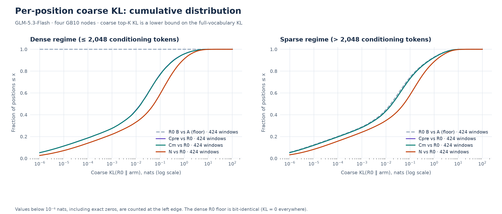

*Per-position KL: cumulative distribution.* Cumulative distribution of per-position coarse KL against R0 for each measured arm, with the R0 run-B-vs-A floor, separately for the dense and sparse regimes.

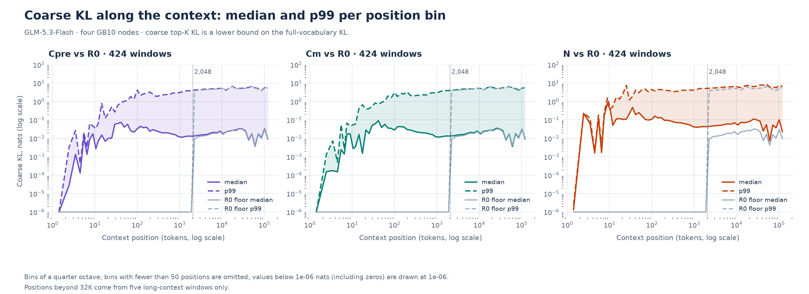

*KL along the context.* Median and p99 of per-position coarse KL in quarter-octave position bins, per arm, with the R0 floor. The dotted line marks 2,048 conditioning tokens.

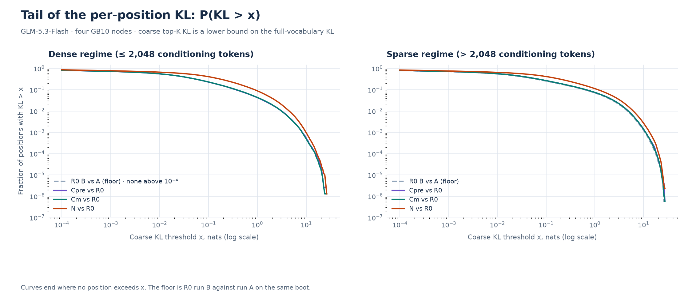

*KL tail survival.* Tail survival P(KL > x) on log-log axes: how often large deviations occur, per regime.

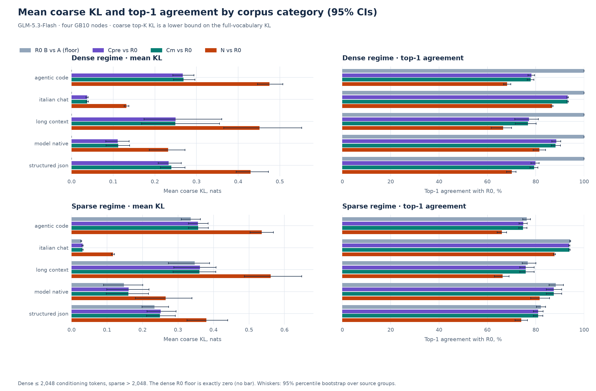

*KL and top-1 agreement by category.* Mean coarse KL and top-1 agreement against R0 by corpus category, per regime, with 95% group-bootstrap CIs.

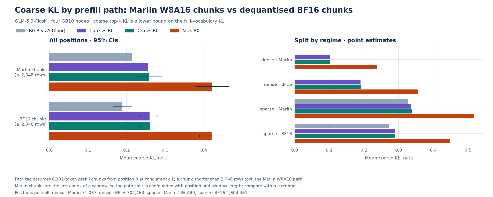

*KL by prefill path.* Mean coarse KL by prefill path (Marlin W8A16 chunks under 2,048 rows vs dequantised BF16 chunks).

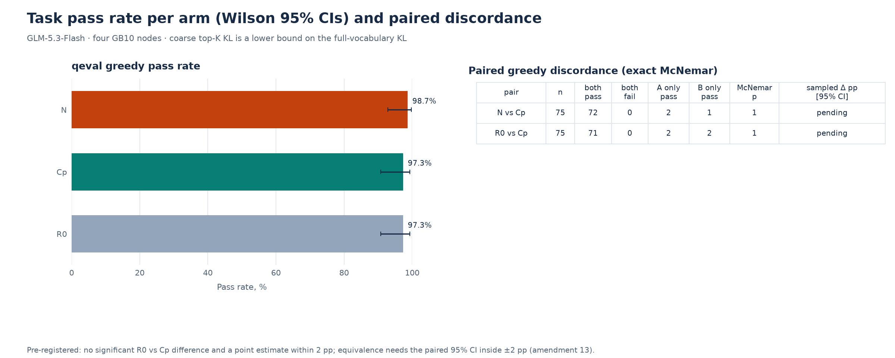

*Task pass rates.* Task pass rate per arm with Wilson 95% CIs, and paired greedy discordance with exact McNemar tests.

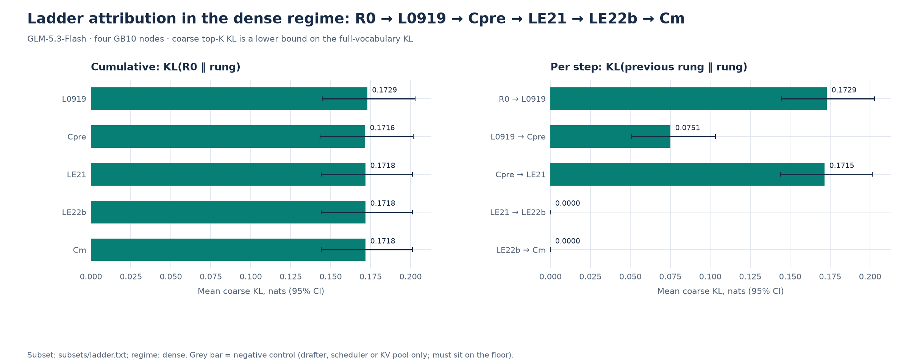

*Ladder attribution.* Dense-regime attribution along the recipe ladder, cumulative from R0 and per step, on the ladder subset.

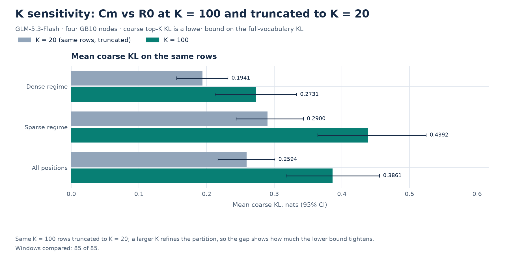

*K sensitivity.* Mean coarse KL of Cm vs R0 at K = 100 and truncated to K = 20 on the same rows.

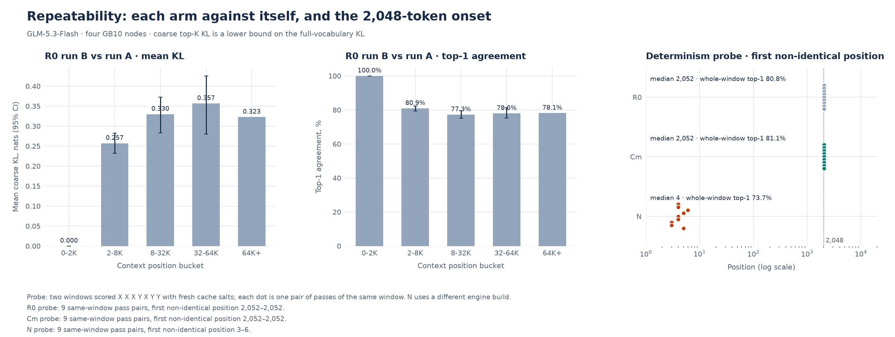

*Repeatability and the 2,048 onset.* Run-to-run repeatability: R0 against itself by position bucket, and the first non-identical position in each arm's determinism probe.

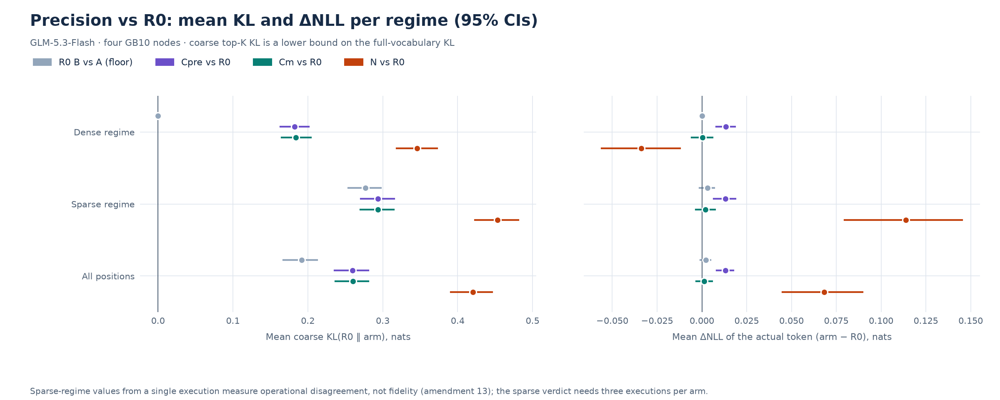

*Precision vs R0.* Summary of Cm, Cpre and N against R0: mean coarse KL and mean ΔNLL per regime with 95% CIs, with the floor.

Not produced, inputs descoped: Decode path: decode-set generations (amendment 15); Voxel showcase: voxel showcase (amendment 16).

## 5. Limitations

- **Coarse KL is a lower bound.** Tokens outside both top-K rows are merged into one cell, so by the data-processing inequality every KL here is a lower bound on the full-vocabulary KL. A small value does not certify a small full KL; the covered probability mass and top-K overlap are reported with each comparison, and any within-margin verdict is scoped to these coarse metrics.
- **R0 is not a BF16 reference.** R0 is the vendor FP8 checkpoint served by the September 18 recipe on this stack, with an FP8 KV cache (BF16 KV would need a different attention backend than the recipe as served, amendment 6). Every arm shares that FP8-KV error. The numbers are therefore not comparable with published full-vocabulary KL figures measured against a BF16 model (for example values around 0.021 nats).
- **Finite corpus.** 424 provisional windows (2,514,441 scored positions) from coding-agent sessions, synthetic Italian conversations and model-generated continuations. Other workloads may differ. Owner exclusions, when listed, drop whole windows without re-measurement.
- **Engine nondeterminism beyond 2,048 tokens.** On this engine build, positions conditioned on more than 2,048 tokens differ from run to run even for the same arm (amendment 12); single-execution sparse-regime differences are operational disagreement. Three executions per arm were collected (amendment 13), but no validated estimator exists for fidelity between population-average distributions under unequal execution variability, so the sparse verdict stays unresolved. The indexer explanation remains a hypothesis. The NVFP4 engine build is nondeterministic from the first positions.
- **No cloud reference.** The cloud arm (Z) was deferred for lack of a spending cap, so the tasks have no hosted-model comparison.
- **Tasks cannot show 2 pp equivalence.** With 75 qeval items and the observed discordance, the approximate paired MDE is 6.5–7.5 pp; a non-significant difference is not equivalence.
- **Measurement mode.** Prompt scoring runs cold and serially (one sequence, fresh cache salts). The production-bridge controls and the DFlash2 exact-match check were not run (amendment 15 limits the serving phase to tasks and the probe), so the distribution verdict is scoped to that mode; the tasks and the corruption probe ran on the production recipe (Cp), speculative decoding included.
- **Descoped work.** Decode-set generations, sampled and hardset task runs, tasktime, Cpre serving (amendment 15) and the voxel showcase (amendment 16) were not run.

## 6. Reproduction

Collection needs the four-node cluster and the private corpus; the analysis, figures and both reports regenerate from the raw runs with one command. Collector details: [scripts/fidelity/README.md](../../scripts/fidelity/README.md).

```sh
# Overlays and their exact deltas
python3 scripts/fidelity/make_overlays.py --check
python3 scripts/fidelity/make_overlays.py --diff cm

# Per measurement boot (client on a workstation, never on rank 0)
PY=data/fidelity/.venv/bin/python
$PY scripts/fidelity/collect_prompt_logprobs.py --base-url http://<api-host>:<port> \
  --arm <ARM> --run prompt-a --K 20 --boot-json <boot-identity.json> --abort-file data/fidelity/ABORT
$PY scripts/fidelity/determinism_probe.py --base-url http://<api-host>:<port> --out <probe.json>

# Metrics, figures, REPORT.md and report.html from data/fidelity/raw/
bash scripts/fidelity/make_all.sh

# Offline checks
$PY scripts/fidelity/analyze_campaign.py --selftest
python3 scripts/tests/test-fidelity-report.py
```
